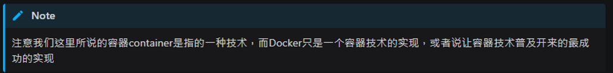

# 容器技术介绍

- 容器不等於 docker; Docker 是容器的一種實現.

  - docker != container
  - 容器有其他的實現

- 容器是一种快速的打包技术
  - Package Software into Standardized Units for Development, Shipment and Deployment
    - 标准化
    - 轻量级
    - 易移植
  - 部署 image 到 dev 伺服器上 (DigitalOcean) - My another note
    - 雲端平台只有在開機器的過程有些不同. 只要是用 docker 部屬, 部屬的過程都是一樣的.
- Linux Container 容器
  - Namespace 命名空间主要用于资源的隔离（诞生于2002年）
  - Cgroups (Control Groups) 就负责资源管理控制作用，比如进程组使用 CPU/MEMORY 的限制，进程组的优先级控制，进程组的挂起和恢复等等。（由Google贡献，2008年合并到了Linux Kernel）
- References:
  - [容器技术的介绍](https://dockertips.readthedocs.io/en/latest/docker-install/docker-intro.html)
