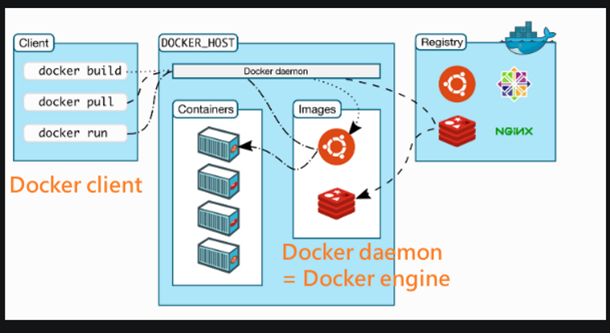

# Desktop vs Server 版本

## Contents [[↑](#desktop-vs-server-版本)]

- [Desktop vs Server 版本](#desktop-vs-server-版本)
  - [Contents \[↑\]](#contents-)
    - [Desktop vs Server Version \[↑\]](#desktop-vs-server-version-)
    - [References \[↑\]](#references-)

### Desktop vs Server Version [[↑](#desktop-vs-server-版本)]

- Desktop vs Server 版本

  - Desktop 有圖形化介面
  - Server 只有命令行
  - 兩者都會安裝 client & engine, 但 desktop 還會多安裝一些其他的東西

### References [[↑](#desktop-vs-server-版本)]

- [Docker 的架构](https://dockertips.readthedocs.io/en/latest/docker-install/docker-architecture.html)
