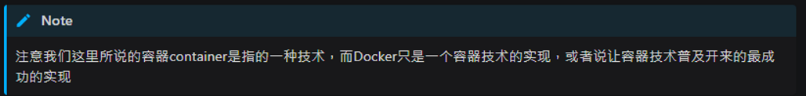

# [容器技術介紹](https://dockertips.readthedocs.io/en/latest/docker-install/docker-intro.html)

## Contents

- [容器技術介紹](#容器技術介紹)
  - [Contents](#contents)
    - [容器技術介紹 \[↑\]](#容器技術介紹-)

### 容器技術介紹 [[↑](#容器技術介紹)]

- 容器不等於 docker; Docker 是容器的一種實現.

  - docker != container
  - 容器有其他的實現

- 容器是一種快速的打包技術
  - Package Software into Standardized Units for Development, Shipment and Deployment
    - 標準化
    - 輕量級
    - 易移植
  <!-- TODO -->
  <!-- Add/link `部署 image 到 dev 伺服器上 (DigitalOcean)` note here -->
  - 部署 image 到 dev 伺服器上 (DigitalOcean) - My another note
    - 雲端平臺只有在開機器的過程有些不同. 只要是用 docker 部屬, 部屬的過程都是一樣的.
- Linux Container 容器
  - Namespace 命名空間主要用於資源的隔離（誕生於2002年）
  - Cgroups (Control Groups) 就負責資源管理控制作用，比如進程組使用 CPU/MEMORY 的限制，進程組的優先級控制，進程組的掛起和恢復等等。（由Google貢獻，2008年合併到了Linux Kernel）
