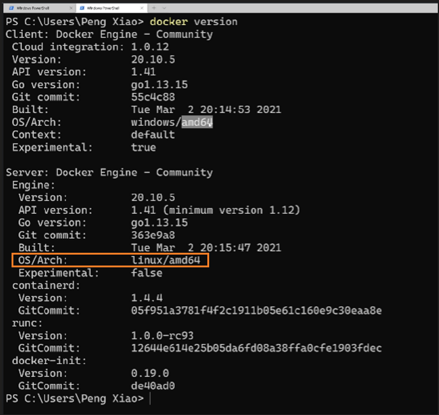
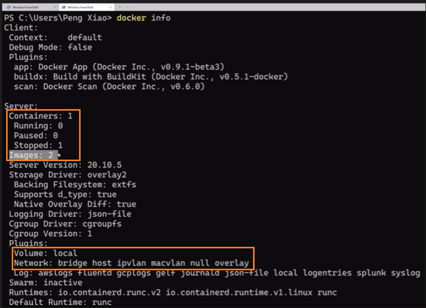
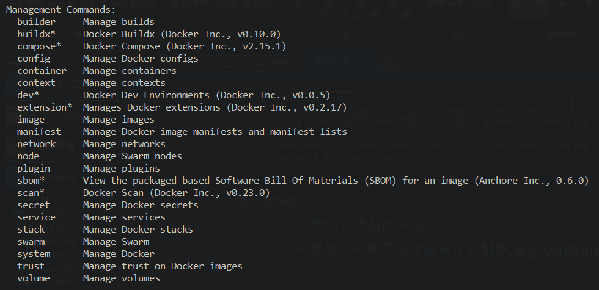
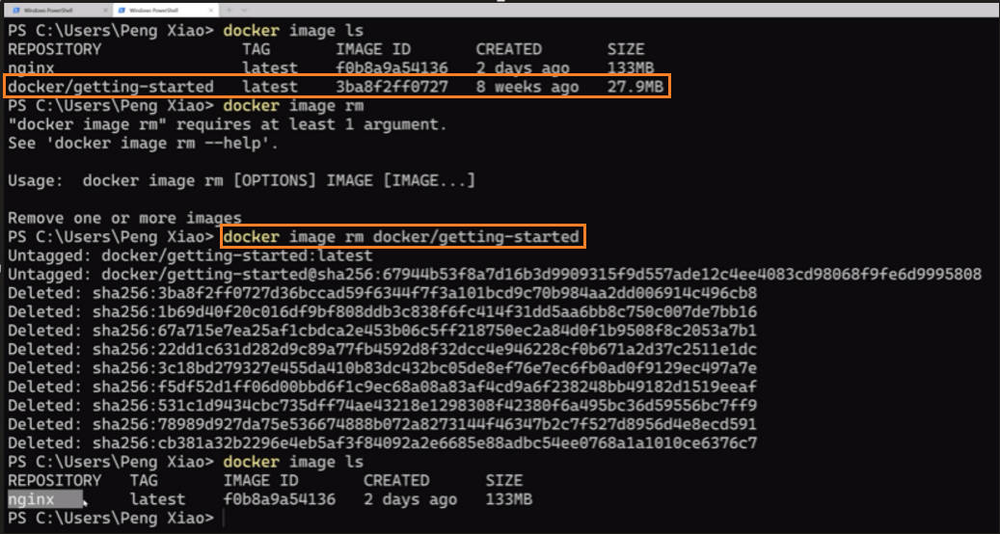

# [认识一下Docker的命令行](https://dockertips.readthedocs.io/en/latest/container-quickstart/docker-cli-intro.html)

2023年2月11日
上午 02:44

## Contents [[↑](#认识一下docker的命令行)]

- [认识一下Docker的命令行](#认识一下docker的命令行)
  - [Contents \[↑\]](#contents-)
  - [docker version \[↑\]](#docker-version-)
  - [docker info \[↑\]](#docker-info-)
  - [docker \[↑\]](#docker-)
  - [docker container \[↑\]](#docker-container-)
  - [docker image \[↑\]](#docker-image-)

## docker version [[↑](#认识一下docker的命令行)]

- `$ docker version`

    <table>
    <colgroup>
    <col style="width: 100%" />
    </colgroup>
    <thead>
    <tr class="header">
    <th>

    <ul class="incremental">
    <li>
Amd64 是 intel 架構
</li>
    </ul></th>
    </tr>
    </thead>
    <tbody>
    </tbody>
    </table>

## docker info [[↑](#认识一下docker的命令行)]

- `$ docker info`

    <table>
    <colgroup>
    <col style="width: 100%" />
    </colgroup>
    <thead>
    <tr class="header">
    <th>

    
 
</th>
    </tr>
    </thead>
    <tbody>
    </tbody>
    </table>

## docker [[↑](#认识一下docker的命令行)]

- `$ docker`

  - 可以列出所有支持的一級命令

    - 一級命令一般是指定欲操作的對象. e.g. `container`, `image`, `volume`, etc

        <table>
        <colgroup>
        <col style="width: 100%" />
        </colgroup>
        <thead>
        <tr class="header">
        <th>

        
 
</th>
        </tr>
        </thead>
        <tbody>
        </tbody>
        </table>

## docker container [[↑](#认识一下docker的命令行)]

- `$ docker container --help`
  - 查看一級命令的使用方式
- `$ docker container ls`
  - `$ docker container ls -a`
  - 等同於舊的命令
    - `$ docker container ps`
    - `$ docker container ps -a`

## docker image [[↑](#认识一下docker的命令行)]

- `$ docker image --help`
  - `$ docker image ls`
  - `$ docker image rm <image-id / image-name>`

    <table>
    <colgroup>
    <col style="width: 100%" />
    </colgroup>
    <thead>
    <tr class="header">
    <th>

    
 
</th>
    </tr>
    </thead>
    <tbody>
    </tbody>
    </table>
