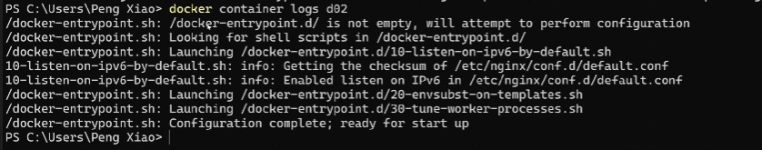
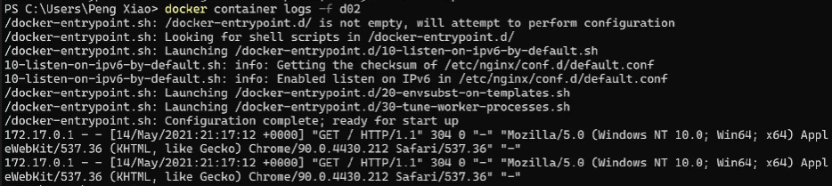
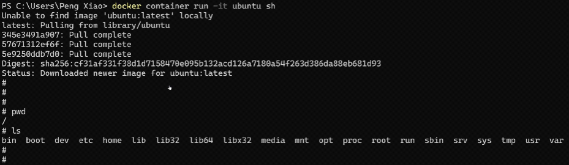
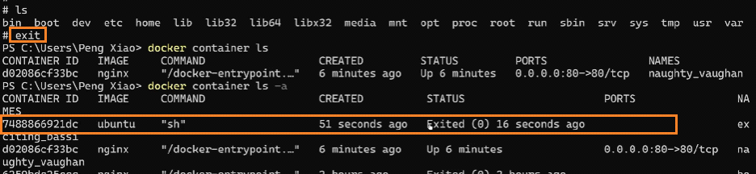
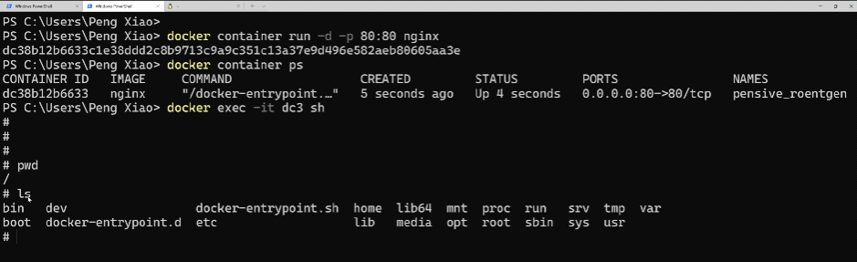
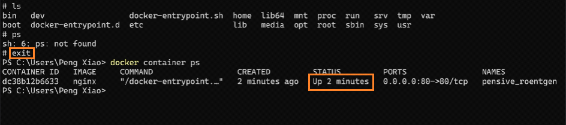

<!-- This md file is originally converted from onenote -->

# [容器的交互式模式](https://dockertips.readthedocs.io/en/latest/container-quickstart/docker-shell.html) (非常常用!!!)

2023年2月12日
下午 01:45

## Contents [[↑](#容器的交互式模式-非常常用)]

- [容器的交互式模式 (非常常用!!!)](#容器的交互式模式-非常常用)
  - [Contents \[↑\]](#contents-)
    - [補充 - 查看 container logs \[↑\]](#補充---查看-container-logs-)
    - [交互式啟動運行 container \[↑\]](#交互式啟動運行-container-)
    - [交互式進入一個已經在後台運行的 detached container (非常常用!!!) \[↑\]](#交互式進入一個已經在後台運行的-detached-container-非常常用-)

### 補充 - 查看 container logs [[↑](#容器的交互式模式-非常常用)]

- 查看 container logs
  - 顯示一次
    - `$ docker container logs <container_id / container_name>`
      <table>
        <colgroup>
          <col style="width: 100%" />
        </colgroup>
        <thead>
          <tr class="header">
            <th>
              

              
 

            </th>
          </tr>
        </thead>
        <tbody>
        </tbody>
      </table>
  - 動態顯示
    - `$ docker container logs` **`-f`** `<container_id / container_name>`
      <table>
        <colgroup>
          <col style="width: 100%" />
        </colgroup>
        <thead>
          <tr class="header">
            <th>
              

              
 

            </th>
          </tr>
        </thead>
        <tbody>
        </tbody>
      </table>

### 交互式啟動運行 container [[↑](#容器的交互式模式-非常常用)]

- 交互式啟動運行 container
  - `$ docker container run -d ubuntu` **`<手動執行的命令>`**
  - `$ docker container run` **`-it`** `ubuntu` `sh`
    - `container run` 是運行 container based on 指定的 image
    - `-it` 可以進入交互式 shell. 創建 container 時, 並直接進入交互模式
      - `-i` -- 可以以輸入進行交互
      - `-t` -- 終端交互 (tty?)
    - 此時, 如果退出交互式 shell, 該 **container 也會停止**. 這是因為 sh 這個命令已經**運行完畢**
      - 這與 `ctrl + c` 可以退出正在運行的 nginx 容器是一個道理.
  - 效果
    <table>
      <colgroup>
        <col style="width: 100%" />
      </colgroup>
      <thead>
        <tr class="header">
          <th>
            

            
 

          </th>
        </tr>
      </thead>
      <tbody>
        <tr class="odd">
          <td>
            

            
 

          </td>
        </tr>
      </tbody>
    </table>

### 交互式進入一個已經在後台運行的 detached container (非常常用!!!) [[↑](#容器的交互式模式-非常常用)]

- 交互式進入一個已經在後台運行的 detached container
  - 這是一個非常常用的命令：
    - `＄ docker` **`exec -it`** `<container_id / container_name>` `<欲執行的命令>`
    - `＄ docker exec -it <container_id / container_name> sh`
      - `-i` -- 可以以輸入進行交互
      - `-t` -- 終端交互
    - 如果**退出交互式**, 不會停止創建 container 時的腳本, 所以**不會 stop container**
  - 效果
    <table>
      <colgroup>
        <col style="width: 100%" />
      </colgroup>
      <thead>
        <tr class="header">
          <th>
            

            
 

          </th>
        </tr>
      </thead>
      <tbody>
        <tr class="odd">
          <td>
            

            
 

          </td>
        </tr>
      </tbody>
    </table>
