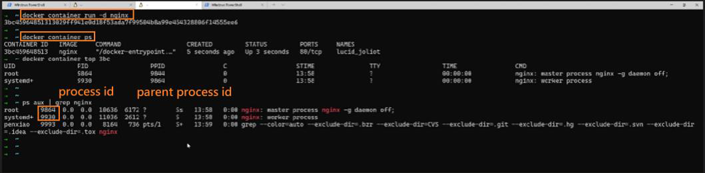
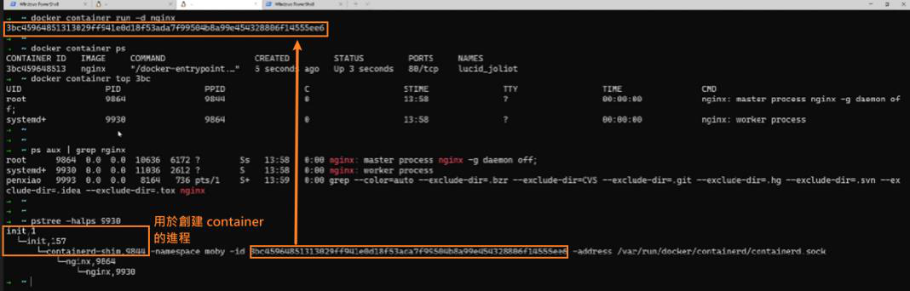
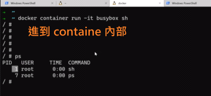
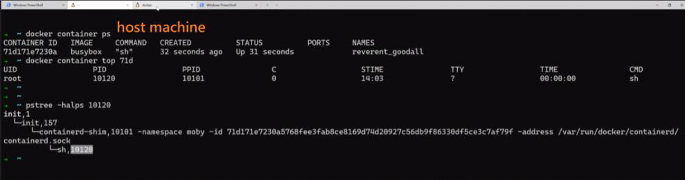

# [容器和虚拟机](https://dockertips.readthedocs.io/en/latest/container-quickstart/container-vs-vm.html)

2023年2月12日
下午 02:21

## Contents [[↑](#容器和虚拟机)]

- [容器和虚拟机](#容器和虚拟机)
  - [Contents \[↑\]](#contents-)
    - [複習 - 進入容器的 shell \[↑\]](#複習---進入容器的-shell-)
    - [容器與虛擬機的區別 \[↑\]](#容器與虛擬機的區別-)
    - [展示 - 容器是一個進程 (process) \[↑\]](#展示---容器是一個進程-process-)

### 複習 - 進入容器的 shell [[↑](#容器和虚拟机)]

- 創建容器並直接進入 shell
  - `$ docker container run` **`-it`**
- 進入已經運行容器的 shell
  - `$` **`docker container exec -it`** `<container id>`

### 容器與虛擬機的區別 [[↑](#容器和虚拟机)]

- 虛擬機是一個操作系統
  - 在 Host 主機上安裝 Hypervisor - VMware, Virtual Box
  - 並在 Hypervisor 安裝虛擬機
- 容器本質上是一個**進程 (process)**
  - 容器不是迷你的虛擬機
  - 当进程停止后，容器就退出了
    <table>
      <colgroup>
        <col style="width: 100%" />
      </colgroup>
      <thead>
        <tr class="header">
          <th>
            

            
 

          </th>
        </tr>
      </thead>
      <tbody>
      </tbody>
    </table>

### 展示 - 容器是一個進程 (process) [[↑](#容器和虚拟机)]

- 因為 Linux 的 docker client & server 都在同一個機器上, 展示比較方便
  <table>
    <colgroup>
      <col style="width: 100%" />
    </colgroup>
    <thead>
      <tr class="header">
        <th>
          

          <ul class="incremental">
            <li>
              
顯示容器到底運行了那些進程

              <ul class="incremental">
                <li>
                  
$ docker <strong>container top</strong> &lt;container_id / container_name&gt;

                </li>
              </ul>
            </li>
            <li>
              
顯示系統運行了那些進程

              <ul class="incremental">
                <li>
                  
$ ps aux | grep nginx

                </li>
              </ul>
            </li>
          </ul>
        </th>
      </tr>
    </thead>
    <tbody>
      <tr class="odd">
        <td>
          

          <ul class="incremental">
            <li>
              
pstree 命令需要额外安装，可以使用 yum install psmisc 或者 sudo apt-get install psmisc 安装

              <ul class="incremental">
                <li>
                  
$ pstree -halps &lt;PID&gt;

                </li>
              </ul>
            </li>
          </ul>
        </td>
      </tr>
    </tbody>
  </table>

- 在 host machine 中看到的進程 ID 和在容器內部中看到的進程 ID 是不一樣的
  - 這與容器實現的原理, 命名空間的映射有關. 後面會詳細討論
    <table>
      <colgroup>
        <col style="width: 100%" />
      </colgroup>
      <thead>
        <tr class="header">
          <th>
            

            
 

          </th>
        </tr>
      </thead>
      <tbody>
        <tr class="odd">
          <td>
            

            
 

          </td>
        </tr>
      </tbody>
    </table>
