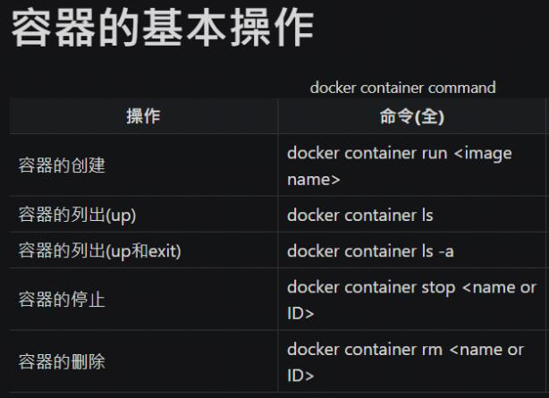
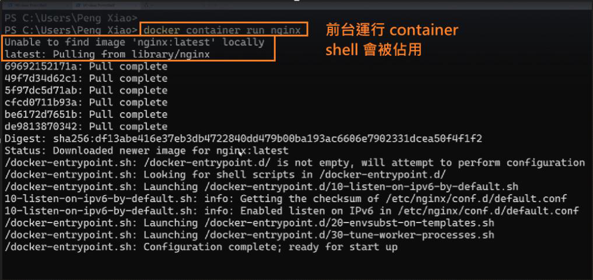
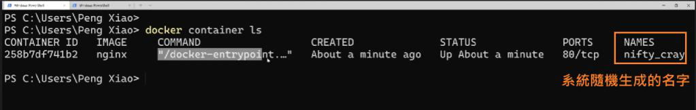

<!-- This md file is originally converted from onenote -->

# [创建我们第一个容器](https://dockertips.readthedocs.io/en/latest/container-quickstart/container-basic.html)

2023年2月11日
下午 12:57

## Contents [[↑](#创建我们第一个容器)]

- [创建我们第一个容器](#创建我们第一个容器)
  - [Contents \[↑\]](#contents-)
    - [容器的基本操作 \[↑\]](#容器的基本操作-)
      - [`$ docker container run nginx` \[↑\]](#-docker-container-run-nginx-)
      - [`$ docker container stop <container_id / container_name>` \[↑\]](#-docker-container-stop-container_id--container_name-)
      - [`$ docker container ls` \[↑\]](#-docker-container-ls-)
      - [`$ docker container rm <container_id / container_name>` \[↑\]](#-docker-container-rm-container_id--container_name-)

### 容器的基本操作 [[↑](#创建我们第一个容器)]

- 容器的基本操作

  <table>
    <colgroup>
      <col style="width: 100%" />
    </colgroup>
    <thead>
      <tr class="header">
        <th>
          

          
 

        </th>
      </tr>
    </thead>
    <tbody>
    </tbody>
  </table>

#### `$ docker container run nginx` [[↑](#创建我们第一个容器)]

- `$ docker container run nginx`

  <table>
    <colgroup>
      <col style="width: 100%" />
    </colgroup>
    <thead>
      <tr class="header">
        <th>
          

          <ul class="incremental">
            <li>
              
`Ctrl + C` 可以退出容器, 該容器也會停止運行

              <ul class="incremental">
                <li>
                  
如果該容器還在運行, 那是 windows 的問題, 則必須使用 `$ docker container stop` 手動停止容器

                </li>
              </ul>
            </li>
          </ul>
        </th>
      </tr>
    </thead>
    <tbody>
      <tr class="odd">
        <td>
          

          
 

        </td>
      </tr>
    </tbody>
  </table>

#### `$ docker container stop <container_id / container_name>` [[↑](#创建我们第一个容器)]

- `$ docker container stop <container_id / container_name>`

#### `$ docker container ls` [[↑](#创建我们第一个容器)]

- `$ docker container ls`

  - `$ docker container ls -a`

  - 等同於舊的命令

    - `$ docker container ls` == `$ docker container ps`

    - `$ docker container ls -a` == `$ docker container ps -a`

  - 建議用 docker 新的命令格式，也就是**完整格式**; 不建議使用命令簡寫.

#### `$ docker container rm <container_id / container_name>` [[↑](#创建我们第一个容器)]

- `$ docker container rm <container_id / container_name>`
