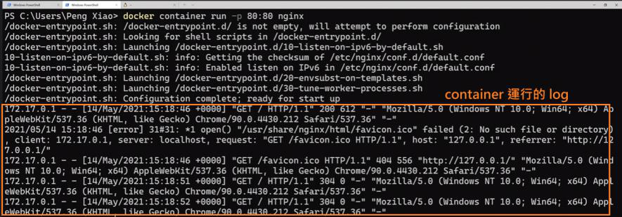
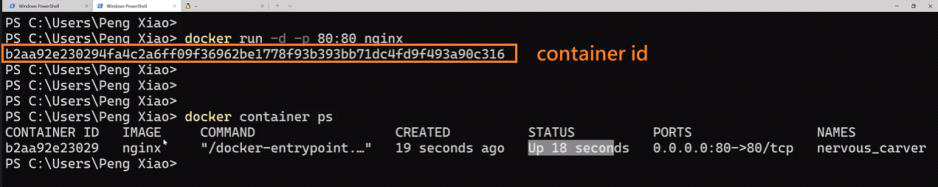
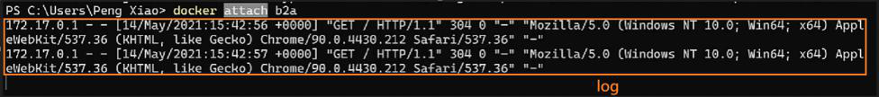

<!-- This md file is originally converted from onenote -->

# [容器的 attached 和 detached 模式](https://dockertips.readthedocs.io/en/latest/container-quickstart/container-mode.html)

2023年2月11日
下午 01:38

## Contents [[↑](#容器的-attached-和-detached-模式)]

- [容器的 attached 和 detached 模式](#容器的-attached-和-detached-模式)
  - [Contents \[↑\]](#contents-)
    - [attach 模式 - 前臺執行 \[↑\]](#attach-模式---前臺執行-)
    - [detached 模式 - 後臺執行 \[↑\]](#detached-模式---後臺執行-)
    - [Re-attach \[↑\]](#re-attach-)
    - [總結 \[↑\]](#總結-)

### attach 模式 - 前臺執行 [[↑](#容器的-attached-和-detached-模式)]

- attach 模式
  - `$ docker container run -p 80:80 nginx`
  - Attached 模式 - 前臺執行
    - 會將 log 打印在前臺
    - 所謂 attach 指的是 container 的 IO attached to 本地前臺的 IO, 使 container 與 本地前臺的 IO 之間可以相互通信
    - 一般情況不推薦使用
      <table>
        <colgroup>
          <col style="width: 100%" />
        </colgroup>
        <thead>
          <tr class="header">
            <th>
              

              
 

            </th>
          </tr>
        </thead>
        <tbody>
        </tbody>
      </table>

- 一般情況來說, attached 模式都是對 IO attached.  
  但 windows 比較奇怪, 只對 O attached, 而沒有對 I attached. 所以在 windows 無法使用 Ctrl + C 將運行的 container 停止.

### detached 模式 - 後臺執行 [[↑](#容器的-attached-和-detached-模式)]

- detach 模式
  - `$ docker container run -d -p 80:80 nginx`
  - detached 模式 - 後臺執行
    - 不會將 log 打印在前臺
    - 所謂 detach 指的是 container 與 本地前臺的 IO 之間沒有相互連接
    - 一般情況推薦使用
      <table>
        <colgroup>
          <col style="width: 100%" />
        </colgroup>
        <thead>
          <tr class="header">
            <th>
              

              
 

            </th>
          </tr>
        </thead>
        <tbody>
        </tbody>
      </table>

### Re-attach [[↑](#容器的-attached-和-detached-模式)]

- Re-attach
  - detached 模式啟動 container 後, 還是可以透過命令與之 attached
    - `$ docker attach <container_id>`
      <table>
        <colgroup>
          <col style="width: 100%" />
        </colgroup>
        <thead>
          <tr class="header">
            <th>
              

              
 

            </th>
          </tr>
        </thead>
        <tbody>
        </tbody>
      </table>

### 總結 [[↑](#容器的-attached-和-detached-模式)]

- 建議盡量使用 -d, detached 模式.
  - 一般**不推薦使用 attached 模式**.
  - 不論是創建時 attach, 或是之後使用 docker attach, 都不推薦.
