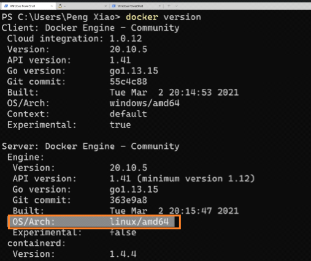
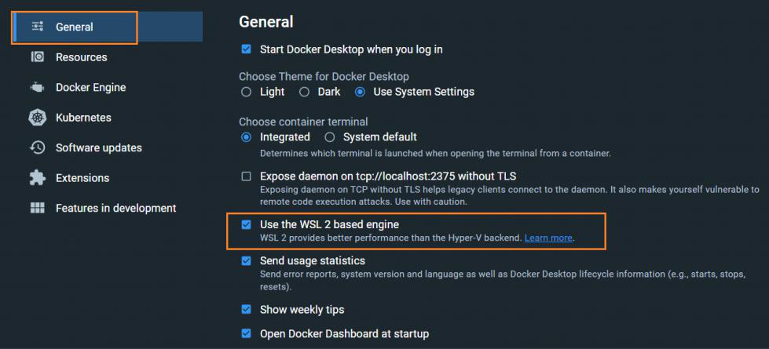
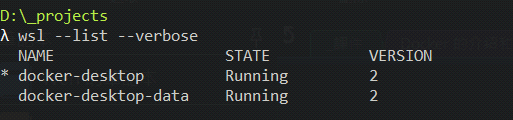

<!-- This md file is originally converted from onenote -->

# Windows/Mac 是如何運行 docker engine 的

2023年2月12日
下午 02:07

## Content [[↑](#windowsmac-是如何運行-docker-engine-的)]

- [Windows/Mac 是如何運行 docker engine 的](#windowsmac-是如何運行-docker-engine-的)
  - [Content \[↑\]](#content-)
    - [Windows 中 docker engine 的 Linux 是怎麼來的? \[↑\]](#windows-中-docker-engine-的-linux-是怎麼來的-)
    - [MAC 中 docker engine 的 Linux 是怎麼來的? \[↑\]](#mac-中-docker-engine-的-linux-是怎麼來的-)

### Windows 中 docker engine 的 Linux 是怎麼來的? [[↑](#windowsmac-是如何運行-docker-engine-的)]

- Windows 中 docker engine 的 Linux 是怎麼來的?
  - Windows 本身是無法運行 docker engine 的, 因為 docker engine 是運行在 linux 系統上的.
  - 所以 Windows 本身是無法運行 docker engine 的.
    <table>
      <colgroup>
        <col style="width: 100%" />
      </colgroup>
      <thead>
        <tr class="header">
          <th>
            

            <ul class="incremental">
              <li>
                
Docker 是一個 client-server 架構的程序

              </li>
              <li>
                
Server 的部分其實是運行在 linux 虛擬機上的一個 docker engine 程序

              </li>
            </ul>
          </th>
        </tr>
      </thead>
      <tbody>
      </tbody>
    </table>

- `Win + s`: Hyper-V manager
  - 可以看到一台 linux 虛擬機, which has installed docker engine

- 也可以使用 wsl2 作為 docker server 的 linux 虛擬機
  <table>
    <colgroup>
      <col style="width: 100%" />
    </colgroup>
    <thead>
      <tr class="header">
        <th>
          

          
 

        </th>
      </tr>
    </thead>
    <tbody>
      <tr class="odd">
        <td>
          

          
 

        </td>
      </tr>
    </tbody>
  </table>

- 也可以直接在 WSL 2 裡面直接安裝 docker client & server
  - WSL 2 就相當於是一個 Linux 系統, 所以可以直接同時安裝 docker client & server

### MAC 中 docker engine 的 Linux 是怎麼來的? [[↑](#windowsmac-是如何運行-docker-engine-的)]

- MAC 與 windows 也是類似的道理.
  - MAC 是基於 Unix 的系統, 也是無法直接運行 docker server 的.
  - 所以也是透過 Linux 的虛擬機來安裝 docker engine.
