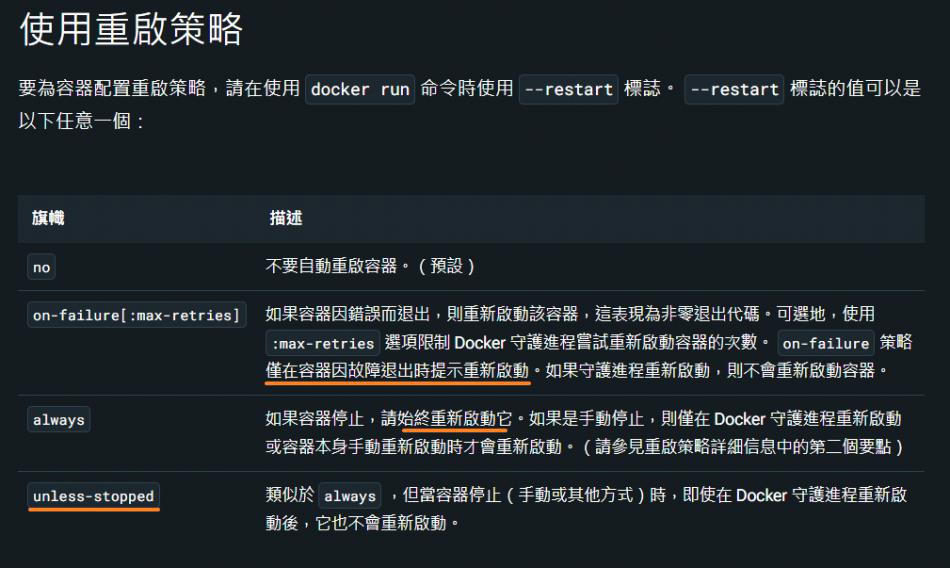
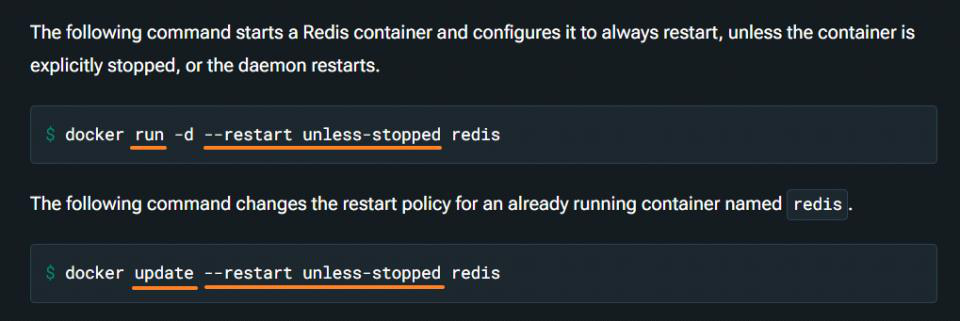

啟動容器補充 - Restart policy

2024年11月5日

上午 02:49

 

- Restart policy

  - 在 docker run 中，有四種主要的 Restart policy 可以選擇，分別適用於不同的情境：

    - no：預設值，不會自動重啟容器。

    - always：無論退出原因，容器都會自動重啟，除非手動停止。此策略適合需要持續運行的服務。

    - **unless-stopped**：與 always 類似，會在 Docker daemon 重啟後自動重啟容器，但如果容器之前是手動停止的，則不會重啟。

    - on-failure：僅在容器因非零退出碼失敗時重啟，可搭配 --restart-max-attempts 設定最大重試次數，適用於偶爾可能會崩潰的應用程式。

> 選擇適合的 Restart policy 可以提高容器穩定性，避免因錯誤或重新啟動 Docker daemon 導致服務中斷​！

<table>
<colgroup>
<col style="width: 100%" />
</colgroup>
<thead>
<tr class="header">
<th>

 
</th>
</tr>
</thead>
<tbody>
</tbody>
</table>

- Syntax

  - \`\$ docker container run --restart \<restart_policy\> \<image_name\>\`

  - \`\$ docker container update --restart \<restart_policy\> \<container_id\>\`

  - \`help\`

    - \$ docker container run --help

<table>
<colgroup>
<col style="width: 100%" />
</colgroup>
<thead>
<tr class="header">
<th>

 
</th>
</tr>
</thead>
<tbody>
</tbody>
</table>

- \$ docker container update --help

<table>
<colgroup>
<col style="width: 100%" />
</colgroup>
<thead>
<tr class="header">
<th>

 
</th>
</tr>
</thead>
<tbody>
</tbody>
</table>

- Examples

<table>
<colgroup>
<col style="width: 100%" />
</colgroup>
<thead>
<tr class="header">
<th>

 
</th>
</tr>
</thead>
<tbody>
</tbody>
</table>

- Reference:

  - [台灣 Windows 容器化技術社群 \| 在 \`docker run\` 中，有四種主要的 Restart policy 可以選擇，分別適用於不同的情境： \| Facebook](https://www.facebook.com/groups/1374060025994759/permalink/8664827153584640/)

  - [Start containers automatically \| Docker Docs](https://docs.docker.com/engine/containers/start-containers-automatically/?fbclid=IwY2xjawGW11BleHRuA2FlbQIxMQABHUxcFe7gTj8SF8bbJGozgKvhq3GVXvV2OrAX_rcLFRQncI7bxaNHQVm42A_aem_4u4M82sxbW9sKixGw5sM9A)
