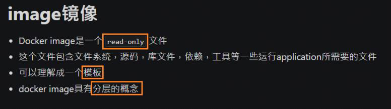
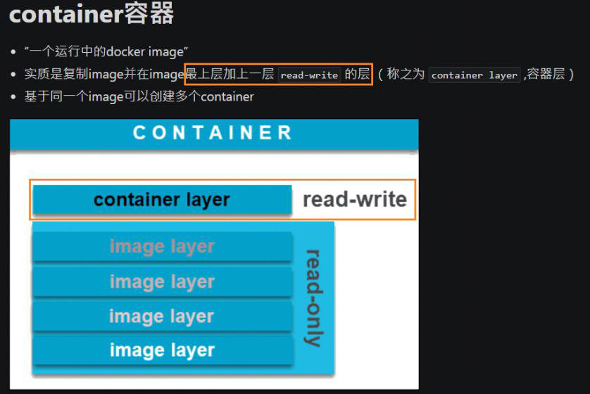
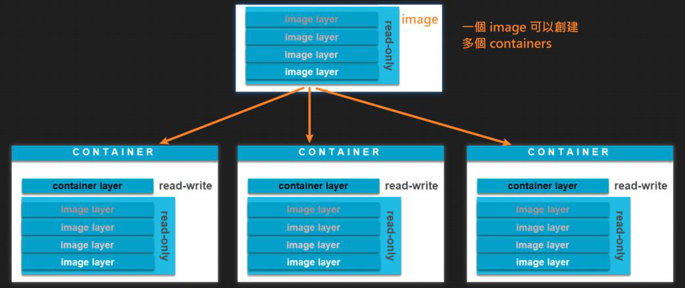

<!-- This md file is originally converted from onenote -->

# [3-3 鏡像和容器](https://dockertips.readthedocs.io/en/latest/container-quickstart/image_vs_container.html)

2023年2月11日
下午 12:46

## Contents [[↑](#3-3-鏡像和容器)]

- [3-3 鏡像和容器](#3-3-鏡像和容器)
  - [Contents \[↑\]](#contents-)
    - [Image \[↑\]](#image-)
    - [Container \[↑\]](#container-)

### Image [[↑](#3-3-鏡像和容器)]

- Image

  <table>
    <colgroup>
      <col style="width: 100%" />
    </colgroup>
    <thead>
      <tr class="header">
        <th>
          

        </th>
      </tr>
    </thead>
    <tbody>
    </tbody>
  </table>

### Container [[↑](#3-3-鏡像和容器)]

- Container

  <table>
    <colgroup>
      <col style="width: 100%" />
    </colgroup>
    <thead>
      <tr class="header">
        <th>
          

          
 

        </th>
      </tr>
    </thead>
    <tbody>
      <tr class="odd">
        <td>
          

          
 

        </td>
      </tr>
    </tbody>
  </table>
