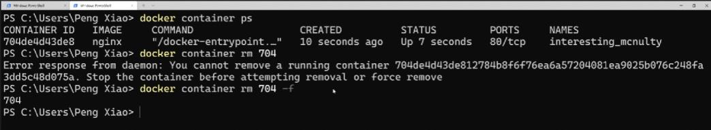

<!-- This md file is originally converted from onenote -->

# [3-4 命令行小技巧之批量操作](https://dockertips.readthedocs.io/en/latest/container-quickstart/container-cli-tips.html)

2023年2月11日
下午 01:27

## Contents [[↑](#3-4-命令行小技巧之批量操作)]

- [3-4 命令行小技巧之批量操作](#3-4-命令行小技巧之批量操作)
  - [Contents \[↑\]](#contents-)
    - [批量停止 \[↑\]](#批量停止-)
    - [批量刪除 \[↑\]](#批量刪除-)
    - [強制刪除運行中的容器 \[↑\]](#強制刪除運行中的容器-)
    - [清理，刪除停止的容器，不用的 image, network or volume \[↑\]](#清理刪除停止的容器不用的-image-network-or-volume-)

### 批量停止 [[↑](#3-4-命令行小技巧之批量操作)]

- 批量停止
  - 方法1
    - `$ docker container stop <container_id1> <container_id2> <container_id3> ...`
      - `$ docker container stop cd3 269 34b 751`
  - 方法2
    - `$ docker container stop $(docker container ls -aq)`

### 批量刪除 [[↑](#3-4-命令行小技巧之批量操作)]

- 批量刪除
  - `$ docker container rm $(docker container ls -aq)`

### 強制刪除運行中的容器 [[↑](#3-4-命令行小技巧之批量操作)]

- 強制刪除運行中的容器
  - `$ docker container rm <container_id / container_name> -f`
    <table>
      <colgroup>
        <col style="width: 100%" />
      </colgroup>
      <thead>
        <tr class="header">
          <th>
            

            <ul class="incremental">
              <li>
                
無法刪除正在運行中的容器

              </li>
              <li>
                
必須 either 先停止運行, or 強制刪除

                <ul class="incremental">
                  <li>
                    
$ docker container rm &lt;container_id / container_name&gt; <strong>-f</strong>

                  </li>
                </ul>
              </li>
            </ul>
          </th>
        </tr>
      </thead>
      <tbody>
      </tbody>
    </table>

### 清理，刪除停止的容器，不用的 image, network or volume [[↑](#3-4-命令行小技巧之批量操作)]

- `$ docker system prune -a -f`
  - `$ docker system prune -f`
    - 可以快速對系統進行清理，刪除停止的容器，不用的image，不用的 network 等等

- `$ docker volume prune -f`
  - 將沒有在使用的 volume 刪除
