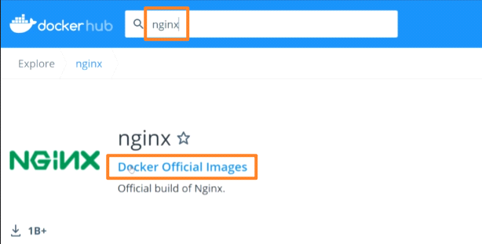
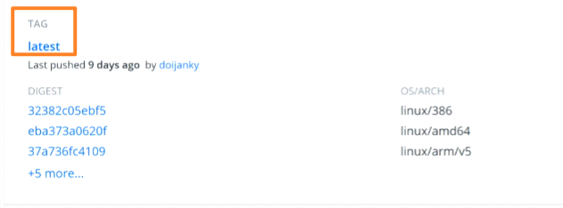
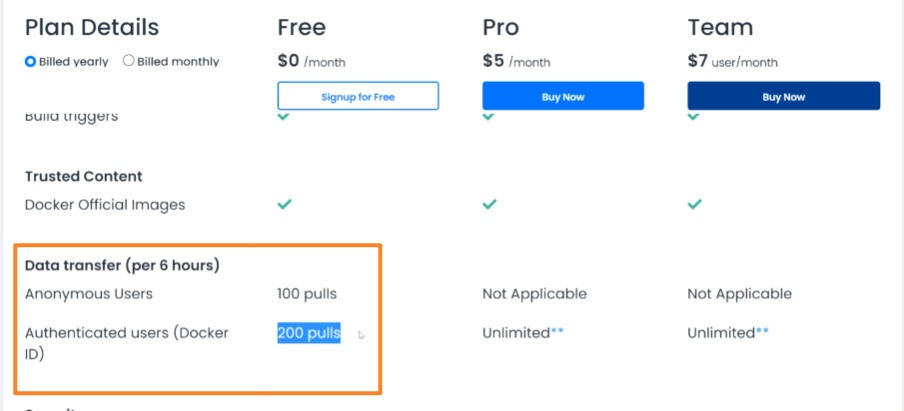

<!-- This md file is originally converted from onenote -->

# 4-3 Docker Image Registries

2023年2月12日
下午 10:45

## Contents [[↑](#4-3-docker-image-registries)]

- [4-3 Docker Image Registries](#4-3-docker-image-registries)
  - [Contents \[↑\]](#contents-)
    - [Docker Image Registries \[↑\]](#docker-image-registries-)
      - [Docker hub \[↑\]](#docker-hub-)
      - [Red hat - Quay.io \[↑\]](#red-hat---quayio-)

### Docker Image Registries [[↑](#4-3-docker-image-registries)]

#### Docker hub [[↑](#4-3-docker-image-registries)]

- Docker hub
  <table>
    <colgroup>
      <col style="width: 100%" />
    </colgroup>
    <thead>
      <tr class="header">
        <th>
          

          <ul class="incremental">
            <li>
              
安全性的考量, 盡量選擇官方的 image

            </li>
          </ul>
        </th>
      </tr>
    </thead>
    <tbody>
      <tr class="odd">
        <td>
          

          <ul class="incremental">
            <li>
              
Tag 相當於是版本訊息

            </li>
            <li>
              
不指定則下載 latest

            </li>
          </ul>
        </td>
      </tr>
      <tr class="even">
        <td>
          

          
 

        </td>
      </tr>
    </tbody>
  </table>

#### Red hat - Quay.io [[↑](#4-3-docker-image-registries)]

- Red hat - Quay.io
  - 資源比不上 Docker hub, 相對不流行
