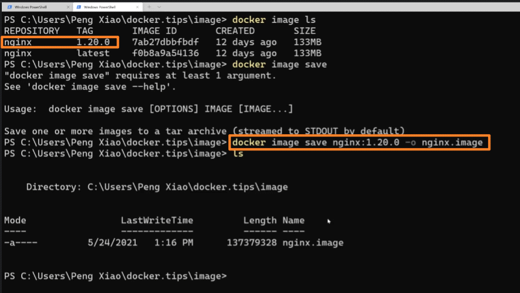
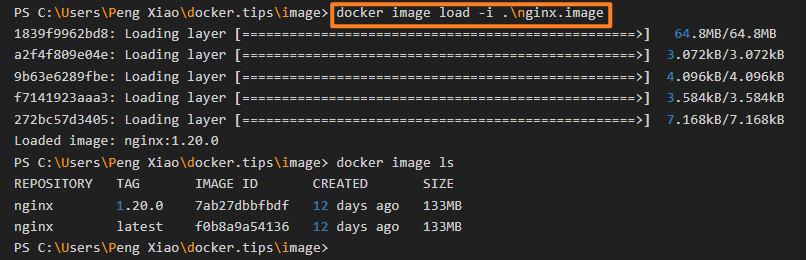

<!-- This md file is originally converted from onenote -->

# [4-5 docker 鏡像的導入和導出](https://dockertips.readthedocs.io/en/latest/docker-image/image-save-load.html)

2023年2月12日
下午 11:28

## Contents [[↑](#4-5-docker-鏡像的導入和導出)]

- [4-5 docker 鏡像的導入和導出](#4-5-docker-鏡像的導入和導出)
  - [Contents \[↑\]](#contents-)
    - [鏡像的導入和導出 (`save` 和 `load`) \[↑\]](#鏡像的導入和導出-save-和-load-)
    - [鏡像的導出 - `$ docker image save` \[↑\]](#鏡像的導出----docker-image-save-)
    - [鏡像的導入 - `$ docker image load` \[↑\]](#鏡像的導入----docker-image-load-)

### 鏡像的導入和導出 (`save` 和 `load`) [[↑](#4-5-docker-鏡像的導入和導出)]

- 這是可以離線方式來導入和導出鏡像
  - 用的比較少

### 鏡像的導出 - `$ docker image save` [[↑](#4-5-docker-鏡像的導入和導出)]

- `$ docker` **`image save`** `nginx:1.20.0 -o nginx.image`
  - `$ docker` **`image save`** `<image_name>:<tag>` `-o <output_filename>`
  - 將本地的 `<image_name>:<tag>` 轉存為 `<output_filename>`
    <table>
      <colgroup>
        <col style="width: 100%" />
      </colgroup>
      <thead>
        <tr class="header">
          <th>
            

            
 

          </th>
        </tr>
      </thead>
      <tbody>
      </tbody>
    </table>

### 鏡像的導入 - `$ docker image load` [[↑](#4-5-docker-鏡像的導入和導出)]

- `$ docker` **`image load`** `-i .\nginx.image`
  - 載入導出的 `nginx.image`
    <table>
      <colgroup>
        <col style="width: 100%" />
      </colgroup>
      <thead>
        <tr class="header">
          <th>
            

            
 

          </th>
        </tr>
      </thead>
      <tbody>
      </tbody>
    </table>
