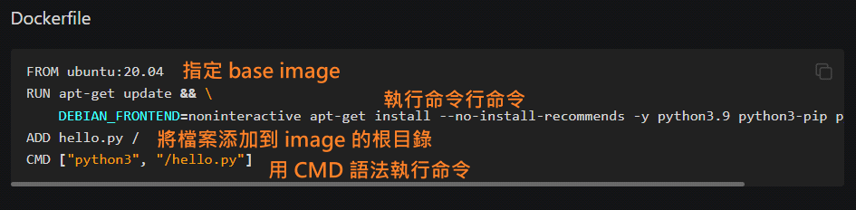

<!-- This md file is originally converted from onenote -->

# [4-6 Dockerfile 的介紹](https://dockertips.readthedocs.io/en/latest/docker-image/dockerfile-intro.html)

2023年2月12日
下午 11:47

## Contents [[↑](#4-6-dockerfile-的介紹)]

- [4-6 Dockerfile 的介紹](#4-6-dockerfile-的介紹)
  - [Contents \[↑\]](#contents-)
    - [複雜的 docker 命令 \[↑\]](#複雜的-docker-命令-)
    - [Dockerfile 的介紹 \[↑\]](#dockerfile-的介紹-)

### 複雜的 docker 命令 [[↑](#4-6-dockerfile-的介紹)]

- 命令行執行 docker 的命令, 可以很長, 很複雜. e.g.

  ```shell
  $ docker container run
    --rm
    -d
    --name pg-14.2
    -p 5432:5432
    -e POSTGRES_PASSWORD="Test123456!!!!!"
    -v pg-14.2-data:/var/lib/postgresql/data
    postgres:14.2
  ```

  或是

  ```shell
  $ docker container run
    --rm
    -d
    --name mssql-2019
    --hostname mssql-2019 -
    -p 1433:1433
    -e "ACCEPT_EULA=Y"
    -e "MSSQL_SA_PASSWORD=Test123456!!!!!"
    --shm-size 2g
    -v mssql-2019-data:/var/opt/mssql 
    mcr.microsoft.com/mssql/server:2019-latest
  ```

  或是
  
  ```shell
  $ docker container run
    --rm
    -d
    --name oracle-19c-std
    -p 15210:1521
    -p 55000:5500
    -e ORACLE_SID=ORCL19cCDB
    -e ORACLE_PWD="Test123456!!!!!"
    -e INIT_SGA_SIZE=4096
    -e INIT_PGA_SIZE=1024
    -v oracle-19c-data:/opt/oracle/oradata
    oracle/database:19.3.0-se2
  ```

### Dockerfile 的介紹 [[↑](#4-6-dockerfile-的介紹)]

- 複雜的 docker 命令難以維護和管理, 而 Dockerfile 可以以腳本的形式, 可以更好的組織, 編寫這些很長且複雜的指令, 也可以更好的複用.
  - Dockerfile 是用於構建 docker 鏡像的文件
  - Dockerfile 裡包含了構建鏡像所需的"指令"
  - Dockerfile 有其特定的語法規則
    - 編寫 Dockerfile 主要就是學其語法規則
- 一個Dockerfile的基本結構
  <table>
    <colgroup>
      <col style="width: 100%" />
    </colgroup>
    <thead>
      <tr class="header">
        <th>
          <p></p>
          <ul class="incremental">
            <li>
              <p>只有在使用 image 創建 container 時, 才會執行 CMD</p>
              <ul class="incremental">
                <li>
                  <p>也就是說 CMD 不會對 image 產生一層 layer</p>
                </li>
              </ul>
            </li>
            <li>
              <p><a href="https://docs.docker.com/engine/reference/builder/">Dockerfile reference</a></p>
            </li>
          </ul>
        </th>
      </tr>
    </thead>
    <tbody>
    </tbody>
  </table>

- 上述複雜的 docker 命令, 可以用 Dockerfile 來簡化, 例如

  ```dockerfile
  FROM postgres:14.2

  ENV POSTGRES_PASSWORD="Test123456!!!!!"

  VOLUME pg-14.2-data:/var/lib/postgresql/data
  ```

  或是

  ```dockerfile
  FROM mcr.microsoft.com/mssql/server:2019-latest

  ENV ACCEPT_EULA=Y
  ENV MSSQL_SA_PASSWORD="Test123456!!!!!"
  ENV MSSQL_DATA_DIR=/var/opt/mssql

  VOLUME mssql-2019-data:$MSSQL_DATA_DIR
  ```

  或是

  ```dockerfile
  FROM oracle/database:19.3.0-se2

  ENV ORACLE_SID=ORCL19cCDB
  ENV ORACLE_PWD="Test123456!!!!!"
  ENV INIT_SGA_SIZE=4096
  ENV INIT_PGA_SIZE=1024

  VOLUME oracle-19c-data:/opt/oracle/oradata
  ```
