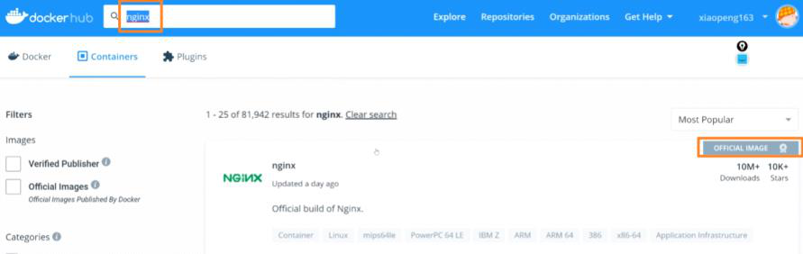
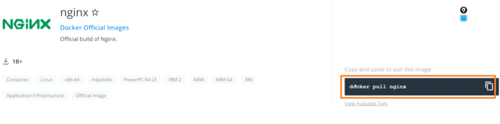
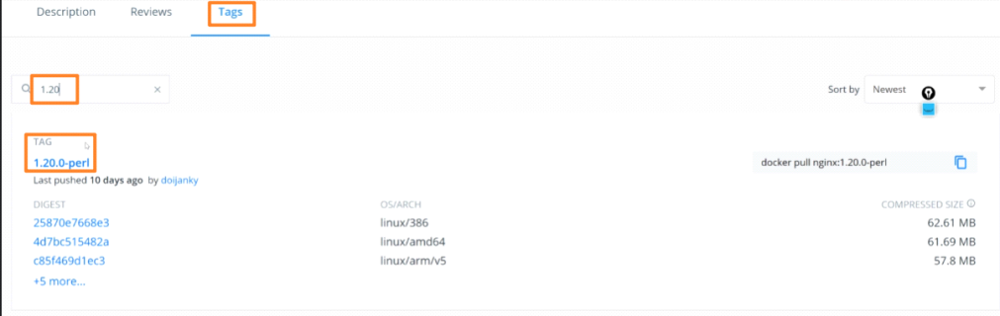
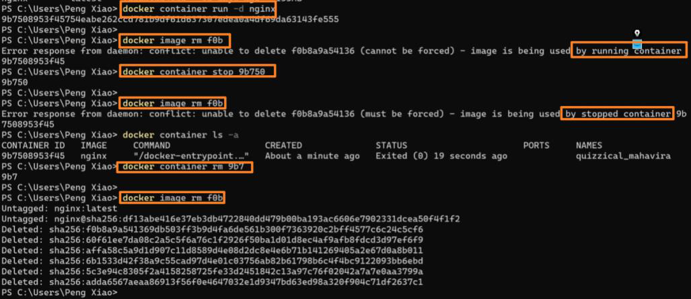
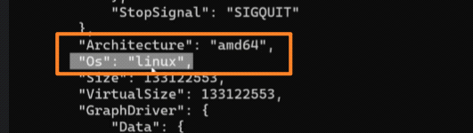
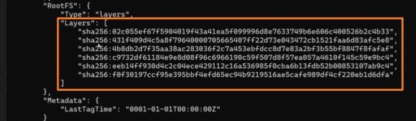
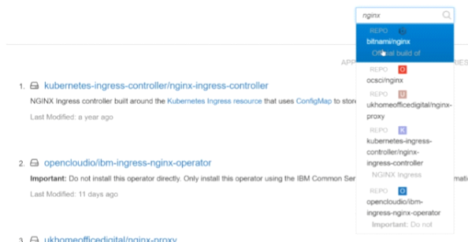
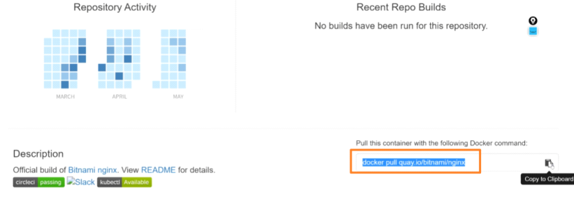

<!-- This md file is originally converted from onenote -->

# [4-4 镜像的基本操作](https://dockertips.readthedocs.io/en/latest/docker-image/docker-image-basic.html)

2023年2月12日
下午 10:56

## Contents [[↑](#4-4-镜像的基本操作)]

- [4-4 镜像的基本操作](#4-4-镜像的基本操作)
  - [Contents \[↑\]](#contents-)
    - [镜像的基本操作 \[↑\]](#镜像的基本操作-)
      - [查看可執行的操作 \[↑\]](#查看可執行的操作-)
      - [Docker Hub \[↑\]](#docker-hub-)
      - [镜像基本操作 \[↑\]](#镜像基本操作-)
      - [Red hat - Quay.io \[↑\]](#red-hat---quayio-)

### 镜像的基本操作 [[↑](#4-4-镜像的基本操作)]

#### 查看可執行的操作 [[↑](#4-4-镜像的基本操作)]

- `$ docker image`

#### Docker Hub [[↑](#4-4-镜像的基本操作)]

- 到 docker hub 找尋欲下載的 image
  <table>
    <colgroup>
      <col style="width: 100%" />
    </colgroup>
    <thead>
      <tr class="header">
        <th>
          

          
 

        </th>
      </tr>
    </thead>
    <tbody>
      <tr class="odd">
        <td>
          

          
 

        </td>
      </tr>
      <tr class="even">
        <td>
          

          
 

        </td>
      </tr>
    </tbody>
  </table>

#### 镜像基本操作 [[↑](#4-4-镜像的基本操作)]

- `$ docker` **`image pull`** `nginx`
  - **Deprecated**: ~~`$ docker pull nginx`~~
  - 拉取鏡像
  - `tag` 相當於版本的概念, 如果不指定版本，會拉取 `latest`

- `$ docker image pull nginx:1.20.0`
  - 指定拉取的版本

- `$ docker image ls`
  - List 所有鏡像

- `$ docker image rm <image_id>`
  - 刪除 image
  - 如果有 container 正在使用這個 image, 則無法刪除. 即使該容器已停止也不行, 必須將該容器先刪除, 才允許刪除 image
    <table>
      <colgroup>
        <col style="width: 100%" />
      </colgroup>
      <thead>
        <tr class="header">
          <th>
            

            
 

          </th>
        </tr>
      </thead>
      <tbody>
      </tbody>
    </table>

- `$ docker image inspect <image_id>`
  <table>
    <colgroup>
      <col style="width: 100%" />
    </colgroup>
    <thead>
      <tr class="header">
        <th>
          

          <ul class="incremental">
            <li>
              
說明這個 image 可以運行在哪種 CPU 架構下

            </li>
          </ul>
        </th>
      </tr>
    </thead>
    <tbody>
      <tr class="odd">
        <td>
          

          <ul class="incremental">
            <li>
              
<a href="../3-quick-start/3-2-image-and-container.md">镜像和容器</a>
              

            </li>
          </ul>
        </td>
      </tr>
    </tbody>
  </table>

#### Red hat - Quay.io [[↑](#4-4-镜像的基本操作)]

- 在 Red hat - Quay.io 找尋欲下載的 image
  <table>
    <colgroup>
      <col style="width: 100%" />
    </colgroup>
    <thead>
      <tr class="header">
        <th>
          

          
 

          
 

        </th>
      </tr>
    </thead>
    <tbody>
      <tr class="odd">
        <td>
          

          
 

        </td>
      </tr>
    </tbody>
  </table>

- `$ docker pull quay.io/bitnami/nginx`
  - 從 Quay 上拉取鏡像
  - `quay.io` -- registry 的地址
  - `bitnami` -- image 的 owner
  - `nginx` -- image name
