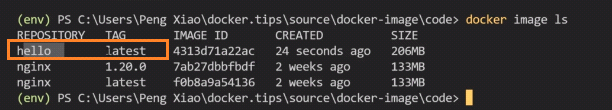

<!-- This md file is originally converted from onenote -->

# [4-7 鏡像的構建和分享](https://dockertips.readthedocs.io/en/latest/docker-image/image-build-push.html)

2023年2月13日
下午 12:23

## Contents [[↑](#4-7-鏡像的構建和分享)]

- [4-7 鏡像的構建和分享](#4-7-鏡像的構建和分享)
  - [Contents \[↑\]](#contents-)
    - [Build image \[↑\]](#build-image-)
      - [構建 \[↑\]](#構建-)
      - [注意事項 \[↑\]](#注意事項-)
    - [Share image \[↑\]](#share-image-)
      - [導出成一個文件 \[↑\]](#導出成一個文件-)
      - [Push to registry, e.g. dockerhub \[↑\]](#push-to-registry-eg-dockerhub-)

### Build image [[↑](#4-7-鏡像的構建和分享)]

#### 構建 [[↑](#4-7-鏡像的構建和分享)]

- `$ docker image build -t <image_name>:<tag> <dir_path_to_Dockerfile>`
  - `$ docker image build -t postgres:init-tiny-url-db .`
  - `$ docker image build -t hello .`
    - 如果沒有指明 `<tag>`, 預設為 `latest`
      <table>
        <colgroup>
          <col style="width: 100%" />
        </colgroup>
                <thead>
          <tr class="header">
            <th>
              

            </th>
          </tr>
        </thead>
        <tbody>
          <tr class="odd">
            <th>
              

              <ul class="incremental">
                <li>
                  
產生了三層 to image

                  <ul class="incremental">
                    <li>
                      
FROM Base image

                    </li>
                    <li>
                      
RUN

                    </li>
                    <li>
                      
ADD

                    </li>
                  </ul>
                </li>
                <li>
                  
CMD 不會產生 layer, 只有用 image 創建 container 時, CMD 才會執行

                </li>
              </ul>
            </th>
          </tr>
          <tr class="even">
            <td>
              

            </td>
          </tr>
        </tbody>
      </table>

  - CMD 不會產生 layer, 只有用 image 創建啟動 container 時, CMD 才會執行
    <table>
      <colgroup>
        <col style="width: 100%" />
      </colgroup>
      <thead>
        <tr class="header">
          <th>
            

          </th>
        </tr>
      </thead>
      <tbody>
      </tbody>
    </table>

  - 當 CMD 的指令執行結束, container 就會退出
    <table>
      <colgroup>
        <col style="width: 100%" />
      </colgroup>
      <thead>
        <tr class="header">
          <th>
            

          </th>
        </tr>
      </thead>
      <tbody>
      </tbody>
    </table>

#### 注意事項 [[↑](#4-7-鏡像的構建和分享)]

- `docker image build` 預設使用的是當前目錄下的 `Dockerfile` 文件來構建. 如果用別的名字的話, 需要用 `-f` 來指定路徑和檔名.
  <table>
    <colgroup>
      <col style="width: 100%" />
    </colgroup>
    <thead>
      <tr class="header">
        <th>
          

        </th>
      </tr>
    </thead>
    <tbody>
    </tbody>
  </table>

### Share image [[↑](#4-7-鏡像的構建和分享)]

#### 導出成一個文件 [[↑](#4-7-鏡像的構建和分享)]

- `$ docker` **`image save`** `<image_name>:<tag> -o <output_filename>`
- [4-5 docker 鏡像的導入和導出](4-5-load-and-save-image.md)

#### Push to registry, e.g. dockerhub [[↑](#4-7-鏡像的構建和分享)]

- 需要有 dockerhub 帳號
- Image 的命名方式必須為 `dockerhub_account_id/image_name`
  - 方法1 - build image 時, 起一個名字
    <table>
      <colgroup>
        <col style="width: 100%" />
      </colgroup>
      <thead>
        <tr class="header">
          <th>
            

          </th>
        </tr>
      </thead>
      <tbody>
        <tr class="odd">
          <td>
            

          </td>
        </tr>
        <tr class="even">
          <td>
            

            <ul class="incremental">
              <li>
                
當有多個 images have the same image id 時, 則無法使用 `$ docker image rm &lt;image_id&gt;` 來刪除

              </li>
              <li>
                
必須使用 `$ docker image rm &lt;image_name&gt;:&lt;tag&gt;` 來 untagged

              </li>
            </ul>
          </td>
        </tr>
      </tbody>
    </table>

  - 方法2
    - `$ docker image tag <existing_image_name>:<existing_tag> <new_image_name>:<new_tag>`
      - 根據已有的 image, 創建一個新的 image with new tag
        <table>
          <colgroup>
            <col style="width: 100%" />
          </colgroup>
          <thead>
            <tr class="header">
              <th>
                

              </th>
            </tr>
          </thead>
          <tbody>
          </tbody>
        </table>

- Push to dockerhub
  - `$ docker login`
    - 預設登入至 dockerhub
      <table>
        <colgroup>
          <col style="width: 100%" />
        </colgroup>
        <thead>
          <tr class="header">
            <th>
              

            </th>
          </tr>
        </thead>
        <tbody>
        </tbody>
      </table>

  - \$ docker image push \<dockerhub_account_id/image_name\>:\<tag\>
    <table>
      <colgroup>
        <col style="width: 100%" />
      </colgroup>
      <thead>
        <tr class="header">
          <th>
            

          </th>
        </tr>
      </thead>
      <tbody>
      </tbody>
    </table>

  - 驗證效果
    <table>
      <colgroup>
        <col style="width: 100%" />
      </colgroup>
      <thead>
        <tr class="header">
          <th>
            

          </th>
        </tr>
      </thead>
      <tbody>
      </tbody>
    </table>
