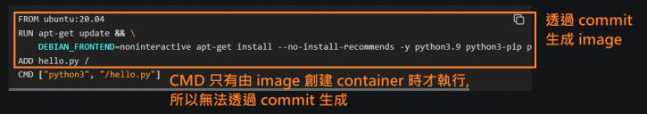

<!-- This md file is originally converted from onenote -->

# [4-8 通過 commit 創建鏡像 (少用)](https://dockertips.readthedocs.io/en/latest/docker-image/container-commit.html)

2023年2月13日
下午 08:13

## Contents [[↑](#4-8-通過-commit-創建鏡像-少用)]

- [4-8 通過 commit 創建鏡像 (少用)](#4-8-通過-commit-創建鏡像-少用)
  - [Contents \[↑\]](#contents-)
    - [Container 的 read-write layer \[↑\]](#container-的-read-write-layer-)
    - [Container commit \[↑\]](#container-commit-)
      - [Container commit 命令 \[↑\]](#container-commit-命令-)
      - [Container commit 模擬 Dockerfile \[↑\]](#container-commit-模擬-dockerfile-)

### Container 的 read-write layer [[↑](#4-8-通過-commit-創建鏡像-少用)]

- Container 的 read-write layer 會隨著 container 的生命週期而變化.  
  也就是說, container 的 data 會隨著 container 的生命週期而變化.

- 展示
  - 先啟動一個 nginx container
    <table>
      <colgroup>
        <col style="width: 100%" />
      </colgroup>
      <thead>
        <tr class="header">
          <th>
            

            
 

          </th>
        </tr>
      </thead>
      <tbody>
        <tr class="odd">
          <td>
            

            <ul class="incremental">
              <li>
                
這是容器內的一個 html 文件

              </li>
            </ul>
            

              <table>
                <colgroup>
                  <col style="width: 100%" />
                </colgroup>
                <thead>
                  <tr class="header">
                    <th>
                      

                      
 

                    </th>
                  </tr>
                </thead>
                <tbody>
                </tbody>
              </table>
            

            <ul class="incremental">
              <li>
                
手動修改此 html

              </li>
            </ul>
            

              <table>
                <colgroup>
                  <col style="width: 100%" />
                </colgroup>
                <thead>
                  <tr class="header">
                    <th>
                      

                      
 

                    </th>
                  </tr>
                </thead>
                <tbody>
                  <tr class="odd">
                    <td>
                      

                      
 

                    </td>
                  </tr>
                </tbody>
              </table>
            

          </td>
        </tr>
      </tbody>
    </table>

  - 將 container 停掉, 再啟動同一個 container, 裡面的 data 不會被刪除. 也就是 read-write layer 會跟這 container 一起保留.
    <table>
      <colgroup>
        <col style="width: 100%" />
      </colgroup>
      <thead>
        <tr class="header">
          <th>
            

            
 

          </th>
        </tr>
      </thead>
      <tbody>
        <tr class="odd">
          <td>
            

            
 

          </td>
        </tr>
      </tbody>
    </table>

  - 如果將 container 刪除, 則裡面的 data 也會被刪除. 也就是 read-write layer 會跟這 container 一起被刪除.

### Container commit [[↑](#4-8-通過-commit-創建鏡像-少用)]

#### Container commit 命令 [[↑](#4-8-通過-commit-創建鏡像-少用)]

- `$ docker container commit <container_id> <image_name>:<tag>`
  - 可以將一個 container commits 成一個 image.
  - 也就是說將 container 的 read-write layer commits 成一個 read-only layer.
    <table>
    <colgroup>
      <col style="width: 100%" />
    </colgroup>
    <thead>
      <tr class="header">
        <th>
          

          
 

        </th>
      </tr>
    </thead>
    <tbody>
    </tbody>
  </table>

#### Container commit 模擬 Dockerfile [[↑](#4-8-通過-commit-創建鏡像-少用)]

- 使用 container commit 的方式製作一個 image as the following `dockerfile` - [Dockerfile 介绍](https://dockertips.readthedocs.io/en/latest/docker-image/dockerfile-intro.html#dockerfile)
  <table>
    <colgroup>
      <col style="width: 100%" />
    </colgroup>
    <thead>
      <tr class="header">
        <th>
          

          
 

        </th>
      </tr>
    </thead>
    <tbody>
    </tbody>
  </table>

- 步驟
  <table>
    <colgroup>
      <col style="width: 100%" />
    </colgroup>
    <thead>
      <tr class="header">
        <th>
          

          
 

        </th>
      </tr>
    </thead>
    <tbody>
      <tr class="odd">
        <td>
          

          
 

        </td>
      </tr>
      <tr class="even">
        <td>
          

          
 

        </td>
      </tr>
      <tr class="odd">
        <td>
          

          
 

        </td>
      </tr>
      <tr class="even">
        <td>
          

          
 

        </td>
      </tr>
      <tr class="odd">
        <td>
          

          <ul class="incremental">
            <li>
              
$ docker image history &lt;image_name&gt;:&lt;tag&gt;

              <ul class="incremental">
                <li>
                  
可以顯示 image 的 layers

                </li>
              </ul>
            </li>
          </ul>
        </td>
      </tr>
    </tbody>
  </table>

- 執行容器
  <table>
    <colgroup>
      <col style="width: 100%" />
    </colgroup>
    <thead>
      <tr class="header">
        <th>
          

          
 

        </th>
      </tr>
    </thead>
    <tbody>
      <tr class="odd">
        <td>
          

          
 

        </td>
      </tr>
    </tbody>
  </table>
