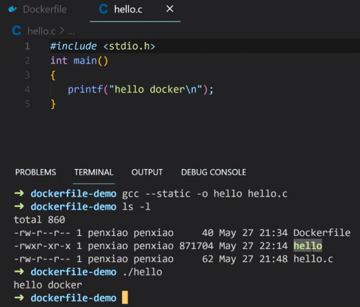
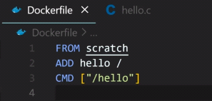
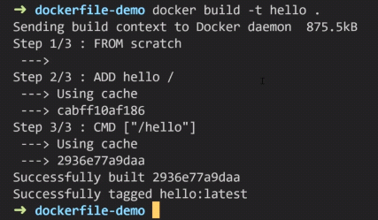
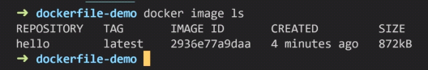
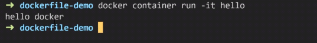
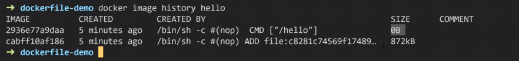

# [4-9 關於 scratch 鏡像 (少用, 理解即可)](https://dockertips.readthedocs.io/en/latest/docker-image/scratch-image.html)

2023年2月13日
下午 08:57

## Contents [[↑](#4-9-關於-scratch-鏡像-少用-理解即可)]

- [4-9 關於 scratch 鏡像 (少用, 理解即可)](#4-9-關於-scratch-鏡像-少用-理解即可)
  - [Contents \[↑\]](#contents-)
    - [scratch 鏡像 \[↑\]](#scratch-鏡像-)

### scratch 鏡像 [[↑](#4-9-關於-scratch-鏡像-少用-理解即可)]

- scratch 是一個特殊的 image, 用來構建最小的 image
- 理解即可, 沒必要自己動手做
- 可以更加理解
  - container is a process
  - Image has layers
- 實驗步驟
  - 先準備一個 C 可執行程序
    <table>
      <colgroup>
        <col style="width: 100%" />
      </colgroup>
      <thead>
        <tr class="header">
          <th>
            

            
 

          </th>
        </tr>
      </thead>
      <tbody>
      </tbody>
    </table>

  - 將其打包成一個 image
    <table>
      <colgroup>
        <col style="width: 100%" />
      </colgroup>
      <thead>
        <tr class="header">
          <th>
            

            
 

          </th>
        </tr>
      </thead>
      <tbody>
        <tr class="odd">
          <td>
            

            
 

          </td>
        </tr>
        <tr class="even">
          <td>
            

            
 

          </td>
        </tr>
        <tr class="odd">
          <td>
            

            
 

          </td>
        </tr>
      </tbody>
    </table>

  - `$ docker image history <image_name>:<tag>`
    - 可以顯示 image 的 layers
      <table>
        <colgroup>
          <col style="width: 100%" />
        </colgroup>
        <thead>
          <tr class="header">
            <th>
              

              <ul class="incremental">
                <li>
                  
`FROM scratch` 不會創建任何新的層，因為 `scratch` 是空的

                </li>
                <li>
                  
雖然有兩層, 但 CMD 其實是空的一層, 並不佔空間

                </li>
                <li>
                  
所以在這個例子中，鏡像真正只有一層，就是 ADD 指令創建的層

                </li>
              </ul>
            </th>
          </tr>
        </thead>
        <tbody>
        </tbody>
      </table>
