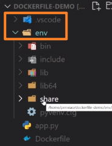

<!-- This md file is originally converted from onenote -->

# [5-10 `.dockerignore`](https://dockertips.readthedocs.io/en/latest/best-practise/dockerignore.html)

2023年2月20日
下午 06:39

## Contents [[↑](#5-10-dockerignore)]

- [5-10 `.dockerignore`](#5-10-dockerignore)
  - [Contents \[↑\]](#contents-)
    - [build context \[↑\]](#build-context-)
    - [`.dockerignore` 文件 \[↑\]](#dockerignore-文件-)

### build context [[↑](#5-10-dockerignore)]

- Docker 是 client-server 架構，理論上 Client 和 Server 可以不在一台機器上。在構建 docker 鏡像的時候，需要把所**需要的文件**由 CLI（client）發給 Server，這些文件實際上就是 **build context**
- $ `docker image build -t <image_name>:<tag> <path_of_build_context>`
    <table>
      <colgroup>
        <col style="width: 100%" />
      </colgroup>
      <thead>
        <tr class="header">
          <th>
            

            <ul class="incremental">
              <li>
                
`.` 這個參數就是代表了 build context 所指向的目錄

              </li>
            </ul>
          </th>
        </tr>
      </thead>
      <tbody>
      </tbody>
    </table>

  - 執行之後
    <table>
      <colgroup>
        <col style="width: 100%" />
      </colgroup>
      <thead>
        <tr class="header">
          <th>
            

            <ul class="incremental">
              <li>
                
build context 指定為當前目錄, 會將當前目錄的<strong>所有</strong>檔案發送給 server

                <ul class="incremental">
                  <li>
                    
包括 env 等不需要的 Python 編譯檔案

                  </li>
                </ul>
              </li>
            </ul>
            <ul class="incremental">
              <ul class="incremental">
                <table>
                  <colgroup>
                    <col style="width: 100%" />
                  </colgroup>
                  <thead>
                    <tr class="header">
                      <th>
                        

                      </th>
                    </tr>
                  </thead>
                  <tbody>
                  </tbody>
                </table>
              </ul>
            </ul>
          </th>
        </tr>
      </thead>
      <tbody>
        <tr class="odd">
          <td>
            

          </td>
        </tr>
      </tbody>
    </table>

- build context 太大的話, 會影響 build image 的速度. 因為需要 client 需要把 build context 發送給後臺的 docker server
  - 所以 build context 最好只包含需要的檔案即可
  - 可以使用 `.dockerignore` 來讓 build context 忽略不必要的檔案

### `.dockerignore` 文件 [[↑](#5-10-dockerignore)]

- `.dockerignore` 文件是用來告訴 docker build 命令哪些文件不需要發送到 server
  - 要與 `Dockerfile` 在同一層目錄
  - 用法與 `.gitignore` 幾乎一模一樣
    <table>
      <colgroup>
        <col style="width: 100%" />
      </colgroup>
      <thead>
        <tr class="header">
          <th>
            

            <ul class="incremental">
              <li>
                
也可以保護一些私人的密碼文件不要發送到 docker server 或是 image 中

              </li>
            </ul>
          </th>
        </tr>
      </thead>
      <tbody>
        <tr class="odd">
          <td>
            

          </td>
        </tr>
      </tbody>
    </table>
