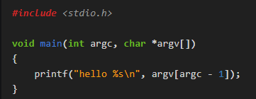
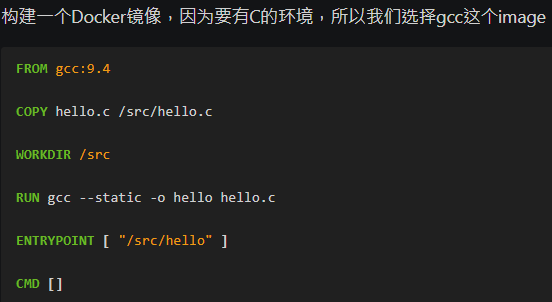
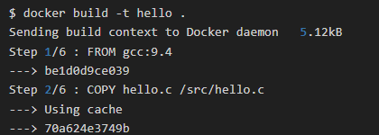
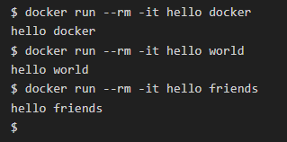
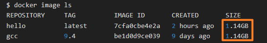
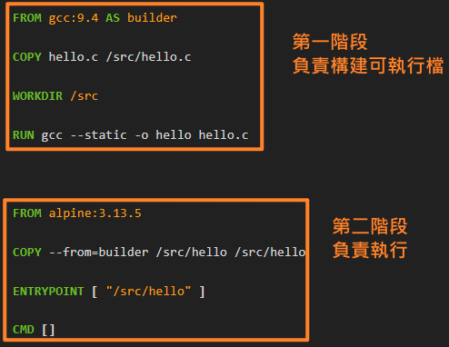
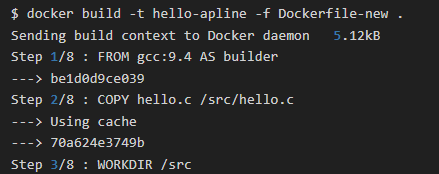
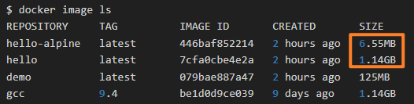
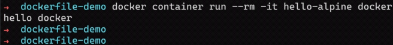

<!-- This md file is originally converted from onenote -->

# [5-11 多階段構建 (Multi-stage build)](https://dockertips.readthedocs.io/en/latest/best-practise/multi-stage-build.html)

2023年2月21日
下午 09:53

## Contents [[↑](#5-11-多階段構建-multi-stage-build)]

- [5-11 多階段構建 (Multi-stage build)](#5-11-多階段構建-multi-stage-build)
  - [Contents \[↑\]](#contents-)
    - [目標 \[↑\]](#目標-)
    - [一般構建 \[↑\]](#一般構建-)
    - [多階段構建 \[↑\]](#多階段構建-)

### 目標 [[↑](#5-11-多階段構建-multi-stage-build)]

- 有一個 C 的程序，我們想用 Docker 去做編譯，最後產生一個容器可以執行該編譯過的可執行文件。
  - C file
    <table>
      <colgroup>
        <col style="width: 100%" />
      </colgroup>
      <thead>
        <tr class="header">
          <th>
            

          </th>
        </tr>
      </thead>
      <tbody>
      </tbody>
    </table>

### 一般構建 [[↑](#5-11-多階段構建-multi-stage-build)]

- `Dockerfile`
  <table>
    <colgroup>
      <col style="width: 100%" />
    </colgroup>
    <thead>
      <tr class="header">
        <th>
          

        </th>
      </tr>
    </thead>
    <tbody>
    </tbody>
    </table>

- Build
  <table>
    <colgroup>
      <col style="width: 100%" />
    </colgroup>
    <thead>
      <tr class="header">
        <th>
          

        </th>
      </tr>
    </thead>
    <tbody>
    </tbody>
  </table>

- 測試
  <table>
    <colgroup>
      <col style="width: 100%" />
    </colgroup>
    <thead>
      <tr class="header">
        <th>
          

        </th>
      </tr>
    </thead>
    <tbody>
    </tbody>
  </table>

- Image 大小
  <table>
    <colgroup>
      <col style="width: 100%" />
    </colgroup>
    <thead>
      <tr class="header">
        <th>
          

          <ul class="incremental">
            <li>
              
Image 很大的原因是, gcc 的編譯鏡像很大

            </li>
            <li>
              
如果我們的目標是運行編譯過的執行檔, 事實上, 這個 gcc 的環境是多餘的. 一個小的 alpine 鏡像就可以了

            </li>
          </ul>
        </th>
      </tr>
    </thead>
    <tbody>
    </tbody>
  </table>

### 多階段構建 [[↑](#5-11-多階段構建-multi-stage-build)]

- 在一個 `Dockerfile` 中, 可以寫多個構建過程
  <table>
    <colgroup>
      <col style="width: 100%" />
    </colgroup>
    <thead>
      <tr class="header">
        <th>
          

          <ul class="incremental">
            <li>
              
適合那種需要編譯環境, 而且編譯環境需要安裝大量的軟件, 而這些軟件對最後的運行是沒有幫助的

            </li>
          </ul>
        </th>
      </tr>
    </thead>
    <tbody>
    </tbody>
  </table>

- Build
  <table>
    <colgroup>
      <col style="width: 100%" />
    </colgroup>
    <thead>
      <tr class="header">
        <th>
          

        </th>
      </tr>
    </thead>
    <tbody>
    </tbody>
  </table>

- Image 大小
  <table>
    <colgroup>
      <col style="width: 100%" />
    </colgroup>
    <thead>
      <tr class="header">
        <th>
          

          <ul class="incremental">
            <li>
              
小非常多, 比較快, 比較省網路帶寬

            </li>
          </ul>
        </th>
      </tr>
    </thead>
    <tbody>
    </tbody>
  </table>

- 測試
  <table>
    <colgroup>
      <col style="width: 100%" />
    </colgroup>
    <thead>
      <tr class="header">
        <th>
          

        </th>
      </tr>
    </thead>
    <tbody>
    </tbody>
  </table>

- 應用
  - Refer to "13-5 如何在Docker Image的構建階段保護敏感信息" for details
