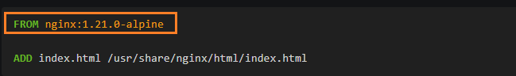
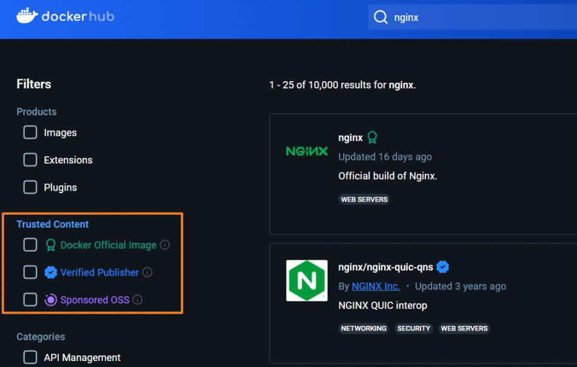
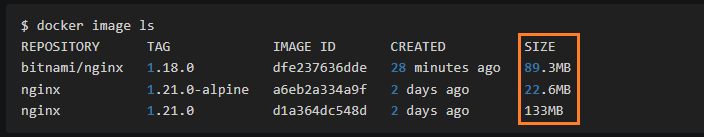

<!-- This md file is originally converted from onenote -->

# [5-2 如何選擇基礎鏡像](https://dockertips.readthedocs.io/en/latest/dockerfile-guide/base-image.html)

2023年2月18日
上午 01:02

## Contents [[↑](#5-2-如何選擇基礎鏡像)]

- [5-2 如何選擇基礎鏡像](#5-2-如何選擇基礎鏡像)
  - [Contents \[↑\]](#contents-)
    - [寫 Dockerfile 的第一步 - 選擇基礎鏡像 \[↑\]](#寫-dockerfile-的第一步---選擇基礎鏡像-)
    - [選擇原則 \[↑\]](#選擇原則-)
      - [安全性的考量 \[↑\]](#安全性的考量-)
      - [穩定性的考量 \[↑\]](#穩定性的考量-)
      - [網路資源的考量 (push \& pull) \[↑\]](#網路資源的考量-push--pull-)

### 寫 Dockerfile 的第一步 - 選擇基礎鏡像 [[↑](#5-2-如何選擇基礎鏡像)]

- 選擇基礎鏡像就是選擇 Base Image
  <table>
    <colgroup>
      <col style="width: 100%" />
    </colgroup>
    <thead>
      <tr class="header">
        <th>
          

          
 

        </th>
      </tr>
    </thead>
    <tbody>
    </tbody>
  </table>

### 選擇原則 [[↑](#5-2-如何選擇基礎鏡像)]

#### 安全性的考量 [[↑](#5-2-如何選擇基礎鏡像)]

- 官方鏡像優於非官方的鏡像，如果沒有官方鏡像，則儘量選擇 Dockerfile 開源的
  <table>
    <colgroup>
      <col style="width: 100%" />
    </colgroup>
    <thead>
      <tr class="header">
        <th>
          

          <ul class="incremental">
            <li>
              
儘量選擇那些 Dockerfile 能夠被看到的開源鏡像

            </li>
          </ul>
        </th>
      </tr>
    </thead>
    <tbody>
    </tbody>
  </table>

#### 穩定性的考量 [[↑](#5-2-如何選擇基礎鏡像)]

- 固定版本 tag 而不是每次都使用 latest
- latest 是隨著時間的推移在變的, 當前最新版是 1.21.0, 過幾天的話可能就不是了, 這樣會對穩定性產生影響

#### 網路資源的考量 (push & pull) [[↑](#5-2-如何選擇基礎鏡像)]

- 儘量選擇體積小的鏡像
  <table>
    <colgroup>
      <col style="width: 100%" />
    </colgroup>
    <thead>
      <tr class="header">
        <th>
          

          <blockquote>
            
 

          </blockquote>
        </th>
      </tr>
    </thead>
    <tbody>
    </tbody>
  </table>

- 很多 image 都有提供 alpine 版本, 體積會比較小
- 如果鏡像體積太大的話, 會消耗很多的網絡帶寬, 速度也會比較慢
- 但體積小的 image 有一個問題是該 image 自帶的東西也會比較少, 所以可能需要自行安裝一些軟件, 會比較麻煩一些
