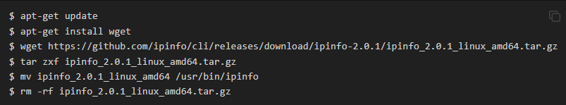
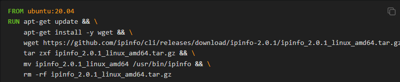
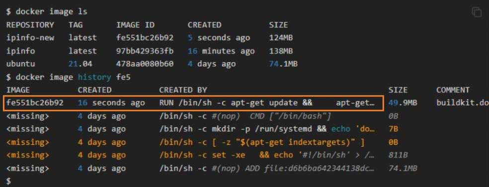
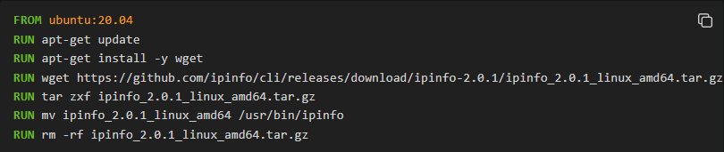
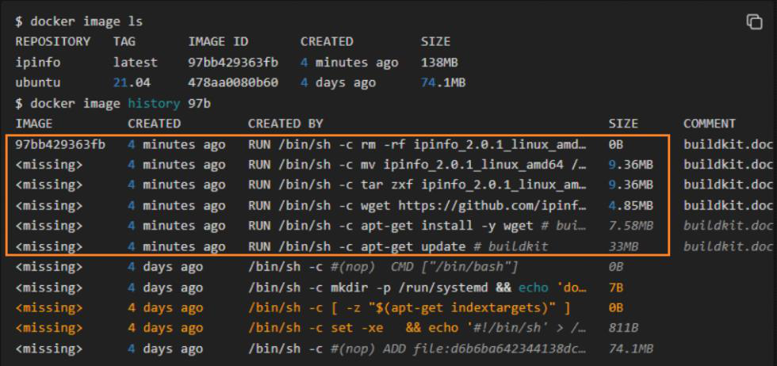

<!-- This md file is originally converted from onenote -->

# [5-3 通過 `RUN` 執行命令](https://dockertips.readthedocs.io/en/latest/dockerfile-guide/run-cmd.html)

2023年2月18日
上午 01:36

## Contents [[↑](#5-3-通過-run-執行命令)]

- [5-3 通過 `RUN` 執行命令](#5-3-通過-run-執行命令)
  - [Contents \[↑\]](#contents-)
    - [`RUN` \[↑\]](#run-)
    - [Examples \[↑\]](#examples-)

### `RUN` [[↑](#5-3-通過-run-執行命令)]

- `RUN` 主要用於在 image 裡執行指令，比如安裝軟件，下載文件, 進行一些簡單的配置等。
  - Linux 的 shell 指令基本上都可以透過 `RUN` 來執行
  - e.g.
    <table>
      <colgroup>
        <col style="width: 100%" />
      </colgroup>
      <thead>
        <tr class="header">
          <th>
            

          </th>
        </tr>
      </thead>
      <tbody>
      </tbody>
    </table>

### Examples [[↑](#5-3-通過-run-執行命令)]

- Good practice
  <table>
    <colgroup>
      <col style="width: 100%" />
    </colgroup>
    <thead>
      <tr class="header">
        <th>
          

          <ul class="incremental">
            <li>
              
$ docker image build <strong>-f</strong> Dockerfile-good -t ipinof .

              <ul class="incremental">
                <li>
                  
$ docker image build <strong>-f</strong> &lt;dockerfile_name&gt; -t &lt;image_name&gt;:&lt;tag&gt;
                    .

                </li>
              </ul>
            </li>
            <li>
              
推薦寫成一條命令, 用一個 `RUN` 來完成所有命令, 使其只生成一層 layer

              <ul class="incremental">
                <li>
                  
這一條 `RUN` 可以寫得很複雜, 幾時行或上百行都可以

                </li>
                <li>
                  
或是將這些命令寫成一個 script, 然後用 `RUN` 來執行這個 script

                </li>
              </ul>
            </li>
          </ul>
        </th>
      </tr>
    </thead>
    <tbody>
      <tr class="odd">
        <td>
          

          <ul class="incremental">
            <li>
              
只產生一層 image layer

            </li>
          </ul>
        </td>
      </tr>
    </tbody>
  </table>

- Bad practice
  <table>
    <colgroup>
      <col style="width: 100%" />
    </colgroup>
    <thead>
      <tr class="header">
        <th>
          

          <ul class="incremental">
            <li>
              
$ docker image build <strong>-f</strong> Dockerfile-bad -t ipinof .

              <ul class="incremental">
                <li>
                  
$ docker image build <strong>-f</strong> &lt;dockerfile_name&gt; -t &lt;image_name&gt;:&lt;tag&gt;
                    .

                </li>
              </ul>
            </li>
            <li>
              
不推薦這種寫法, 因為 `RUN` 會產生一層 layer. Layer 越多, 最後生成的 image 體積就越大

            </li>
          </ul>
        </th>
      </tr>
    </thead>
    <tbody>
      <tr class="odd">
        <td>
          

          <ul class="incremental">
            <li>
              
$ docker image history &lt;image_id&gt;

            </li>
            <li>
              
每個 `RUN` 都產生一層 image layer

              <ul class="incremental">
                <li>
                  
最後的 `RUN` 只有純命令, 所以不佔空間

                </li>
                <li>
                  
每一層的 size 會疊加成最後的 image size, 所以即使最後一層把檔案刪掉了, 由於中間層 
                    持有這些檔案, 所以這些檔案的 size 都會疊加到最後的 image size 上

                </li>
              </ul>
            </li>
          </ul>
        </td>
      </tr>
    </tbody>
  </table>
