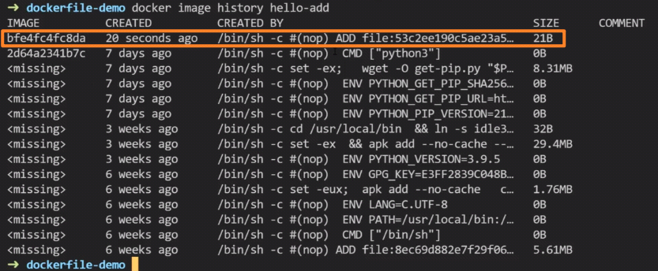

<!-- This md file is originally converted from onenote -->

# [5-4 文件的複製 (`COPY` vs `ADD`)](https://dockertips.readthedocs.io/en/latest/dockerfile-guide/workdir-copy-add.html)

2023年2月18日
下午 02:21

## Contents [[↑](#5-4-文件的複製-copy-vs-add)]

- [5-4 文件的複製 (`COPY` vs `ADD`)](#5-4-文件的複製-copy-vs-add)
  - [Contents \[↑\]](#contents-)
    - [`COPY` vs `ADD` 的聯繫 \[↑\]](#copy-vs-add-的聯繫-)
    - [`COPY` vs `ADD` 的區別 \[↑\]](#copy-vs-add-的區別-)
    - [演示 \[↑\]](#演示-)
    - [`COPY` vs `ADD` 的選擇 \[↑\]](#copy-vs-add-的選擇-)

### `COPY` vs `ADD` 的聯繫 [[↑](#5-4-文件的複製-copy-vs-add)]

- `COPY` 和 `ADD` 都可以把 local 的一個**文件或文件夾**複製到鏡像裡. 並且連執行權限都會一同複製到 image 裡
- 如果目標目錄不存在，則會自動創建
- `COPY` 和 `ADD` 在構建 image 時, 都會增加一層
  <table>
    <colgroup>
      <col style="width: 100%" />
    </colgroup>
    <thead>
      <tr class="header">
        <th>
          <table>
            <colgroup>
              <col style="width: 52%" />
              <col style="width: 47%" />
            </colgroup>
            <thead>
              <tr class="header">
                <td>
                  

                </th>
                <td>
                  

                </th>
              </tr>
            </thead>
          </table>
        </th>
      </tr>
    </thead>
    <tbody>
      <tr class="odd">
        <td>
          

        </td>
      </tr>
    </tbody>
  </table>

### `COPY` vs `ADD` 的區別 [[↑](#5-4-文件的複製-copy-vs-add)]

- `ADD` 比 `COPY` 高級一點的地方是，如果複製的是一個 gzip 等壓縮文件時，**`ADD` 會自動去解壓縮文件** (**壓縮文件本身不會保留在 image 中**)

### 演示 [[↑](#5-4-文件的複製-copy-vs-add)]

- `COPY`
  <table>
    <colgroup>
      <col style="width: 100%" />
    </colgroup>
    <thead>
      <tr class="header">
        <th>
          

          <ul class="incremental">
            <li>
              
$ docker image build <strong>-f</strong> &lt;dockerfile_name&gt; -t &lt;image_name&gt;:&lt;tag&gt; .
              

              <ul class="incremental">
                <li>
                  
$ docker image build <strong>-f</strong> Dockerfile-copy -t hello-copy .

                </li>
              </ul>
            </li>
          </ul>
        </th>
      </tr>
    </thead>
    <tbody>
      <tr class="odd">
        <td>
          

          <ul class="incremental">
            <li>
              
`COPY` 會額外增加一層

            </li>
          </ul>
        </td>
      </tr>
    </tbody>
  </table>

- `ADD`
  <table>
    <colgroup>
      <col style="width: 100%" />
    </colgroup>
    <thead>
      <tr class="header">
        <th>
          

          <ul class="incremental">
            <li>
              
$ docker image build <strong>-f</strong> &lt;dockerfile_name&gt; -t &lt;image_name&gt;:&lt;tag&gt; .
              

              <ul class="incremental">
                <li>
                  
$ docker image build <strong>-f</strong> Dockerfile-add -t hello-add .

                </li>
              </ul>
            </li>
          </ul>
        </th>
      </tr>
    </thead>
    <tbody>
      <tr class="odd">
        <td>
          

          <ul class="incremental">
            <li>
              
`ADD` 會額外增加一層

            </li>
          </ul>
        </td>
      </tr>
    </tbody>
  </table>

- 壓縮文件
  - `COPY` 就原封不動的將其 `COPY` 進 image
  - `ADD` 會將其解壓縮, 並將其解壓縮出來的文件拷貝進 image (**壓縮文件本身不會保留在 image 中**)
    <table>
      <colgroup>
        <col style="width: 100%" />
      </colgroup>
      <thead>
        <tr class="header">
          <th>
            

            <ul class="incremental">
              <li>
                
$ docker image build <strong>-f</strong> &lt;dockerfile_name&gt; -t &lt;image_name&gt;:&lt;tag&gt; .
                

                <ul class="incremental">
                  <li>
                    
$ docker image build <strong>-f</strong> Dockerfile-gzip -t hello-gzip .

                  </li>
                </ul>
              </li>
            </ul>
          </th>
        </tr>
      </thead>
      <tbody>
        <tr class="odd">
          <td>
            

          </td>
        </tr>
        <tr class="even">
          <td>
            

          </td>
        </tr>
      </tbody>
    </table>

### `COPY` vs `ADD` 的選擇 [[↑](#5-4-文件的複製-copy-vs-add)]

- 所有普通文件的複製建議使用 `COPY` 指令，需要自動解壓縮的場合使用 `ADD` 指令.
