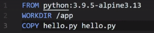
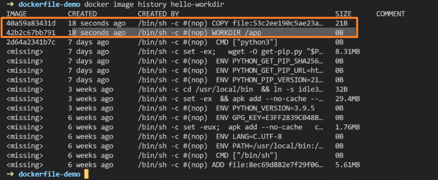
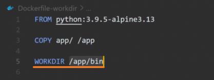

<!-- This md file is originally converted from onenote -->

# 5-4-2 目錄操作 (`WORKDIR`)

2023年2月18日
下午 10:32

## Contents [[↑](#5-4-2-目錄操作-workdir)]

- [5-4-2 目錄操作 (`WORKDIR`)](#5-4-2-目錄操作-workdir)
  - [Contents \[↑\]](#contents-)
    - [`WORKDIR` 的作用 \[↑\]](#workdir-的作用-)
    - [應用場景 \[↑\]](#應用場景-)

### `WORKDIR` 的作用 [[↑](#5-4-2-目錄操作-workdir)]

- 相當於 `cd` 操作
- 但若 `WORKDIR` 指定的目錄不存在, 則會**自動創建**
  <table>
    <colgroup>
      <col style="width: 100%" />
    </colgroup>
    <thead>
      <tr class="header">
        <th>
          

          <ul class="incremental">
            <li>
              
$ docker image build <strong>-f</strong> &lt;dockerfile_name&gt; -t &lt;image_name&gt;:&lt;tag&gt; .
              

              <ul class="incremental">
                <li>
                  
$ docker image build <strong>-f</strong> Dockerfile-workdir -t hello-workdir .

                </li>
              </ul>
            </li>
          </ul>
        </th>
      </tr>
    </thead>
    <tbody>
      <tr class="odd">
        <td>
          

          <ul class="incremental">
            <li>
              
`WORKDIR` 會額外增加一層

            </li>
            <li>
              
因為 `WORKDIR` 只是去進行了一個目錄的變更, 沒有進行任何的文件或者是其他的操作, 所以增加的這一層大小是 0, 並不會影響到最後這個鏡像的大小

            </li>
          </ul>
        </td>
      </tr>
    </tbody>
  </table>

### 應用場景 [[↑](#5-4-2-目錄操作-workdir)]

- 比如從本地複製了一個比較複雜的文件夾目錄到鏡像裡面, 而需要切換到這個文件夾的某一個目錄裡面去執行某些操作
  <table>
    <colgroup>
      <col style="width: 100%" />
    </colgroup>
    <thead>
      <tr class="header">
        <th>
          

        </th>
      </tr>
    </thead>
    <tbody>
    </tbody>
  </table>
