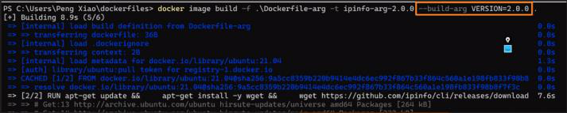

<!-- This md file is originally converted from onenote -->

# [5-5 構建參數和環境變量 (`ARG` vs `ENV`)](https://dockertips.readthedocs.io/en/latest/dockerfile-guide/env_vs_arg.html)

2023年2月18日
下午 10:41

## Contents [[↑](5-5-構建參數和環境變量-arg-vs-env)]

- [5-5 構建參數和環境變量 (`ARG` vs `ENV`)](#5-5-構建參數和環境變量-arg-vs-env)
  - [Contents \[↑\]](#contents-)
    - [`ARG` 和 `ENV` \[↑\]](#arg-和-env-)
    - [使用場景 \[↑\]](#使用場景-)
    - [`ARG` 的靈活使用 \[↑\]](#arg-的靈活使用-)
    - [`ARG` 的安全問題 \[↑\]](#arg-的安全問題-)

### `ARG` 和 `ENV` [[↑](5-5-構建參數和環境變量-arg-vs-env)]

- `ARG` 和 `ENV` 都可以用來設置一個"變量". 語法上也幾乎是完全一樣的.
  - `ARG` 和 `ENV` 是經常容易被混淆的兩個 `Dockerfile` 的語法，語法上幾乎沒有區別, 都可以用來設置一個“變量”, 並在 `Dockerfile` 裡面去引用它.
  - 但實際上兩者在**作用域**上有很大的不同:
    - `ARG` 的變量只存在於 image **構建階段**, 並不會保存在 image 當中, 之後創建的 container 也不會有這個變量
    - `ENV` 的變量不只用於 image 構建階段, 也會保存在 image 中作為環境變量存在, 之後創建的 container 會將該變量作為**環境變量**
    - 選擇
      - `ARG` 關注的是構建 image 使用的變量
      - `ENV` 關注的是之後的 container 是否可以使用的變量

### 使用場景 [[↑](5-5-構建參數和環境變量-arg-vs-env)]

- 將版本號用變量來定義
  <table>
    <colgroup>
      <col style="width: 100%" />
    </colgroup>
    <thead>
      <tr class="header">
        <th>
          

        </th>
      </tr>
    </thead>
    <tbody>
    </tbody>
  </table>

- 語法上沒有區別
  <table>
    <colgroup>
      <col style="width: 100%" />
    </colgroup>
    <thead>
      <tr class="header">
        <th>
          

        </th>
      </tr>
    </thead>
    <tbody>
      <tr class="odd">
        <td>
          

        </td>
      </tr>
    </tbody>
  </table>

- 構建 image
  - $ `docker image build` **`-f`** `<dockerfile_name> -t <image_name>:<tag> .`
    - $ `docker image build` **`-f`** `Dockerfile-env -t ipinfo-env .`
    - $ `docker image build` **`-f`** `Dockerfile-arg -t ipinfo-arg .`
  - 效果
    <table>
      <colgroup>
        <col style="width: 100%" />
      </colgroup>
      <thead>
        <tr class="header">
          <th>
            

          </th>
        </tr>
      </thead>
      <tbody>
        <tr class="odd">
          <td>
            

          </td>
        </tr>
        <tr class="even">
          <td>
            

          </td>
        </tr>
      </tbody>
    </table>

- 差異 - **作用域**上的不同
  <table>
    <colgroup>
      <col style="width: 100%" />
    </colgroup>
    <thead>
      <tr class="header">
        <th>
          

          <ul class="incremental">
            <li>
              
`ARG` 的變量只存在於 image 構建階段, 並不會保存在 image 當中, 之後創建的 container 也不會有這個變量

            </li>
            <li>
              
`ENV` 的變量不只用於 image 構建階段, 也會保存在 image 中作為環境變量存在, 之後創建的 container 會將該變量作為環境變量

            </li>
            <li>
              
選擇

              <ul class="incremental">
                <li>
                  
ARG 關注的是構建 image 使用的變量

                </li>
                <li>
                  
ENV 關注的是之後 container 是否可以使用的變量

                </li>
              </ul>
            </li>
          </ul>
        </th>
      </tr>
    </thead>
    <tbody>
      <tr class="odd">
        <td>
          

          <ul class="incremental">
            <li>
              
`ENV` 的變量不只用於 image 構建階段, 也會保存在 image 中作為環境變量存在, 之後創建的 container 會將該變量作為環境變量

            </li>
          </ul>
        </td>
      </tr>
      <tr class="even">
        <td>
          

          <ul class="incremental">
            <li>
              
`ARG` 的變量只存在於 image 構建階段, 並不會保存在 image 當中, 之後創建的 container 也不會有這個變量

            </li>
          </ul>
        </td>
      </tr>
    </tbody>
  </table>

### `ARG` 的靈活使用 [[↑](5-5-構建參數和環境變量-arg-vs-env)]

- $ `docker image build --help`
  <table>
    <colgroup>
      <col style="width: 100%" />
    </colgroup>
    <thead>
      <tr class="header">
        <th>
          

          <blockquote>
          </blockquote>
        </th>
      </tr>
    </thead>
    <tbody>
    </tbody>
  </table>

- $ `docker image build -f Dockerfile-arg -t ipinfo-arg-2.0.0` **`--build-arg VERSION 2.0.0`** `.`
  - 使用 `--build-arg` 在構建 image 時, 可以在不需改 `dockerfile` 的情況下, 就可以動態修改 `ARG` 變量的值
    <table>
      <colgroup>
        <col style="width: 100%" />
      </colgroup>
      <thead>
        <tr class="header">
          <th>
            

          </th>
        </tr>
      </thead>
      <tbody>
        <tr class="odd">
          <td>
            

          </td>
        </tr>
      </tbody>
    </table>

### `ARG` 的安全問題 [[↑](5-5-構建參數和環境變量-arg-vs-env)]

- `ARG` 只能用於普通的參數傳遞, 不能用於敏感參數. `ARG` with `--build-arg` 無法起到保護敏感參數的效果
  <table>
    <colgroup>
      <col style="width: 100%" />
    </colgroup>
    <thead>
      <tr class="header">
        <th>
          

        </th>
      </tr>
    </thead>
    <tbody>
      <tr class="odd">
        <td>
          

        </td>
      </tr>
      <tr class="even">
        <td>
          

          <ul class="incremental">
            <li>
              
$ docker image history &lt;image_name&gt;

              <ul class="incremental">
                <li>
                  
$ docker image history &lt;image_name&gt; --no-trunc

                </li>
              </ul>
            </li>
            <li>
              
這個 token 可以從 image history 中看到, 所以不安全

            </li>
          </ul>
          <table>
            <colgroup>
              <col style="width: 100%" />
            </colgroup>
            <thead>
              <tr class="header">
                <th>
                  

                </th>
              </tr>
            </thead>
            <tbody>
            </tbody>
          </table>
        </td>
      </tr>
    </tbody>
  </table>

- 可能的解決方法
  - 多階段構建
  - 使用 secret
  - Refer to "13-5 如何在Docker Image的構建階段保護敏感信息" for details
