<!-- This md file is originally converted from onenote -->

# [5-6-1 容器啟動命令 `CMD`](https://dockertips.readthedocs.io/en/latest/dockerfile-guide/cmd.html)

2023年2月18日
下午 11:48

## Contents [[↑](#5-6-1-容器啟動命令-cmd)]

- [5-6-1 容器啟動命令 `CMD`](#5-6-1-容器啟動命令-cmd)
  - [Contents \[↑\]](#contents-)
    - [`CMD` 用法 \[↑\]](#cmd-用法-)
    - [演練1 \[↑\]](#演練1-)
    - [演練2 \[↑\]](#演練2-)
    - [演練3 \[↑\]](#演練3-)

### `CMD` 用法 [[↑](#5-6-1-容器啟動命令-cmd)]

- 用來設置容器**啟動時默認**會執行的命令
- 如果 docker container **run** 啟動容器時**指定了其它命令**，則 `CMD` 命令會被忽略
- 如果定義了多個 `CMD`，**只有最後一個會被執行**

### 演練1 [[↑](#5-6-1-容器啟動命令-cmd)]

- Dockerfile
  <table>
    <colgroup>
      <col style="width: 100%" />
    </colgroup>
    <thead>
      <tr class="header">
        <th>
          
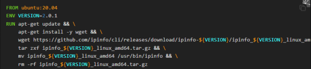

        </th>
      </tr>
    </thead>
    <tbody>
    </tbody>
  </table>

- 構建 image
  - $ `docker image build -t ipinfo .`

- 運行容器
  - $ `docker container run -it ipinfo`
    - 後面沒有任何命令, 結果直接進入 `shell`
      <table>
        <colgroup>
          <col style="width: 100%" />
        </colgroup>
        <thead>
          <tr class="header">
            <th>
              
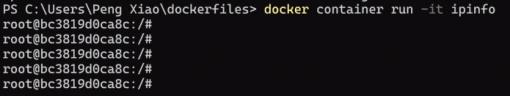

            </th>
          </tr>
        </thead>
        <tbody>
        </tbody>
      </table>

- 查看 image history
  <table>
    <colgroup>
      <col style="width: 100%" />
    </colgroup>
    <thead>
      <tr class="header">
        <th>
          
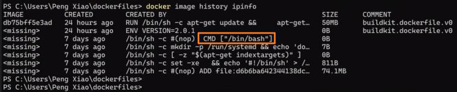

          <ul class="incremental">
            <li>
              
雖然 Dockerfile 沒有定義 `CMD`, 但 base image `ubuntu:21.04` 有定義了 `CMD`, 
                所以就會以它作為容器<strong>啟動時默認</strong>會執行的命令

            </li>
          </ul>
        </th>
      </tr>
    </thead>
    <tbody>
    </tbody>
  </table>

- `docker container run` 啟動容器時**指定了其它命令**
  - $ `docker container run -it ipinfo` **`ipinfo`**
  - 後面接 ipinfo 命令, 這個命令會覆蓋 `ubuntu:21.04` image 內的 `CMD`
    <table>
      <colgroup>
        <col style="width: 100%" />
      </colgroup>
      <thead>
        <tr class="header">
          <th>
            
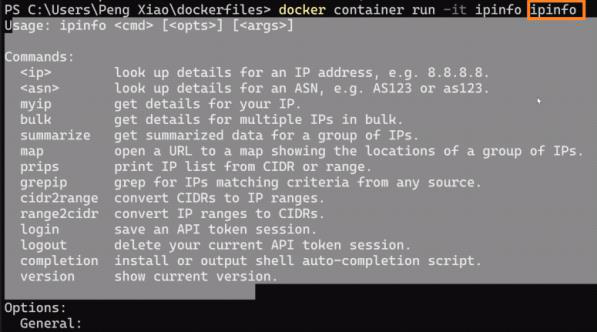

          </th>
        </tr>
      </thead>
      <tbody>
      </tbody>
    </table>

### 演練2 [[↑](#5-6-1-容器啟動命令-cmd)]

- 在 `Dockerfile` 中添加 `CMD` - 1
  - 這個 `CMD` 會覆蓋 `ubuntu:21.04` image 內的 `CMD`
    <table>
      <colgroup>
        <col style="width: 100%" />
      </colgroup>
      <thead>
        <tr class="header">
          <th>
            
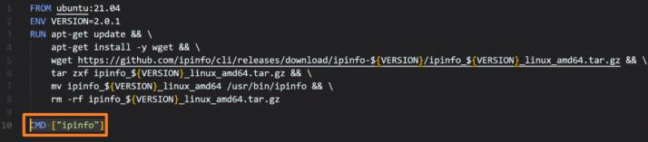

          </th>
        </tr>
      </thead>
      <tbody>
      </tbody>
    </table>

- 構建 image
  - $ `docker image build -t ipinfo-new .`

- 運行容器
  - $ `docker container run -it ipinfo-new`
  - 後面沒有任何命令, 結果會執行 image 中最後定義的 `CMD`, 也就是 `ipinfo`
    <table>
      <colgroup>
        <col style="width: 100%" />
      </colgroup>
      <thead>
        <tr class="header">
          <th>
            
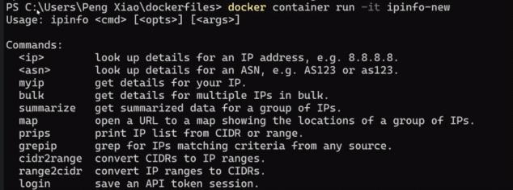

          </th>
        </tr>
      </thead>
      <tbody>
      </tbody>
    </table>

### 演練3 [[↑](#5-6-1-容器啟動命令-cmd)]

- 在 `Dockerfile` 中添加 `CMD` - 2
  - 這個空的 `CMD` 也會覆蓋 ubuntu:21.04 image 內的 `CMD`
    <table>
      <colgroup>
        <col style="width: 100%" />
      </colgroup>
      <thead>
        <tr class="header">
          <th>
            
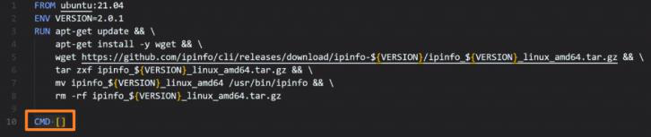

          </th>
        </tr>
      </thead>
      <tbody>
      </tbody>
    </table>

- 運行容器 - RUN1
  - $ `docker container run -it ipinfo`
  - 後面沒有任何命令, 結果會報錯, 因為沒有命令
    <table>
      <colgroup>
        <col style="width: 100%" />
      </colgroup>
      <thead>
        <tr class="header">
          <th>
            
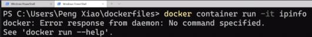

          </th>
        </tr>
      </thead>
      <tbody>
      </tbody>
    </table>

- 運行容器 - RUN2
  - $ `docker container run -it ipinfo` **`ipinfo 8.8.8.8`**
  - 後面接 `ipinfo 8.8.8.8` 命令
    <table>
      <colgroup>
        <col style="width: 100%" />
      </colgroup>
      <thead>
        <tr class="header">
          <th>
            
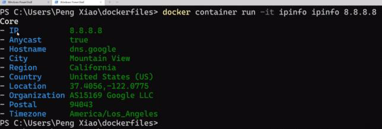

            <ul class="incremental">
              <li>
                
命令執行完, 容器的生命週期就結束了

              </li>
            </ul>
            <table>
              <colgroup>
                <col style="width: 100%" />
              </colgroup>
              <thead>
                <tr class="header">
                  <th>
                    
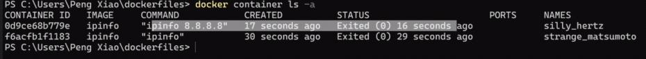

                  </th>
                </tr>
              </thead>
              <tbody>
              </tbody>
            </table>
          </th>
        </tr>
      </thead>
      <tbody>
      </tbody>
    </table>

- 運行容器 with `--rm` - RUN3
  - $ `docker container run` **`--rm`** `-it ipinfo` `ipinfo 8.8.8.8`
    - 容器退出後直接刪除容器
      <table>
        <colgroup>
          <col style="width: 100%" />
        </colgroup>
        <thead>
          <tr class="header">
            <th>
              
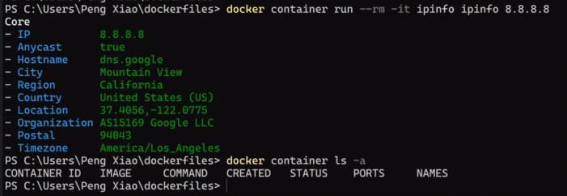

            </th>
          </tr>
        </thead>
        <tbody>
        </tbody>
      </table>
