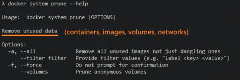
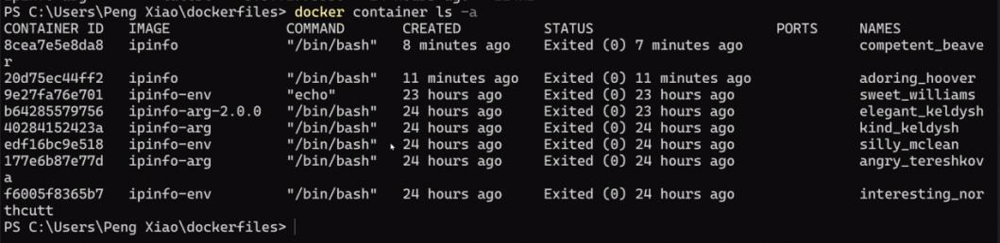
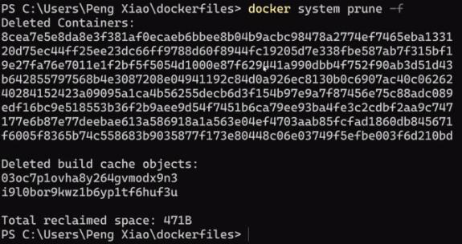
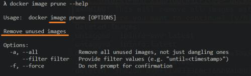
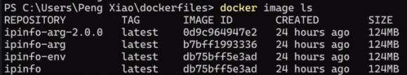
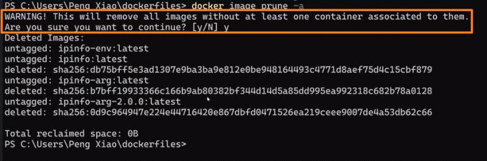
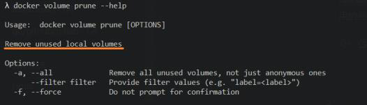
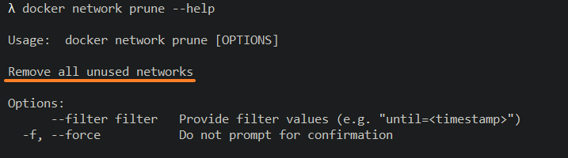

<!-- This md file is originally converted from onenote -->

# 5-6-2 清理數據的命令

2023年2月19日
上午 12:48

## Contents [[↑](#5-6-2-清理數據的命令)]

- [5-6-2 清理數據的命令](#5-6-2-清理數據的命令)
  - [Contents \[↑\]](#contents-)
    - [`docker` **`system prune`** \[↑\]](#docker-system-prune-)
    - [`docker` **`image prune`** \[↑\]](#docker-image-prune-)
    - [其他相關操作 \[↑\]](#其他相關操作-)

### `docker` **`system prune`** [[↑](#5-6-2-清理數據的命令)]

- $ `docker` **`system prune` `-f`**
  - 清理所有停止的容器, 未停止的容器不會被刪除
    <table>
      <colgroup>
        <col style="width: 100%" />
      </colgroup>
      <thead>
        <tr class="header">
          <th>
            

            <ul class="incremental">
              <li>
                
刪除

                <ul class="incremental">
                  <li>
                    
未使用的容器：所有 **處於 exited 狀態** 或 **已停止的容器** 會被刪除

                  </li>
                  <li>
                    
未使用的 **dangling** images：任何沒有被容器引用的 dangling images 會被刪除

                    <ul class="incremental">
                      <li>
                        
dangling images 是指沒有關聯任何標記的中間層鏡像

                      </li>
                      <li>
                        
`-a` 選項會刪除所有未使用的鏡像，不僅僅是懸 dangling images

                      </li>
                    </ul>
                  </li>
                  <li>
                    
未使用的卷：如果卷沒有被任何容器使用，也會被刪除

                  </li>
                  <li>
                    
未使用的網絡：未被任何容器使用的網絡會被刪除

                  </li>
                  <li>
                    
不加上 `-f` 選項的話, 這個命令會交互式詢問您是否確認刪除未使用的數據

                  </li>
                </ul>
              </li>
              <li>
                
不會刪除

                <ul class="incremental">
                  <li>
                    
不會刪除正在運行的容器

                  </li>
                  <li>
                    
該命令不會刪除命名卷，即使它們沒有被使用（需要顯式刪除未使用的命名卷）

                  </li>
                </ul>
              </li>
              <li>
                
清理時要謹慎操作，特別是在生產環境中，以免誤刪一些可能需要的資源

              </li>
            </ul>
          </th>
        </tr>
      </thead>
    </table>
  
  - 示範
    <table>
      <colgroup>
        <col style="width: 100%" />
      </colgroup>
      <thead>
        <tr class="header">
          <td>
            

          </td>
        </tr>
      </thead>
      <tbody>
        <tr class="odd">
          <td>
            

          </td>
        </tr>
      </tbody>
    </table>

### `docker` **`image prune`** [[↑](#5-6-2-清理數據的命令)]

- $ `docker` **`image prune -a`**
  - 刪除所有沒在使用的 images, 正在使用的 images 不會被刪除
    <table>
      <colgroup>
        <col style="width: 100%" />
      </colgroup>
      <thead>
        <tr class="header">
          <th>
            

            <ul class="incremental">
              <li>
                
刪除

                <ul class="incremental">
                  <li>
                    
未使用的 dangling images：任何沒有被容器引用的 dangling images 會被刪除。dangling images 是指沒有關聯任何標記的中間層鏡像。

                    <ul class="incremental">
                      <li>
                        
`-a` 選項會刪除所有未使用的鏡像，不僅僅是懸 dangling images

                      </li>
                    </ul>
                  </li>
                </ul>
              </li>
              <li>
                
不會刪除

                <ul class="incremental">
                  <li>
                    
不會刪除正在使用的鏡像：即使使用 `-a` 選項，`docker image prune` 也不會刪除當前正在運行容器所使用的鏡像。

                  </li>
                </ul>
              </li>
            </ul>
          </th>
        </tr>
      </thead>
    </table>
  
  - 示範
    <table>
      <colgroup>
        <col style="width: 100%" />
      </colgroup>
      <thead>
        <tr class="header">
          <td>
            

          </td>
        </tr>
      </thead>
      <tbody>
        <tr class="odd">
          <td>
            

            <ul class="incremental">
              <li>
                
不加上 `-f` 選項的話, 這個命令會交互式詢問您是否確認刪除未使用的 images

              </li>
            </ul>
          </td>
        </tr>
      </tbody>
    </table>

### 其他相關操作 [[↑](#5-6-2-清理數據的命令)]

- $ `docker` **`volume prune`**
  <table>
    <colgroup>
      <col style="width: 100%" />
    </colgroup>
    <thead>
      <tr class="header">
        <th>
          

          <ul class="incremental">
            <li>
              
刪除

              <ul class="incremental">
                <li>
                  
未使用的匿名卷, 即會刪除那些沒有被任何容器掛載的匿名卷，通常是指已經停止或刪除的容器所使用過的匿名卷

                </li>
              </ul>
            </li>
            <li>
              
不會刪除

              <ul class="incremental">
                <li>
                  
不會刪除正在使用的卷

                </li>
                <li>
                  
不會刪除命名卷，即使它們沒有被使用

                </li>
              </ul>
            </li>
          </ul>
        </th>
      </tr>
    </thead>
    <tbody>
    </tbody>
  </table>

- $ `docker` **`network prune`**
  <table>
    <colgroup>
      <col style="width: 100%" />
    </colgroup>
    <thead>
      <tr class="header">
        <th>
          

          <ul class="incremental">
            <li>
              
刪除

              <ul class="incremental">
                <li>
                  
刪除未使用的網絡：這個命令會刪除那些不再與任何運行中或停止的容器相關聯的 Docker 網絡

                </li>
              </ul>
            </li>
            <li>
              
不會刪除

              <ul class="incremental">
                <li>
                  
不會刪除 Docker 自帶的默認網絡（如 `bridge`、`host`、`none`）

                </li>
                <li>
                  
不會刪除正在使用的網絡

                </li>
              </ul>
            </li>
          </ul>
        </th>
      </tr>
    </thead>
    <tbody>
    </tbody>
  </table>
