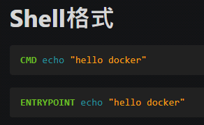
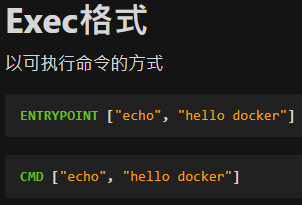
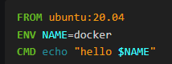
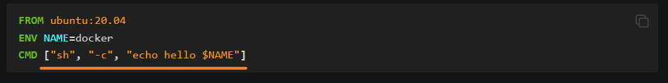
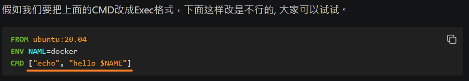

<!-- This md file is originally converted from onenote -->

# [5-7-2 `Shell` 格式和 `Exec` 格式](https://dockertips.readthedocs.io/en/latest/dockerfile-guide/shell-exec.html)

2023年2月19日
上午 04:37

## Contents [[↑](#5-7-2-shell-格式和-exec-格式)]

- [5-7-2 `Shell` 格式和 `Exec` 格式](#5-7-2-shell-格式和-exec-格式)
  - [Contents \[↑\]](#contents-)
    - [`Shell` 格式 \[↑\]](#shell-格式-)
    - [`Exec` 格式 \[↑\]](#exec-格式-)
    - [注意事項 \[↑\]](#注意事項-)

### `Shell` 格式 [[↑](#5-7-2-shell-格式和-exec-格式)]

- e.g.
  <table>
    <colgroup>
      <col style="width: 100%" />
    </colgroup>
    <thead>
      <tr class="header">
        <th>
          

        </th>
      </tr>
    </thead>
    <tbody>
    </tbody>
  </table>

### `Exec` 格式 [[↑](#5-7-2-shell-格式和-exec-格式)]

- 寫 `Dockerfile` 時, 比較常使用 `Exec` 格式
- e.g.
  <table>
    <colgroup>
      <col style="width: 100%" />
    </colgroup>
    <thead>
      <tr class="header">
        <th>
          

          <ul class="incremental">
            <li>
              
注意要用<strong>雙引號</strong>

            </li>
          </ul>
        </th>
      </tr>
    </thead>
    <tbody>
    </tbody>
  </table>

### 注意事項 [[↑](#5-7-2-shell-格式和-exec-格式)]

- `Dockerfile` 中執行讀取環境變數的注意事項

  - 使用 `Shell` 格式讀取環境變數的方式
    <table>
      <colgroup>
        <col style="width: 100%" />
      </colgroup>
      <thead>
        <tr class="header">
          <th>
            

          </th>
        </tr>
      </thead>
      <tbody>
      </tbody>
    </table>

  - 使用 `Exec` 格式讀取環境變數的方式
    <table>
      <colgroup>
        <col style="width: 100%" />
      </colgroup>
      <thead>
        <tr class="header">
          <th>
            

            <ul class="incremental">
              <li>
                
要以執行 shell 腳本的方式執行

              </li>
            </ul>
          </th>
        </tr>
      </thead>
      <tbody>
      </tbody>
    </table>

    - `Exec` 格式直接使用 `$NAME` 會抓不到, 而解析成字串 "$NAME"
      <table>
        <colgroup>
          <col style="width: 100%" />
        </colgroup>
        <thead>
          <tr class="header">
            <th>
              

              <ul class="incremental">
                <li>
                  
會輸出 hello $NAME , 而不是 hello docker

                </li>
              </ul>
            </th>
          </tr>
        </thead>
        <tbody>
        </tbody>
      </table>
