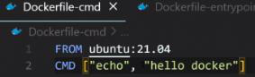
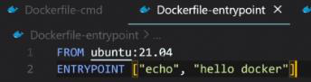
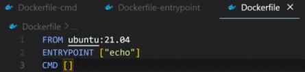
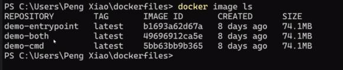
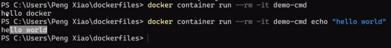
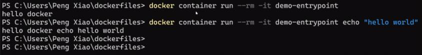
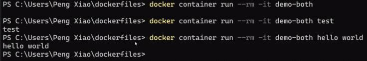

<!-- This md file is originally converted from onenote -->

# [5-7-1 容器啟動命令 `ENTRYPOINT`](https://dockertips.readthedocs.io/en/latest/dockerfile-guide/entrypoint.html)

2023年2月19日 上午 04:23

## Contents [[↑](#5-7-1-容器啟動命令-entrypoint)]

- [5-7-1 容器啟動命令 `ENTRYPOINT`](#5-7-1-容器啟動命令-entrypoint)
  - [Contents \[↑\]](#contents-)
    - [`ENTRYPOINT` \[↑\]](#entrypoint-)
    - [`ENTRYPOINT` 與 `CMD` 的區別 \[↑\]](#entrypoint-與-cmd-的區別-)
    - [示範 \[↑\]](#示範-)

### `ENTRYPOINT` [[↑](#5-7-1-容器啟動命令-entrypoint)]
  
- 用來設置容器**啟動時**會執行的命令

### `ENTRYPOINT` 與 `CMD` 的區別 [[↑](#5-7-1-容器啟動命令-entrypoint)]

- `CMD` 設置的命令，可以在 `docker container run` 時傳入其它命令，覆蓋掉 `CMD` 的命令，但是 **`ENTRYPOINT` 所設置的命令是一定會被執行的**

### 示範 [[↑](#5-7-1-容器啟動命令-entrypoint)]

- 鏡像準備
  <table>
    <colgroup>
      <col style="width: 100%" />
    </colgroup>
    <thead>
      <tr class="header">
        <th>
          <table>
            <colgroup>
              <col style="width: 26%" />
              <col style="width: 32%" />
              <col style="width: 41%" />
            </colgroup>
            <thead>
              <tr class="header">
                <th>
                  

                </th>
                <th>
                  

                </th>
                <th>
                  

                </th>
              </tr>
            </thead>
            <tbody>
            </tbody>
          </table>
        </th>
      </tr>
    </thead>
    <tbody>
      <tr class="odd">
        <td>
          

        </td>
      </tr>
    </tbody>
  </table>

- 效果
  - `CMD`
    <table>
      <colgroup>
        <col style="width: 100%" />
      </colgroup>
      <thead>
        <tr class="header">
          <td>
            

          </td>
        </tr>
      </thead>
      <tbody>
        <tr class="odd">
          <td>
            

          </td>
        </tr>
      </tbody>
    </table>

  - `ENTRYPOINT`
    <table>
      <colgroup>
        <col style="width: 100%" />
      </colgroup>
      <thead>
        <tr class="header">
          <td>
            

          </td>
        </tr>
      </thead>
      <tbody>
        <tr class="odd">
          <th>
            

            <ul class="incremental">
              <li>
                
$ docker container run --rm -it demo-entrypoint <strong>echo "hello world"</strong>

              </li>
              <li>
                
相當於將 <strong>`echo "hello world"`</strong> 作為參數傳給個 `ENTRYPOINT`

                <ul class="incremental">
                  <li>
                    
`ENTRYPOINT` ["echo, "hello docker", "echo hello world"]

                  </li>
                </ul>
              </li>
            </ul>
          </th>
        </tr>
      </tbody>
    </table>

  - Both
    - `ENTRYPOINT` 和 `CMD` 可以聯合使用，`ENTRYPOINT` 設置執行的命令，`CMD` 傳遞參數
      <table>
      <colgroup>
        <col style="width: 100%" />
      </colgroup>
      <thead>
        <tr class="header">
          <td>
            

          </td>
        </tr>
      </thead>
      <tbody>
        <tr class="odd">
          <th>
            

          </th>
        </tr>
      </tbody>
    </table>
