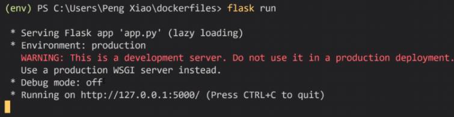

<!-- This md file is originally converted from onenote -->

# [5-8 建構一個 Python-Flask 鏡像](https://dockertips.readthedocs.io/en/latest/dockerfile-guide/python-flask.html)

2023年2月19日
上午 04:43

## Contents [[↑](#5-8-建構一個-python-flask-鏡像)]

- [5-8 建構一個 Python-Flask 鏡像](#5-8-建構一個-python-flask-鏡像)
  - [Contents \[↑\]](#contents-)
    - [Python 程序](#python-程序)
    - [本機安裝運行](#本機安裝運行)
    - [使用 Docker container 運行](#使用-docker-container-運行)

### Python 程序

- 如何運行以下 Python-Flask 程序
  <table>
    <colgroup>
      <col style="width: 100%" />
    </colgroup>
    <thead>
      <tr class="header">
        <th>
          

        </th>
      </tr>
    </thead>
    <tbody>
    </tbody>
  </table>

### 本機安裝運行

- 先自己安裝 python
  <table>
    <colgroup>
      <col style="width: 100%" />
    </colgroup>
    <thead>
      <tr class="header">
        <th>
          

        </th>
      </tr>
    </thead>
    <tbody>
    </tbody>
  </table>

- 安裝 flask
  - 在本地先創建一個虛擬環境
    <table>
      <colgroup>
        <col style="width: 100%" />
      </colgroup>
      <thead>
        <tr class="header">
          <th>
            

          </th>
        </tr>
      </thead>
      <tbody>
      </tbody>
    </table>

  - 在虛擬環境中安裝 flask
    <table>
      <colgroup>
        <col style="width: 100%" />
      </colgroup>
      <thead>
        <tr class="header">
          <th>
            

          </th>
        </tr>
      </thead>
      <tbody>
      </tbody>
    </table>

- 運行 flask
  - 設定環境變量
    - Mac/Linux
      <table>
        <colgroup>
          <col style="width: 100%" />
        </colgroup>
        <thead>
          <tr class="header">
            <th>
              

            </th>
          </tr>
        </thead>
        <tbody>
        </tbody>
      </table>

    - Windows Power shell
      <table>
        <colgroup>
          <col style="width: 100%" />
        </colgroup>
        <thead>
          <tr class="header">
            <th>
              

            </th>
          </tr>
        </thead>
        <tbody>
        </tbody>
      </table>

  - Run
    <table>
      <colgroup>
        <col style="width: 100%" />
      </colgroup>
      <thead>
        <tr class="header">
          <th>
            

          </th>
        </tr>
      </thead>
      <tbody>
        <tr class="odd">
          <td>
            

          </td>
        </tr>
      </tbody>
    </table>

### 使用 Docker container 運行

- 準備 Dockerfile
  - 先去 docker hub 找一個 python 的基礎競像, 找一個 size 小一點的
    <table>
      <colgroup>
        <col style="width: 100%" />
      </colgroup>
      <thead>
        <tr class="header">
          <th>
            

          </th>
        </tr>
      </thead>
      <tbody>
      </tbody>
    </table>

  - Dockerfile
    <table>
      <colgroup>
        <col style="width: 100%" />
      </colgroup>
      <thead>
        <tr class="header">
          <th>
            

          </th>
        </tr>
      </thead>
      <tbody>
      </tbody>
    </table>

    - [Optional] VS code 插件
      <table>
        <colgroup>
          <col style="width: 100%" />
        </colgroup>
        <thead>
          <tr class="header">
            <th>
              

            </th>
          </tr>
        </thead>
        <tbody>
        </tbody>
      </table>

- Build
  - $ `docker image build -t flask-demo .`
    <table>
      <colgroup>
        <col style="width: 100%" />
      </colgroup>
      <thead>
        <tr class="header">
          <th>
            

          </th>
        </tr>
      </thead>
      <tbody>
      </tbody>
    </table>

- Image and container
  <table>
    <colgroup>
      <col style="width: 100%" />
    </colgroup>
    <thead>
      <tr class="header">
        <th>
          

        </th>
      </tr>
    </thead>
    <tbody>
      <tr class="odd">
        <td>
          

          <ul class="incremental">
            <li>
              
沒有指定端口轉發, 這樣是無法從外面訪問容器的

            </li>
          </ul>
        </td>
      </tr>
      <tr class="even">
        <td>
          

          <ul class="incremental">
            <li>
              
指定端口轉發

              <ul class="incremental">
                <li>
                  
$ docker container run -d <strong>-p 5000:5000</strong> flask-demo

                  <ul class="incremental">
                    <li>
                      
-p &lt;本地端口&gt;:&lt;容器端口&gt;

                    </li>
                  </ul>
                </li>
              </ul>
            </li>
          </ul>
        </td>
      </tr>
      <tr class="odd">
        <td>
          

        </td>
      </tr>
    </tbody>
  </table>

- `EXPOSE 5000` 的補充
  - [7-11 端口轉發和 Dockerfile](../7-docker-network/7-11-port-forwarding-and-dockerfile.md)
