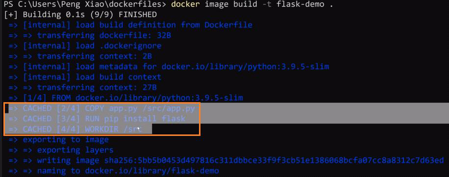
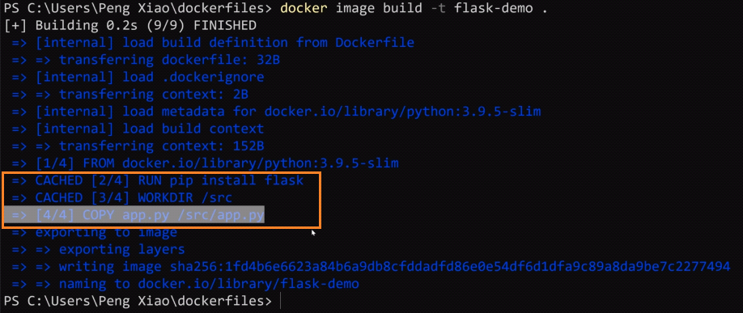

<!-- This md file is originally converted from onenote -->

# [5-9 合理使用緩存](https://dockertips.readthedocs.io/en/latest/best-practise/build-cache.html)

2023年2月20日
下午 12:35

## Contents [[↑](#5-9-合理使用緩存)]

- [5-9 合理使用緩存](#5-9-合理使用緩存)
  - [Contents \[↑\]](#contents-)
    - [Dockerfile - 使用緩存 \[↑\]](#dockerfile---使用緩存-)
    - [Dockerfile - 更改 app.py \[↑\]](#dockerfile---更改-apppy-)
    - [Dockerfile 改進 \[↑\]](#dockerfile-改進-)

### Dockerfile - 使用緩存 [[↑](#5-9-合理使用緩存)]

- Dockerfile 中的每一層都會生成一個 cache
  <table>
    <colgroup>
      <col style="width: 100%" />
    </colgroup>
    <thead>
      <tr class="header">
        <th>
          

        </th>
      </tr>
    </thead>
    <tbody>
    </tbody>
  </table>

- $ `docker image build -f flash-demo .`
  - 因為之前構建過了, 所以系統內留有 cache.
  - 如果系統內有 cache, 構建 image 的過程, 會優先使用 cache
    <table>
      <colgroup>
        <col style="width: 100%" />
      </colgroup>
      <thead>
        <tr class="header">
          <th>
            

          </th>
        </tr>
      </thead>
      <tbody>
      </tbody>
    </table>

### Dockerfile - 更改 app.py [[↑](#5-9-合理使用緩存)]

- 更改 app.py
  <table>
    <colgroup>
      <col style="width: 48%" />
      <col style="width: 51%" />
    </colgroup>
    <thead>
      <tr class="header">
        <th>
          

        </th>
        <th>
          

        </th>
      </tr>
    </thead>
    <tbody>
    </tbody>
  </table>

  <table>
    <colgroup>
      <col style="width: 100%" />
    </colgroup>
    <thead>
      <tr class="header">
        <th>
          

        </th>
      </tr>
    </thead>
    <tbody>
    </tbody>
  </table>

  - 雖然只改變了一層, 其他層的指令不變. 但因為 cache 會連動, 所以往後的每一層 cache 也都失效了
    <table>
      <colgroup>
        <col style="width: 100%" />
      </colgroup>
      <thead>
        <tr class="header">
          <th>
            

            <ul class="incremental">
              <li>
                
特別是 `RUN pip install flask` 會比較慢, 要儘可能使用 cache

              </li>
            </ul>
          </th>
        </tr>
      </thead>
      <tbody>
      </tbody>
    </table>

### Dockerfile 改進 [[↑](#5-9-合理使用緩存)]

- 把容易發生改變的內容放到後面, 這樣可以提高 cache 的使用率
  <table>
    <colgroup>
      <col style="width: 100%" />
    </colgroup>
    <thead>
      <tr class="header">
        <th>
          

        </th>
      </tr>
    </thead>
    <tbody>
    </tbody>
  </table>

  <table>
    <colgroup>
      <col style="width: 100%" />
    </colgroup>
    <thead>
      <tr class="header">
        <th>
          

        </th>
      </tr>
    </thead>
    <tbody>
    </tbody>
  </table>
