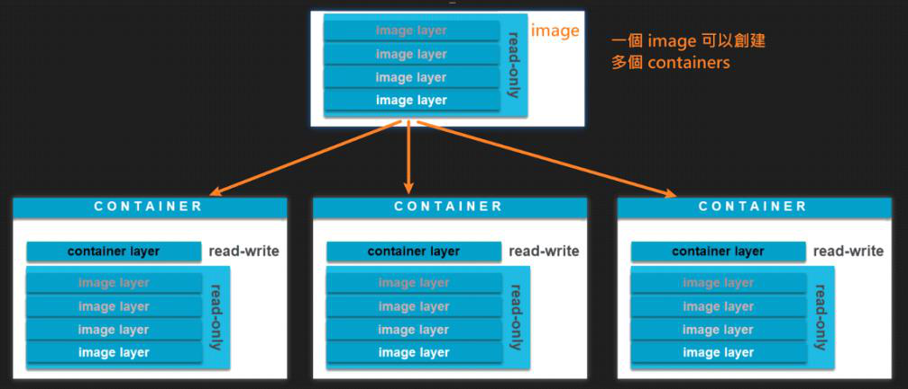
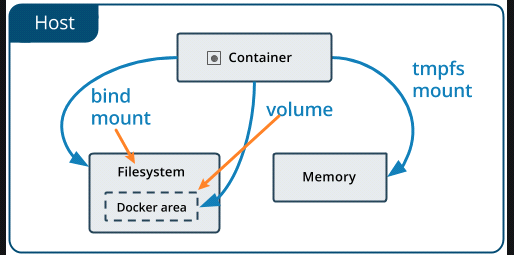

<!-- This md file is originally converted from onenote -->

# [6-1 介紹](https://dockertips.readthedocs.io/en/latest/docker-volume/intro.html)

2023年2月24日
上午 02:11

## Contents [[↑](#6-1-介紹)]

- [6-1 介紹](#6-1-介紹)
  - [Contents \[↑\]](#contents-)
    - [Docker 的存儲 \[↑\]](#docker-的存儲-)
    - [Docker 數據持久化的需求 \[↑\]](#docker-數據持久化的需求-)
    - [Docker 數據持久化的方式 \[↑\]](#docker-數據持久化的方式-)

### Docker 的存儲 [[↑](#6-1-介紹)]

- 實際上想要去解決的問題就是數據的一個持久化
- 默認情況下，在運行中的容器裡創建的文件，被保存在一個**可寫的容器層** - [鏡像和容器](../3-quick-start/3-2-image-and-container.md)
  <table>
    <colgroup>
      <col style="width: 100%" />
    </colgroup>
    <thead>
      <tr class="header">
        <th>
          

          <ul class="incremental">
            <li>
              
如果容器被刪除了，則數據也沒有了

              <ul class="incremental">
                <li>
                  
如果只是停止容器, container layer 不會被刪除, data 還在

                </li>
              </ul>
            </li>
            <li>
              
這個可寫的容器層是和特定的<strong>容器綁定的</strong>，也就是這些<strong>數據無法</strong>方便的<strong>和其它容器共享</strong>

            </li>
          </ul>
        </th>
      </tr>
    </thead>
    <tbody>
    </tbody>
  </table>

### Docker 數據持久化的需求 [[↑](#6-1-介紹)]

- 數據最好可以保存下來, e.g. 數據庫
- 這個數據也可以被其他的容器使用

### Docker 數據持久化的方式 [[↑](#6-1-介紹)]

- Docker 主要提供了兩種方式做數據的持久化
  - **Data Volume**:
    - **由 Docker 管理** (/var/lib/docker/volumes/ Linux), 持久化數據的**最好方式**
    - 推薦使用, 因為 Data Volume 是由 Docker 進行管理的, 它有一系列相應的命令可以使用
  - **Bind Mount**:
    - 由用戶指定存儲的數據具體 mount 在系統什麼位置
  - 區別
    <table>
      <colgroup>
        <col style="width: 100%" />
      </colgroup>
      <thead>
        <tr class="header">
          <th>
            

            <ul class="incremental">
              <li>
                
Volume 的數據是在一個叫做 Docker Area 的地方, 是 Docker 幫我們去指定的一個位置, 由 Docker 進行管理. 比如, Volume 的名字,
                  怎麼去進行一個查看等相關的一些信息

              </li>
              <li>
                
Bind Mount 是在文件系統裡面, 由用戶指定數據具體在哪個路徑下

              </li>
            </ul>
          </th>
        </tr>
      </thead>
      <tbody>
      </tbody>
    </table>
