<!-- This md file is originally converted from onenote -->

# [6-2 Data Volume](https://dockertips.readthedocs.io/en/latest/docker-volume/data-volume.html)

2023年2月24日
上午 02:18

## Contents [[↑](#6-2-data-volume)]

- [6-2 Data Volume](#6-2-data-volume)
  - [Contents \[↑\]](#contents-)
    - [預備知識 \[↑\]](#預備知識-)
    - [測試案例 \[↑\]](#測試案例-)
      - [Without volume \[↑\]](#without-volume-)
      - [With volume \[↑\]](#with-volume-)
    - [匿名 volume vs 具名 volume \[↑\]](#匿名-volume-vs-具名-volume-)

### 預備知識 [[↑](#6-2-data-volume)]

- [鏡像和容器](../3-quick-start/3-2-image-and-container.md)
- [通過 Docker container 執行計劃任務](https://dockertips.readthedocs.io/en/latest/docker-blog/docker-cron.html)

### 測試案例 [[↑](#6-2-data-volume)]

- 在一個 docker container 中執行 cron job
- 並使用 volume 將這個 container 中的 log 保存下來

#### Without volume [[↑](#6-2-data-volume)]

- Dockerfile
  <table>
    <colgroup>
      <col style="width: 100%" />
    </colgroup>
    <thead>
      <tr class="header">
        <th>
          
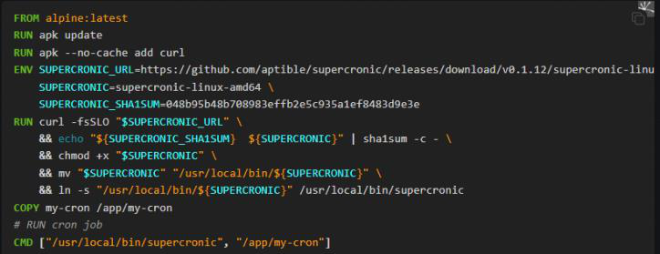

        </th>
      </tr>
    </thead>
    <tbody>
    </tbody>
  </table>

- 構建鏡像
  <table>
    <colgroup>
      <col style="width: 100%" />
    </colgroup>
    <thead>
      <tr class="header">
        <th>
          
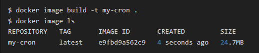

        </th>
      </tr>
    </thead>
    <tbody>
    </tbody>
  </table>

- 將容器停止, 再啟動. 數據不會消失.
  <table>
    <colgroup>
      <col style="width: 100%" />
    </colgroup>
    <thead>
      <tr class="header">
        <th>
          
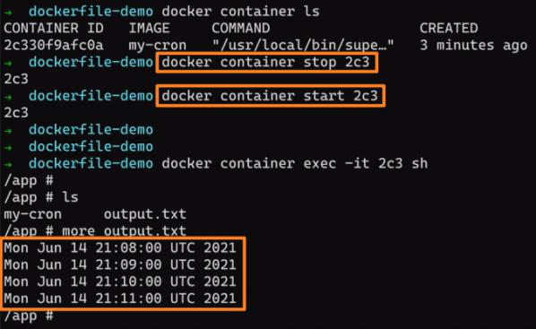

          <ul class="incremental">
            <li>
              
$ docker container <strong>start</strong> &lt;container_id / container_name&gt;

            </li>
            <li>
              
$ docker container <strong>stop</strong> &lt;container_id / container_name&gt;

            </li>
          </ul>
        </th>
      </tr>
    </thead>
    <tbody>
    </tbody>
  </table>

- 但如果將容器刪除, 數據就被刪除了

#### With volume [[↑](#6-2-data-volume)]

讓數據保存在磁盤上, 容器刪除也沒關係

- Dockerfile
  <table>
    <colgroup>
      <col style="width: 100%" />
    </colgroup>
    <thead>
      <tr class="header">
        <th>
          
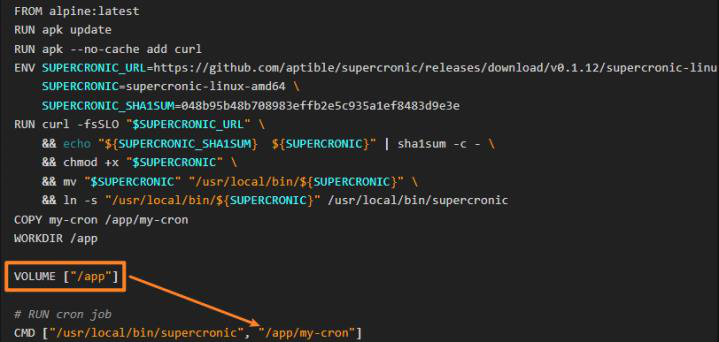

          <ul class="incremental">
            <li>
              
一個 Dockerfile 中可以定義多個 volume

            </li>
          </ul>
        </th>
      </tr>
    </thead>
    <tbody>
    </tbody>
  </table>

- 構建鏡像
  <table>
    <colgroup>
      <col style="width: 100%" />
    </colgroup>
    <thead>
      <tr class="header">
        <th>
          

        </th>
      </tr>
    </thead>
    <tbody>
    </tbody>
  </table>

- 查看 volume 訊息
  - $ `docker volume ls`
    <table>
      <colgroup>
        <col style="width: 100%" />
      </colgroup>
      <thead>
        <tr class="header">
          <th>
            

          </th>
        </tr>
      </thead>
      <tbody>
      </tbody>
      <tbody>
        <tr class="odd">
          <td>
            
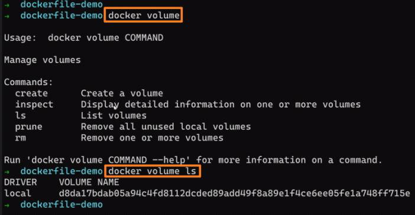

          </td>
        </tr>
      </tbody>
    </table>

  - $ `docker volume inspect <volume_name>`
    <table>
      <colgroup>
        <col style="width: 100%" />
      </colgroup>
      <thead>
        <tr class="header">
          <th>
            
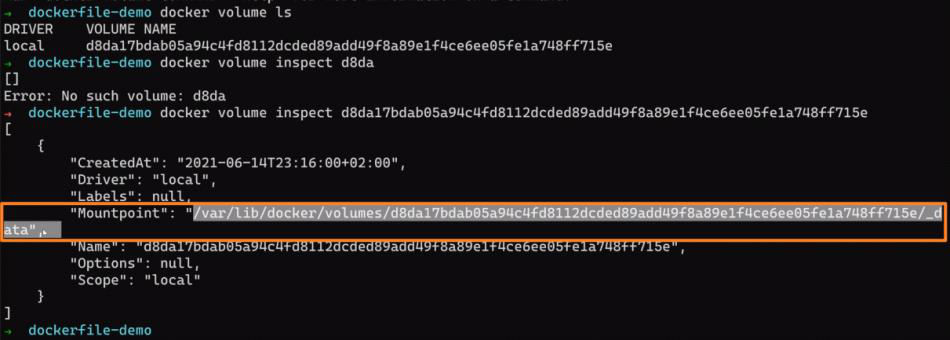

            <ul class="incremental">
              <li>
                
Mountpoint 就是 Linux 中此 volume 所在的路徑, windows 無法查看此路徑

              </li>
            </ul>
          </th>
        </tr>
      </thead>
    </table>

- 即使將容器刪除了, 這個 volume 不會被刪除, 進而實現了數據的持久化
  <table>
    <colgroup>
      <col style="width: 100%" />
    </colgroup>
    <thead>
      <tr class="header">
        <th>
          
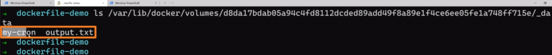

        </th>
      </tr>
    </thead>
    <tbody>
    </tbody>
  </table>

### 匿名 volume vs 具名 volume [[↑](#6-2-data-volume)]

- **注意**: 如果將此容器刪除了, 再去重新起一個容器, 此時會**再創建一個新的匿名 volume**
  - 這樣依然無法復用之前的數據, 這不是我們想要的
    <table>
      <colgroup>
        <col style="width: 100%" />
      </colgroup>
      <thead>
        <tr class="header">
          <th>
            
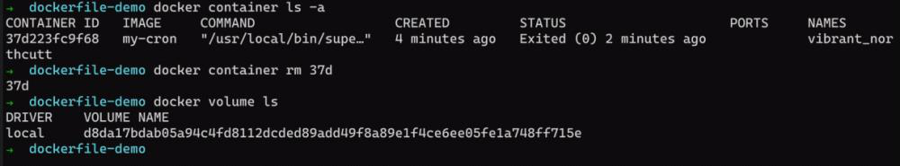

          </th>
        </tr>
      </thead>
      <tbody>
      </tbody>
    </table>

- 解法為**創建 volume 的時候, 要給一個固定的名字**

  - $ `docker volume prune -f`
    - 將沒有在使用的 volume 刪除
  - $ `docker container run -d` **`-v <give_a_volume_name>:<the_dir_or_file_in_container_to_map>`** `<image>`
    - 若這個 **`<give_a_volume_name>`** 不存在, 會**自動創建**這個 volume
      <table>
        <colgroup>
          <col style="width: 100%" />
        </colgroup>
        <thead>
          <tr class="header">
            <th>
              
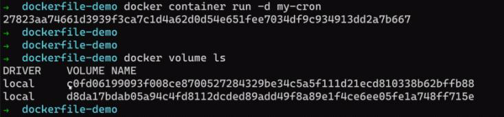

              <ul class="incremental">
                <li>
                  
將 cron-data 綁定到 dockerfile 中定義的 volume, 但因為 dockerfile 中可以定義多個 volume, 所以在綁定時, 需要明確指定要綁定哪一個 volume
                  

                </li>
              </ul>
              <ul class="incremental">
                <table>
                  <colgroup>
                    <col style="width: 100%" />
                  </colgroup>
                  <thead>
                    <tr class="header">
                      <th>
                        
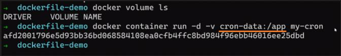

                      </th>
                    </tr>
                  </thead>
                  <tbody>
                  </tbody>
                </table>
              </ul>
            </th>
          </tr>
        </thead>
        <tbody>
          <tr class="odd">
            <td>
              
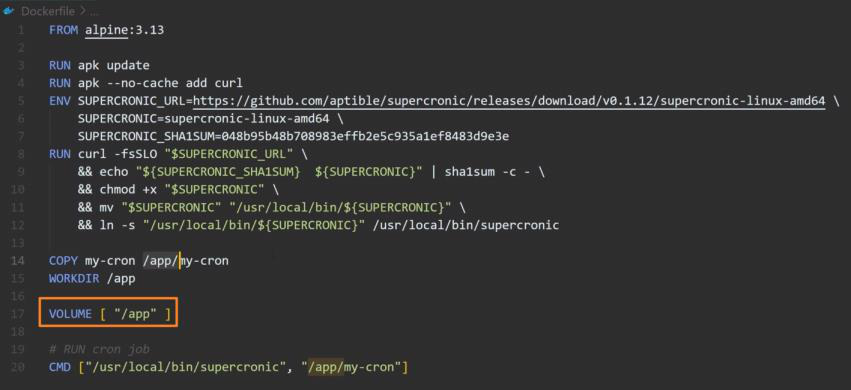

            </td>
          </tr>
          <tr class="even">
            <td>
              
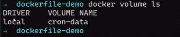

            </td>
          </tr>
          <tr class="odd">
            <td>
              
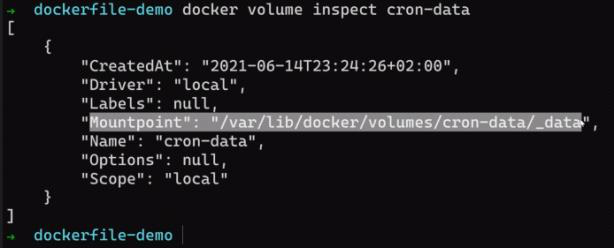

            </td>
          </tr>
        </tbody>
      </table>

  - 此時如果將此容器刪除了, 再去重新起一個容器, 並指定使用同一個 volume.  
    這樣就可以復用之前的數據
    <table>
      <colgroup>
        <col style="width: 100%" />
      </colgroup>
      <thead>
        <tr class="header">
          <th>
            
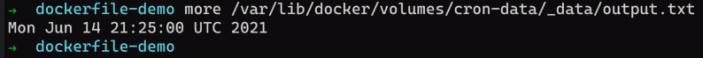

          </th>
        </tr>
      </thead>
      <tbody>
      </tbody>
    </table>
