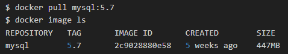
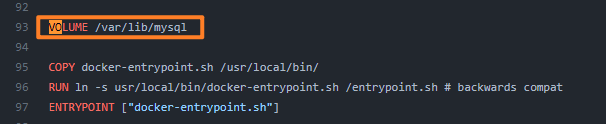
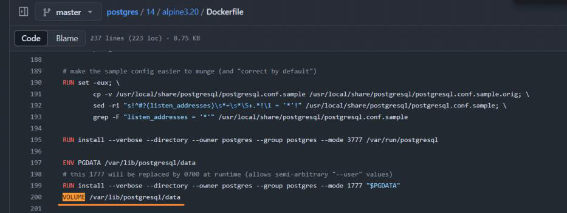
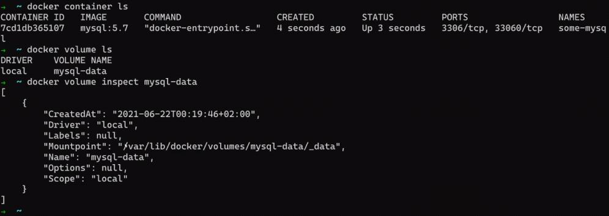
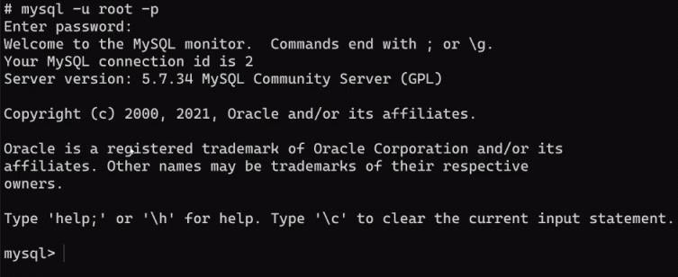
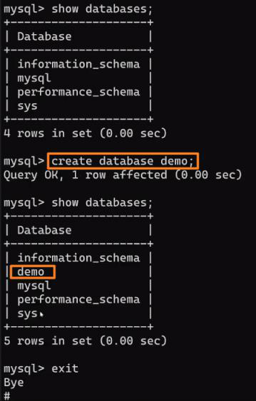
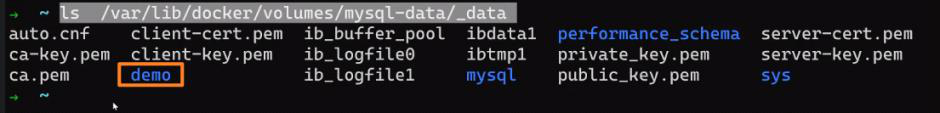
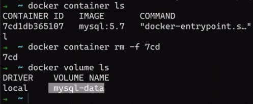
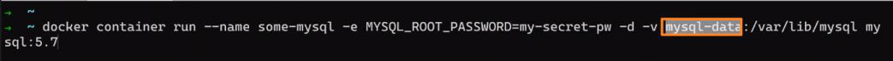
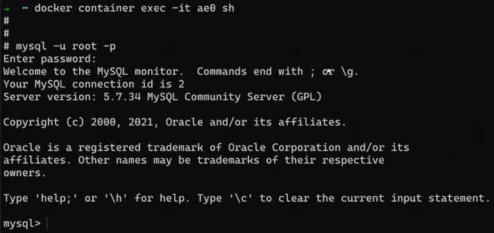

<!-- This md file is originally converted from onenote -->

# [6-3 Data Volume 練習 - MySQL](https://dockertips.readthedocs.io/en/latest/docker-volume/data-volume-mysql.html)

2023年2月26日
上午 12:04

## Contents [[↑](#6-3-data-volume-練習---mysql)]

- [6-3 Data Volume 練習 - MySQL](#6-3-data-volume-練習---mysql)
  - [Contents \[↑\]](#contents-)
    - [準備鏡像 \[↑\]](#準備鏡像-)
    - [創建容器 \[↑\]](#創建容器-)
    - [創建 MySQL data \[↑\]](#創建-mysql-data-)
    - [測試 volume \[↑\]](#測試-volume-)

### 準備鏡像 [[↑](#6-3-data-volume-練習---mysql)]

- Image: `mysql:5.7`
  <table>
    <colgroup>
      <col style="width: 100%" />
    </colgroup>
    <thead>
      <tr class="header">
        <th>
          <p></p>
        </th>
      </tr>
    </thead>
    <tbody>
    </tbody>
  </table>

### 創建容器 [[↑](#6-3-data-volume-練習---mysql)]

- $ `docker container run` with environment variable and volume

  ```bash
  docker container run
    -d
    --name some-mysql
    -e MYSQL_ROOT_PASSWORD=my-secret-pw
    -v mysql-data:/var/lib/mysql
    mysql:5.7
  ```

- 關於 Dockerfile `VOLUME` 的定義，可以參考

  - [mysql:5.7 - Official Dockerfile](https://github.com/docker-library/mysql/blob/0097ab8a1fde788a9a51357339fa5498855623e2/5.7/Dockerfile.oracle)
    <table>
      <colgroup>
        <col style="width: 100%" />
      </colgroup>
      <thead>
        <tr class="header">
          <th>
            <p></p>
          </th>
        </tr>
      </thead>
      <tbody>
      </tbody>
    </table>

  - [postgres - Official Dockerfile](https://github.com/docker-library/postgres/blob/master/14/alpine3.20/Dockerfile)
    <table>
      <colgroup>
        <col style="width: 100%" />
      </colgroup>
      <thead>
        <tr class="header">
          <th>
            <p></p>
          </th>
        </tr>
      </thead>
      <tbody>
      </tbody>
    </table>

  - 效果
    <table>
      <colgroup>
        <col style="width: 100%" />
      </colgroup>
      <thead>
        <tr class="header">
          <th>
            <p></p>
          </th>
        </tr>
      </thead>
      <tbody>
      </tbody>
    </table>

### 創建 MySQL data [[↑](#6-3-data-volume-練習---mysql)]

- 創建 MySQL data
  <table>
    <colgroup>
      <col style="width: 100%" />
    </colgroup>
    <thead>
      <tr class="header">
        <th>
          <p></p>
        </th>
      </tr>
    </thead>
    <tbody>
      <tr class="odd">
        <td>
          <p></p>
        </td>
      </tr>
      <tr class="even">
        <td>
          <p></p>
        </td>
      </tr>
      <tr class="odd">
        <td>
          <p></p>
        </td>
      </tr>
    </tbody>
  </table>

### 測試 volume [[↑](#6-3-data-volume-練習---mysql)]

- 刪除 container, 觀察 volume 是否還在? YES!
  <table>
    <colgroup>
      <col style="width: 100%" />
    </colgroup>
    <thead>
      <tr class="header">
        <th>
          <p></p>
        </th>
      </tr>
    </thead>
    <tbody>
    </tbody>
  </table>

- 再重新創建一個 container with the same volume, 觀察數據是否還在? YES!
  <table>
    <colgroup>
      <col style="width: 100%" />
    </colgroup>
    <thead>
      <tr class="header">
        <th>
          <p></p>
        </th>
      </tr>
    </thead>
    <tbody>
      <tr class="odd">
        <td>
          <p></p>
        </td>
      </tr>
      <tr class="even">
        <td>
          <p></p>
        </td>
      </tr>
    </tbody>
  </table>
