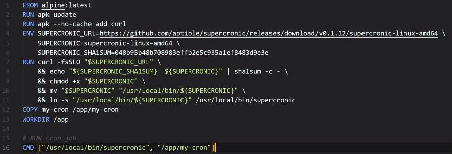

<!-- This md file is originally converted from onenote -->

# [6-4 Bind Mount](https://dockertips.readthedocs.io/en/latest/docker-volume/bind-mount.html)

2023年2月25日
下午 11:04

## Contents [[↑](#6-4-bind-mount)]

- [6-4 Bind Mount](#6-4-bind-mount)
  - [Contents \[↑\]](#contents-)
    - [Data volume vs Bind mount \[↑\]](#data-volume-vs-bind-mount-)
    - [Bind mount 演示 \[↑\]](#bind-mount-演示-)
    - [Troubleshooting \[↑\]](#troubleshooting-)

### Data volume vs Bind mount [[↑](#6-4-bind-mount)]

- Windows 很難訪問 Data volume 的 mountpoint
  - 因為這個 mountpoint 是在 linux 虛擬機中
    <table>
      <colgroup>
        <col style="width: 100%" />
      </colgroup>
      <thead>
        <tr class="header">
          <th>
            

          </th>
        </tr>
      </thead>
      <tbody>
      </tbody>
    </table>

- 但 Windows 和 Linux 都可以很容易的訪問 Bind Mount 的 mountpoint

### Bind mount 演示 [[↑](#6-4-bind-mount)]

- Dockerfile
  <table>
    <colgroup>
      <col style="width: 100%" />
    </colgroup>
    <thead>
      <tr class="header">
        <th>
          

        </th>
      </tr>
    </thead>
    <tbody>
    </tbody>
  </table>

- 創建容器時, 指定 Bind mount 使用 `-v` 指定路徑即可
  - $ `docker container run -d` `-v` **`<the_absolute_dir_on_localhost>`**:**`<the_dir_or_file_in_container_to_map>`** `<image>`
    <table>
      <colgroup>
        <col style="width: 100%" />
      </colgroup>
      <thead>
        <tr class="header">
          <th>
            

          </th>
        </tr>
      </thead>
      <tbody>
      </tbody>
    </table>

- Bind mount 不會創建任何 volume
  <table>
    <colgroup>
      <col style="width: 100%" />
    </colgroup>
    <thead>
      <tr class="header">
        <th>
          

        </th>
      </tr>
    </thead>
    <tbody>
      <tr class="odd">
        <td>
          <table>
            <colgroup>
              <col style="width: 58%" />
              <col style="width: 41%" />
            </colgroup>
            <thead>
              <tr class="header">
                <th></th>
                <th>
                  

                </th>
              </tr>
            </thead>
            <tbody>
            </tbody>
          </table>
          
 

        </td>
      </tr>
    </tbody>
  </table>

### Troubleshooting [[↑](#6-4-bind-mount)]

- 如果出現以下錯誤, 則代表要加入訪問資料夾的權限
  <table>
    <colgroup>
      <col style="width: 100%" />
    </colgroup>
    <thead>
      <tr class="header">
        <th>
          

        </th>
      </tr>
    </thead>
    <tbody>
      <tr class="odd">
        <td>
          

        </td>
      </tr>
    </tbody>
  </table>
