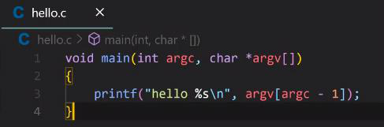
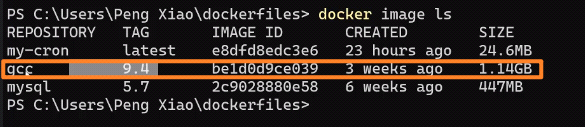
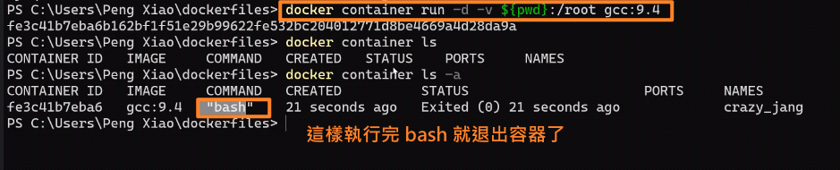
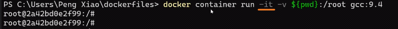
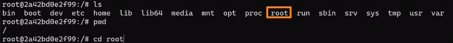
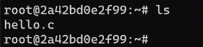
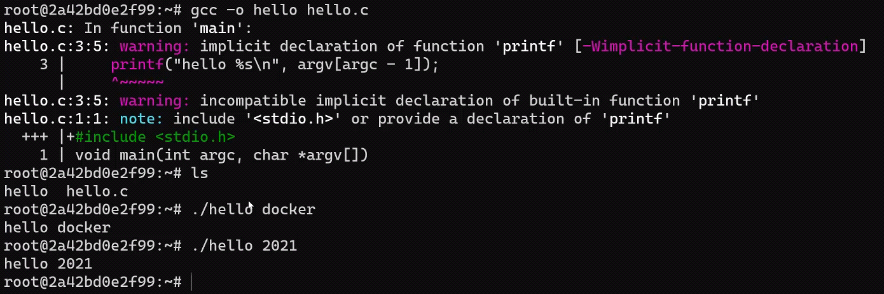

<!-- This md file is originally converted from onenote -->

# [6-5-1 Bind Mount 練習 - Docker 開發環境](https://dockertips.readthedocs.io/en/latest/docker-volume/bind-mount-vscode.html)

2023年2月26日
上午 12:19

## Contents [[↑](#6-5-1-bind-mount-練習---docker-開發環境)]

- [6-5-1 Bind Mount 練習 - Docker 開發環境](#6-5-1-bind-mount-練習---docker-開發環境)
  - [Contents \[↑\]](#contents-)
    - [想達到的效果 \[↑\]](#想達到的效果-)
    - [演示 \[↑\]](#演示-)

### 想達到的效果 [[↑](#6-5-1-bind-mount-練習---docker-開發環境)]

- 可以起一個有編譯運行環境的 container, 並將本機的 proj dir bind mount 到該 container 中.
- 這樣就可以實現, 本地寫 code 開發, 在 container 中編譯運行的效果.
  - 類似於 [GitHub - W-Shih/django-twitter](https://github.com/W-Shih/django-twitter) 的本地寫 code 開發, 虛擬機 + vagrant 運行的效果
  - 本機可以不安裝任何的編程環境

### 演示 [[↑](#6-5-1-bind-mount-練習---docker-開發環境)]

- 起一個可以編譯運行 c 的 container, 並將本機的 proj dir bind mount 到該 container 的 `/root` 中
  <table>
    <colgroup>
      <col style="width: 100%" />
    </colgroup>
    <thead>
      <tr class="header">
        <th>
          

        </th>
      </tr>
    </thead>
    <tbody>
      <tr class="odd">
        <td>
          

        </td>
      </tr>
      <tr class="even">
        <td>
          

        </td>
      </tr>
    </tbody>
  </table>

- 要改用 -it 的交互式, 才不會退出容器
  <table>
    <colgroup>
      <col style="width: 100%" />
    </colgroup>
    <thead>
      <tr class="header">
        <th>
          

        </th>
      </tr>
    </thead>
    <tbody>
      <tr class="odd">
        <td>
          

        </td>
      </tr>
      <tr class="even">
        <td>
          

        </td>
      </tr>
      <tr class="odd">
        <td>
          

        </td>
      </tr>
    </tbody>
  </table>
