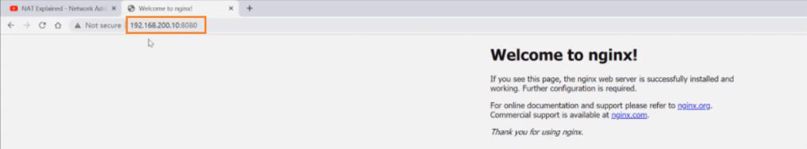

<!-- This md file is originally converted from onenote -->

# 7-10 容器的端口轉發 Port Forwarding

2024年6月25日
上午 01:34

## Contents [[↑](#7-10-容器的端口轉發-port-forwarding)]

- [7-10 容器的端口轉發 Port Forwarding](#7-10-容器的端口轉發-port-forwarding)
  - [Contents \[↑\]](#contents-)
    - [原理講解 \[↑\]](#原理講解-)
    - [實驗環境 \[↑\]](#實驗環境-)
    - [實現機制 \[↑\]](#實現機制-)

### 原理講解 [[↑](#7-10-容器的端口轉發-port-forwarding)]

- host1 的 `busybox` 是可以訪問 host1 的 `nginx` 80 端口的, 因為他們都是接在 `docker0` 上
  <table>
    <colgroup>
      <col style="width: 100%" />
    </colgroup>
    <thead>
      <tr class="header">
        <th>
          

          
 

        </th>
      </tr>
    </thead>
    <tbody>
    </tbody>
  </table>

- host1 上的 containers (`nginx` 和 `busybox`) 可以透過 `eth0` 上的 NAT 訪問 host2
  <table>
    <colgroup>
      <col style="width: 100%" />
    </colgroup>
    <thead>
      <tr class="header">
        <th>
          

          
 

        </th>
      </tr>
    </thead>
    <tbody>
    </tbody>
  </table>

- 但 host1 上的 containers (`nginx` 和 `busybox`) 相當於私網, 所以 host2 無法直接訪問. host2 不知道 `172.17.0.2` 在哪.
  - 使用端口轉發/映射, 讓 host1 的端口與指定的 container 及端口進行映射
  - `docker container run -d --rm -name web` `-p` **`<host_port>`**`:`**`<container_port>`** `nginx`
    <table>
      <colgroup>
        <col style="width: 100%" />
      </colgroup>
      <thead>
        <tr class="header">
          <th>
            

            
 

          </th>
        </tr>
      </thead>
      <tbody>
      </tbody>
    </table>

### 實驗環境 [[↑](#7-10-容器的端口轉發-port-forwarding)]

- host1 的 `busybox` 與 host1 的 `nginx` 可以互相通信
  <table>
    <colgroup>
      <col style="width: 100%" />
    </colgroup>
    <thead>
      <tr class="header">
        <th>
          

          
 

        </th>
      </tr>
    </thead>
    <tbody>
    </tbody>
  </table>

- host1 可以透過訪問 `localhost:8080` 轉發到內部 `nginx` 容器的 80 端口
  <table>
    <colgroup>
      <col style="width: 100%" />
    </colgroup>
    <thead>
      <tr class="header">
        <th>
          

          
 

        </th>
      </tr>
    </thead>
    <tbody>
      <tr class="odd">
        <td>
          

          
 

        </td>
      </tr>
    </tbody>
  </table>

- host1 也可以透過訪問自己 ip 的 8080 轉發到內部 `nginx` 容器的 80 端口
  <table>
    <colgroup>
      <col style="width: 100%" />
    </colgroup>
    <thead>
      <tr class="header">
        <th>
          

          
 

        </th>
      </tr>
    </thead>
    <tbody>
      <tr class="odd">
        <td>
          

          
 

        </td>
      </tr>
    </tbody>
  </table>

### 實現機制 [[↑](#7-10-容器的端口轉發-port-forwarding)]

- IP tables
  <table>
    <colgroup>
      <col style="width: 100%" />
    </colgroup>
    <thead>
      <tr class="header">
        <th>
          

          <ul class="incremental">
            <li>
              
當使用 docker container 的 `-p` 時, 會在 ip tables 中添加一條轉發/映射的規則

            </li>
          </ul>
        </th>
      </tr>
    </thead>
    <tbody>
    </tbody>
  </table>
