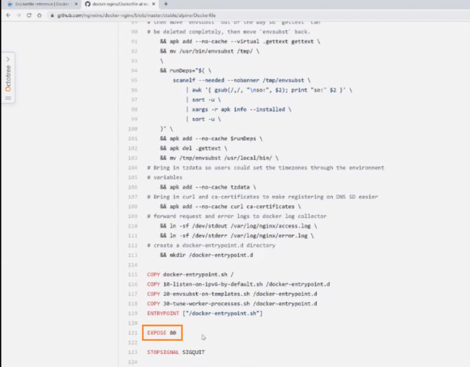
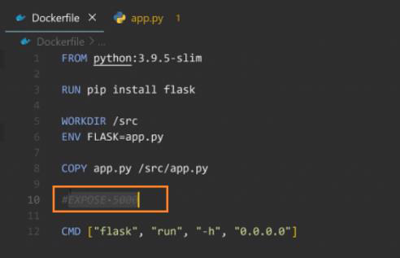
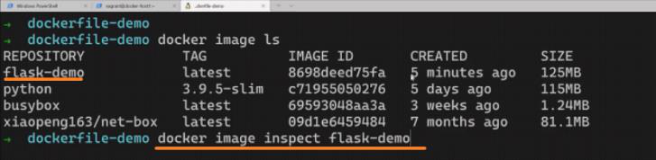
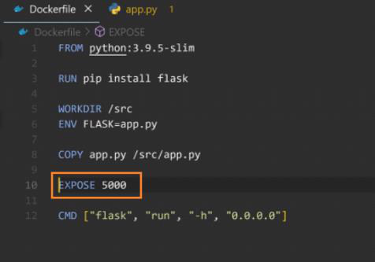
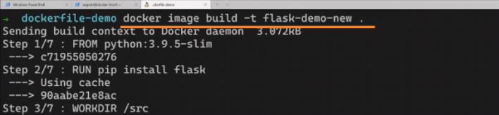
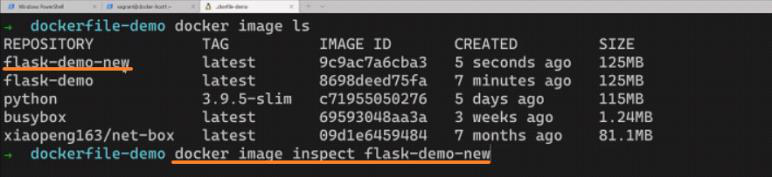
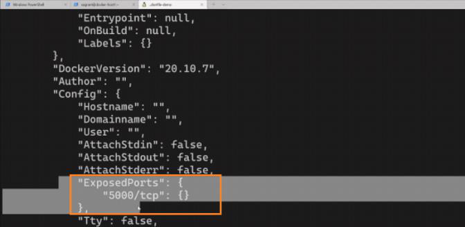
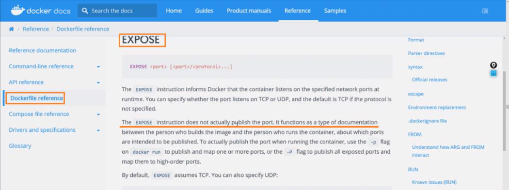

<!-- This md file is originally converted from onenote -->

# 7-11 端口轉發和 Dockerfile

2024年6月25日
上午 02:08

## Contents [[↑](#7-11-端口轉發和-dockerfile)]

- [7-11 端口轉發和 Dockerfile](#7-11-端口轉發和-dockerfile)
  - [Contents \[↑\]](#contents-)
    - [Dockerfile 中的 `EXPOSE` 的相關問題 \[↑\]](#dockerfile-中的-expose-的相關問題-)
    - [Dockerfile 中的 `EXPOSE` 的作用 \[↑\]](#dockerfile-中的-expose-的作用-)
    - [`EXPOSE` 的官方文檔 \[↑\]](#expose-的官方文檔-)

### Dockerfile 中的 `EXPOSE` 的相關問題 [[↑](#7-11-端口轉發和-dockerfile)]

- `EXPOSE`
  <table>
    <colgroup>
      <col style="width: 100%" />
    </colgroup>
    <thead>
      <tr class="header">
        <th>
          

          <ul class="incremental">
            <li>
              
<a
                  href="https://github.com/nginxinc/docker-nginx/blob/master/stable/alpine-slim/Dockerfile">https://github.com/nginxinc/docker-nginx/blob/master/stable/alpine-slim/Dockerfile</a>
              

            </li>
            <li>
              
問題

              <ul class="incremental">
                <li>
                  
如果要使用 `-p` 參數做端口的轉發/映射的話, 那麼對於原始的這個鏡像的 dockerfile 一定要使用 `EXPOSE` 定義一個端口嗎？-&gt;
                    <strong>**NO**</strong>

                </li>
                <li>
                  
假如把這個 `EXPOSE 80` 這一行刪掉的話, 那麼通過這個 dockerfile 所構建的鏡像可不可以使用 `-p` 參數做端口的轉發/映射？ -&gt;
                    <strong>**YES**</strong>

                </li>
              </ul>
            </li>
          </ul>
        </th>
      </tr>
    </thead>
    <tbody>
    </tbody>
  </table>

### Dockerfile 中的 `EXPOSE` 的作用 [[↑](#7-11-端口轉發和-dockerfile)]

- `EXPOSE` 這個語法的作用實際上更多的是一種解釋說明, 給這個鏡像的使用者知道這個鏡像有一個開放的端口
- Example - 如果沒有 `EXPOSE`
  <table>
    <colgroup>
      <col style="width: 100%" />
    </colgroup>
    <thead>
      <tr class="header">
        <th>
          

          
 

        </th>
      </tr>
    </thead>
    <tbody>
      <tr class="odd">
        <td>
          

          <ul class="incremental">
            <li>
              
`inspect` 會找不到關於開放端口的訊息

            </li>
          </ul>
        </td>
      </tr>
    </tbody>
  </table>

- Example - 如果有 `EXPOSE`
  <table>
    <colgroup>
      <col style="width: 100%" />
    </colgroup>
    <thead>
      <tr class="header">
        <th>
          

          
 

        </th>
      </tr>
    </thead>
    <tbody>
      <tr class="odd">
        <td>
          

          
 

        </td>
      </tr>
      <tr class="even">
        <td>
          

          <ul class="incremental">
            <li>
              
可以找到關於開放端口的訊息

            </li>
          </ul>
          

            <table>
              <colgroup>
                <col style="width: 100%" />
              </colgroup>
              <thead>
                <tr class="header">
                  <th>
                    

                    <blockquote>
                      
 

                    </blockquote>
                  </th>
                </tr>
              </thead>
              <tbody>
              </tbody>
            </table>
          

        </td>
      </tr>
    </tbody>
  </table>

- 如果沒有 `EXPOSE` 端口的話, 作為一個用戶想去使用這個鏡像的時候, 就根本不知道這個鏡像有開放什麼端口
- 相反的話, 如果我們定義 `EXPOSE` 端口的話, 那麼作為這個鏡像的用戶, 就知道這個鏡像有開放什麼端口. 就可以進一步使用 `-p` 參數做端口的轉發/映射
- `EXPOSE` 的作用更多的是提供給用戶的一個解釋和查看的一個作用. 即使在 dockerfile 不去使用 `EXPOSE`, 最終 `build` 出來的鏡像還是可以通過 `-p` 參數做端口的轉發/映射, 還是可以把這個 `5000` 端口映射到外面去.

### `EXPOSE` 的官方文檔 [[↑](#7-11-端口轉發和-dockerfile)]

<table>
  <colgroup>
    <col style="width: 100%" />
  </colgroup>
  <thead>
    <tr class="header">
      <th>
        

        
 

      </th>
    </tr>
  </thead>
  <tbody>
  </tbody>
</table>
