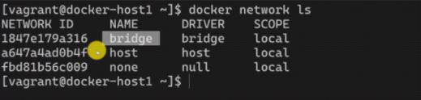
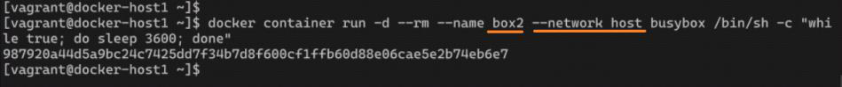
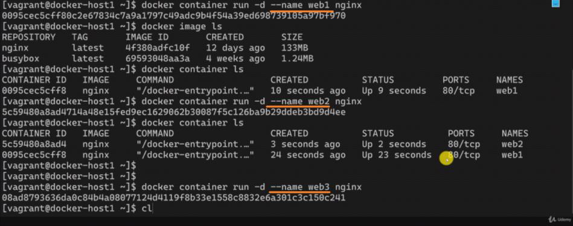
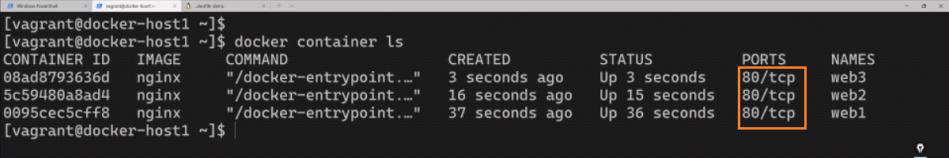
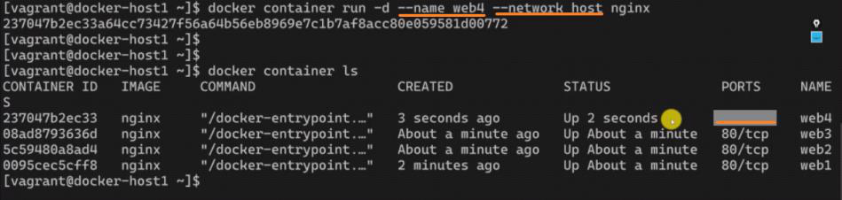
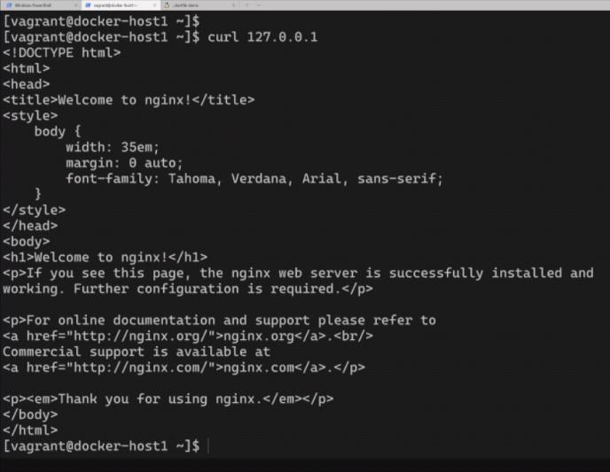
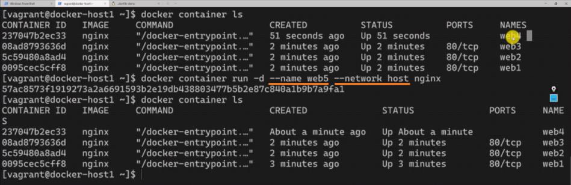
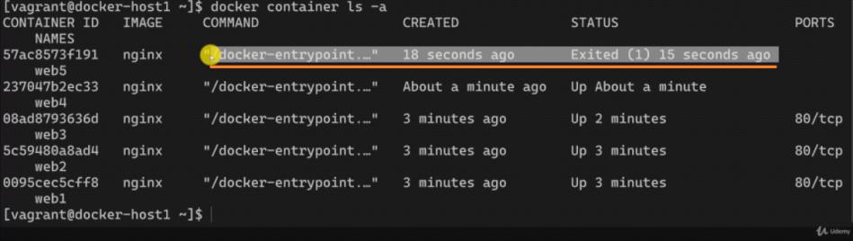
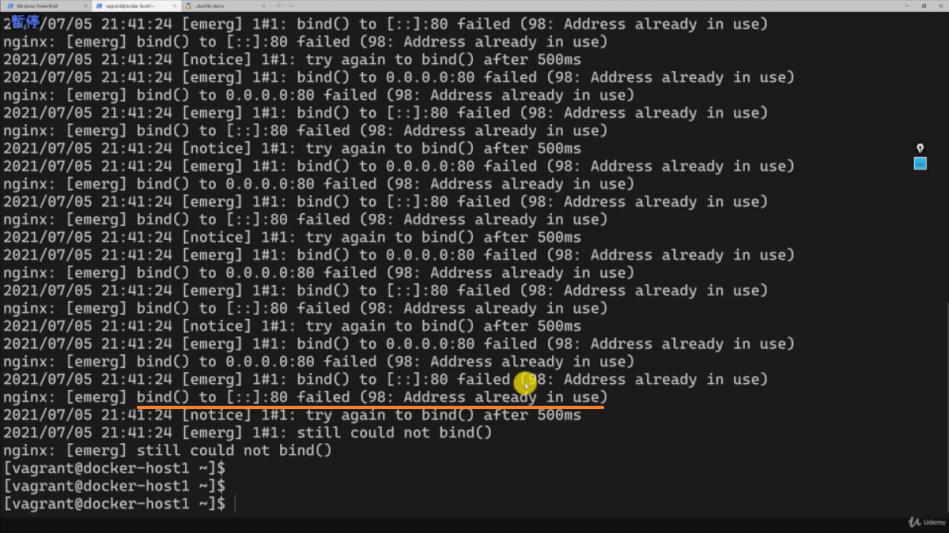
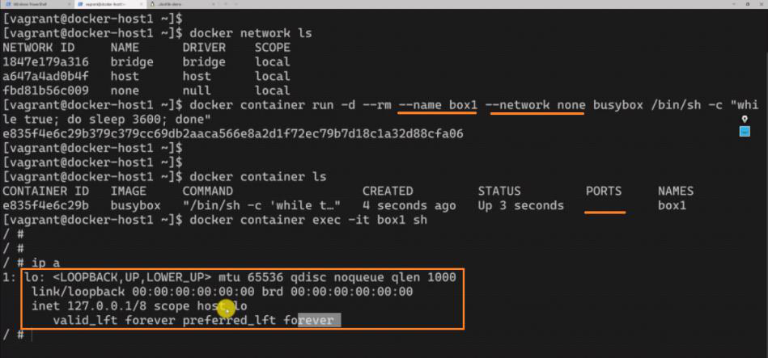

<!-- This md file is originally converted from onenote -->

# 7-12 host 網絡詳解

2024年6月25日
下午 09:55

## Contents [[↑](#7-12-host-網絡詳解)]

- [7-12 host 網絡詳解](#7-12-host-網絡詳解)
  - [Contents \[↑\]](#contents-)
    - [默認的 built-in network \[↑\]](#默認的-built-in-network-)
    - [host 網路 \[↑\]](#host-網路-)
      - [host network 的限制 \[↑\]](#host-network-的限制-)
    - [null 網絡 (很少使用) \[↑\]](#null-網絡-很少使用-)

### 默認的 built-in network [[↑](#7-12-host-網絡詳解)]

- 默認的 built-in network
  <table>
    <colgroup>
      <col style="width: 100%" />
    </colgroup>
    <thead>
      <tr class="header">
        <th>
          

          
 

        </th>
      </tr>
    </thead>
    <tbody>
    </tbody>
  </table>

### host 網路 [[↑](#7-12-host-網絡詳解)]

- host network 就是這個 container 和主機共享同一個網絡
  <table>
    <colgroup>
      <col style="width: 100%" />
    </colgroup>
    <thead>
      <tr class="header">
        <th>
          

          <ul class="incremental">
            <li>
              
對這個 container 使用 `$ ip a` 和對 host machine 使用 `$ ip a` 會看到一樣的網絡

            </li>
          </ul>
        </th>
      </tr>
    </thead>
    <tbody>
    </tbody>
  </table>

#### host network 的限制 [[↑](#7-12-host-網絡詳解)]

- 使用 docker0 bridge 每個容器都有自己的 ip, 所以各自監聽自己的 80 端口不會有衝突
  <table>
    <colgroup>
      <col style="width: 100%" />
    </colgroup>
    <thead>
      <tr class="header">
        <th>
          

          
 

        </th>
      </tr>
    </thead>
    <tbody>
      <tr class="odd">
        <td>
          

          
 

        </td>
      </tr>
    </tbody>
  </table>

- 使用 host network, 容器與 host machine **共享** ip 及端口. 所以如果端口被佔用, 則容器會啟動失敗
  <table>
    <colgroup>
      <col style="width: 100%" />
    </colgroup>
    <thead>
      <tr class="header">
        <th>
          

          
 

        </th>
      </tr>
    </thead>
    <tbody>
      <tr class="odd">
        <td>
          

          
 

        </td>
      </tr>
      <tr class="even">
        <td>
          

          <ul class="incremental">
            <li>
              
web5 無法在兼聽 80 端口, 因為 80 端口已經被佔用

            </li>
          </ul>
          

            <table>
              <colgroup>
                <col style="width: 100%" />
              </colgroup>
              <thead>
                <tr class="header">
                  <th>
                    

                    
 

                  </th>
                </tr>
              </thead>
              <tbody>
                <tr class="odd">
                  <td>
                    

                    <ul class="incremental">
                      <li>
                        
`$ docker logs -f web5`

                      </li>
                    </ul>
                  </td>
                </tr>
              </tbody>
            </table>
          

        </td>
      </tr>
    </tbody>
  </table>

### null 網絡 (很少使用) [[↑](#7-12-host-網絡詳解)]

- null 網絡
  <table>
    <colgroup>
      <col style="width: 100%" />
    </colgroup>
    <thead>
      <tr class="header">
        <th>
          

          <ul class="incremental">
            <li>
              
除了 lo (lookback) 就是本地的地址以外, 沒有任何的地址. 這種情況的話, 這個容器實際上是無法對內對外進行通信的

            </li>
            <li>
              
這種容器很顯然對於個人開發者來講一般不會用到

            </li>
            <li>
              
這種容器一般會被一些第三方的程序去使用, e.g. 容器的編排工具. 那麼他希望 docker 創建一個沒有網絡的容器,

            </li>
          </ul>
          <blockquote>
            
至於網絡部分由我自己去負責去進行相關的配置和創建.

          </blockquote>
        </th>
      </tr>
    </thead>
    <tbody>
    </tbody>
  </table>
