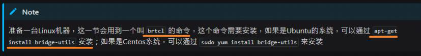
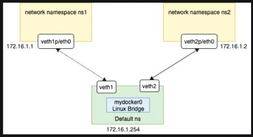
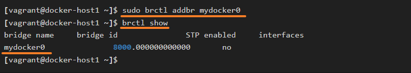
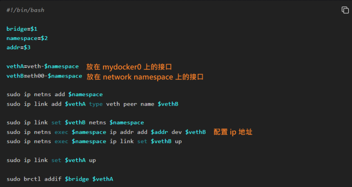
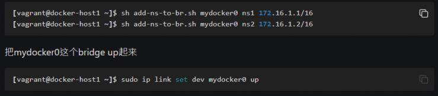
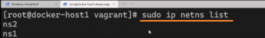
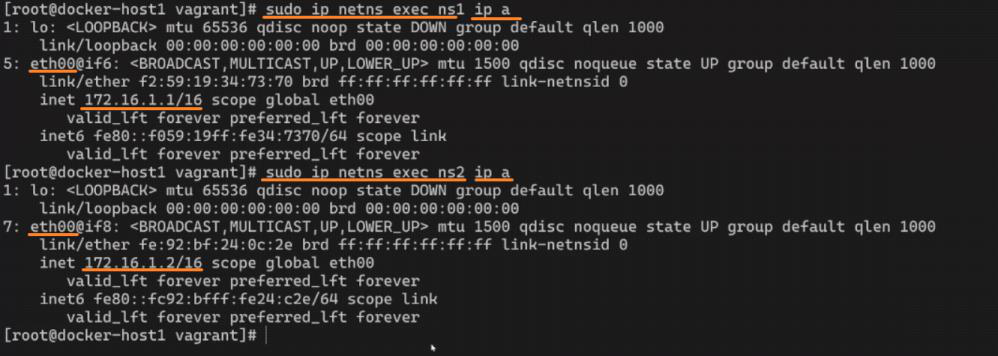
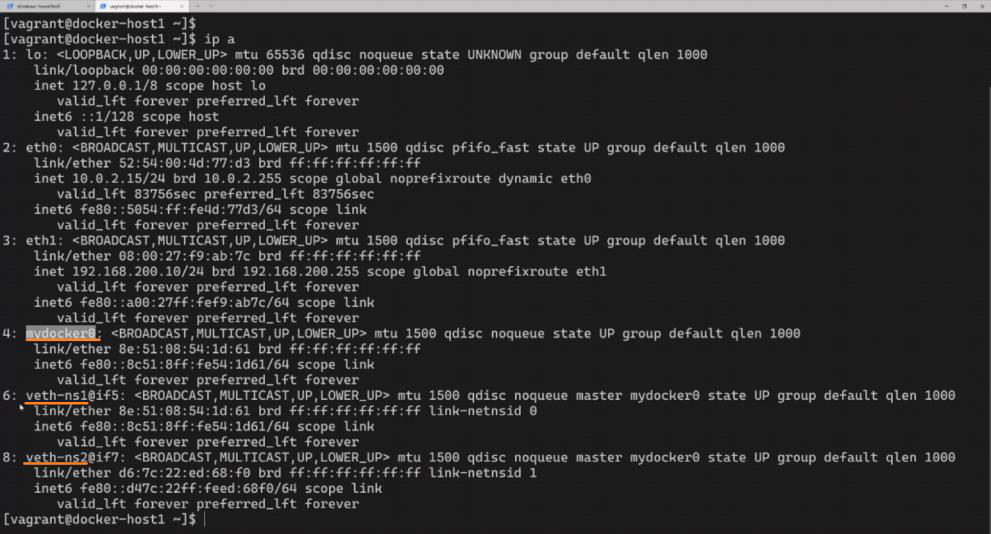
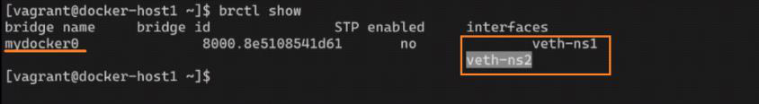
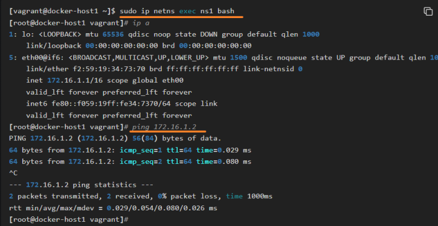

<!-- This md file is originally converted from onenote -->

# [7-13 Linux 網路命名空間](https://dockertips.readthedocs.io/en/latest/single-host-network/network-namespace.html)

2024年6月26日
上午 12:37

## Contents [[↑](#7-13-linux-網路命名空間)]

- [7-13 Linux 網路命名空間](#7-13-linux-網路命名空間)
  - [Contents \[↑\]](#contents-)
    - [Docker 的網絡是如何實現的 \[↑\]](#docker-的網絡是如何實現的-)
    - [實現環境 \[↑\]](#實現環境-)
      - [`brctl` \[↑\]](#brctl-)
      - [目標 - 模擬 docker 容器間的通信 \[↑\]](#目標---模擬-docker-容器間的通信-)
      - [具體操作 \[↑\]](#具體操作-)

### Docker 的網絡是如何實現的 [[↑](#7-13-linux-網路命名空間)]

- 用原生的 Linux network namespace 來理解 Docker 的網絡是如何實現的
  - 在Docker容器中，不同的容器通過 Linux 的 Network namespace 進行了隔離，也就是不同的容器有各自的 IP 地址，路由表等，互不影響。

### 實現環境 [[↑](#7-13-linux-網路命名空間)]

#### `brctl` [[↑](#7-13-linux-網路命名空間)]

<table>
  <colgroup>
    <col style="width: 100%" />
  </colgroup>
  <thead>
    <tr class="header">
      <th>
        

        <ul class="incremental">
          <li>
            
`$ sudo apt-get install bridge-util`

          </li>
        </ul>
      </th>
    </tr>
  </thead>
  <tbody>
  </tbody>
</table>

#### 目標 - 模擬 docker 容器間的通信 [[↑](#7-13-linux-網路命名空間)]

- 創建兩個不同的 Network Namespace: `NS1` 和 `NS2`
- 接著創建一個 Linux 的 Bridge, 叫做 `mydocker0`
  - 這個是去模擬 Docker 中 `Docker0` Bridge
- 然後通過 `VETH` 這樣的一對一對類似於網線把這三者給連起來
  - 每一條 網線/連接/link 的兩頭都會有一個接口, 叫做 `VETH`
  - `VETH` 就是類似於這個網線的接口
    <table>
      <colgroup>
        <col style="width: 100%" />
      </colgroup>
      <thead>
        <tr class="header">
          <th>
            

            
 

          </th>
        </tr>
      </thead>
      <tbody>
      </tbody>
    </table>

#### 具體操作 [[↑](#7-13-linux-網路命名空間)]

- 創建一個 bridge
  <table>
    <colgroup>
      <col style="width: 100%" />
    </colgroup>
    <thead>
      <tr class="header">
        <th>
          

          <ul class="incremental">
            <li>
              
`$ sudo brctl addbr mydocker0`

            </li>
            <li>
              
`$ brctl show`

            </li>
          </ul>
        </th>
      </tr>
    </thead>
    <tbody>
    </tbody>
  </table>

- 準備一個 shell script 來創建兩頭接口和連接
  <table>
    <colgroup>
      <col style="width: 100%" />
    </colgroup>
    <thead>
      <tr class="header">
        <th>
          

          
 

        </th>
      </tr>
    </thead>
    <tbody>
    </tbody>
  </table>

- 腳本執行
  <table>
    <colgroup>
      <col style="width: 100%" />
    </colgroup>
    <thead>
      <tr class="header">
        <th>
          

          
 

        </th>
      </tr>
    </thead>
    <tbody>
    </tbody>
  </table>

- 驗證
  <table>
    <colgroup>
      <col style="width: 100%" />
    </colgroup>
    <thead>
      <tr class="header">
        <th>
          

          
 

        </th>
      </tr>
    </thead>
    <tbody>
      <tr class="odd">
        <td>
          

          
 

        </td>
      </tr>
      <tr class="even">
        <td>
          

          
 

        </td>
      </tr>
      <tr class="odd">
        <td>
          

          
 

        </td>
      </tr>
      <tr class="even">
        <td>
          

          
 

        </td>
      </tr>
    </tbody>
  </table>
