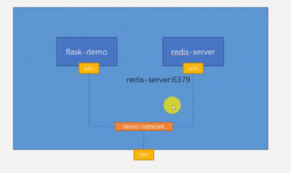
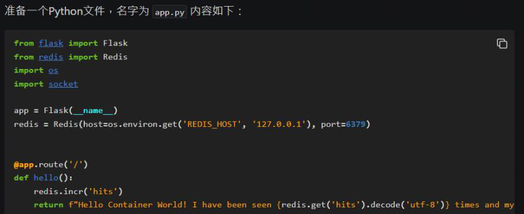
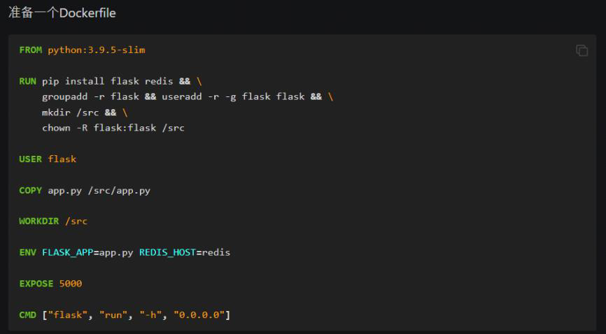

<!-- This md file is originally converted from onenote -->

# [7-14 多容器應用部署練習](https://dockertips.readthedocs.io/en/latest/single-host-network/flask-redis.html)

2024年6月26日
下午 04:48

## Contents [[↑](#7-14-多容器應用部署練習)]

- [7-14 多容器應用部署練習](#7-14-多容器應用部署練習)
  - [Contents \[↑\]](#contents-)
    - [練習目標 \[↑\]](#練習目標-)
    - [步驟 \[↑\]](#步驟-)
    - [總結 \[↑\]](#總結-)

### 練習目標 [[↑](#7-14-多容器應用部署練習)]

- 通過 Docker 然後去部署一個 Python Flask 程序 + Redis 的多容器應用
  - Flask 和 Redis 這兩個模塊之間, 有一個數據的通信
- 對於這個應用, 會使用兩個容器：一個是去部署 Flask (flask-demo), 一個是去部署 Redis (redis-server)
- 這兩個容器都連到一個自定義的 Docker Bridge (demo-network) 上
  - 注意這裡不使用默認的 Docker0 Bridge
  - 因為如果使用一個自定義的 Bridge, 連到這個自定義 Bridge 上的容器之間可以去通過這個容器的名字進行通信, 也就是說它有一個 DNS 的效果. 比如說在 flask-demo 這個容器上面 PING redis-server 這個名字, 是可以拼通, 而不需要去知道 redis-server 的 IP 地址
    <table>
      <colgroup>
        <col style="width: 100%" />
      </colgroup>
      <thead>
        <tr class="header">
          <th>
            <p></p>
            <p> </p>
          </th>
        </tr>
      </thead>
      <tbody>
      </tbody>
    </table>

### 步驟 [[↑](#7-14-多容器應用部署練習)]

- prepare image
  - `$ docker image pull redis`
  - `$ docker image build -t flask-demo .`
    <table>
      <colgroup>
        <col style="width: 100%" />
      </colgroup>
      <thead>
        <tr class="header">
          <th>
            <p></p>
            <p> </p>
          </th>
        </tr>
      </thead>
      <tbody>
        <tr class="odd">
          <td>
            <p></p>
            <p> </p>
          </td>
        </tr>
      </tbody>
    </table>

- create network
  - `$ docker network create -d bridge demo-network`
  - `$ docker network ls`

- create container
  - `$ docker container run -d --name` **`redis-server`** `--network demo-network redis`
  - `$ docker container run -d --network demo-network --name` **`flask-demo`** **`--env REDIS_HOST=redis-server`** `-p 5000:5000 flask-demo`
    - 覆蓋 Dockerfile 中定義的 `REDIS_HOST`

### 總結 [[↑](#7-14-多容器應用部署練習)]

- 可以把上面的步驟合併到一起，成為一個部署腳本
  
  ```bash
  # prepare image
  docker image pull redis
  docker image build -t flask-demo .
  
  # create network
  docker network create -d bridge demo-network
  
  # create container
  docker container run -d --name redis-server --network demo-network redis
  docker container run -d --network demo-network --name flask-demo --env REDIS_HOST=redis-server -p 5000:5000 flask-demo
  ```

- 現實的 app 都是這樣的步驟, 可以使用 `docker-compose` 來簡化這些步驟
