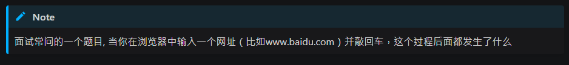
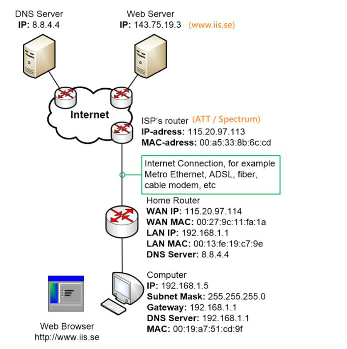
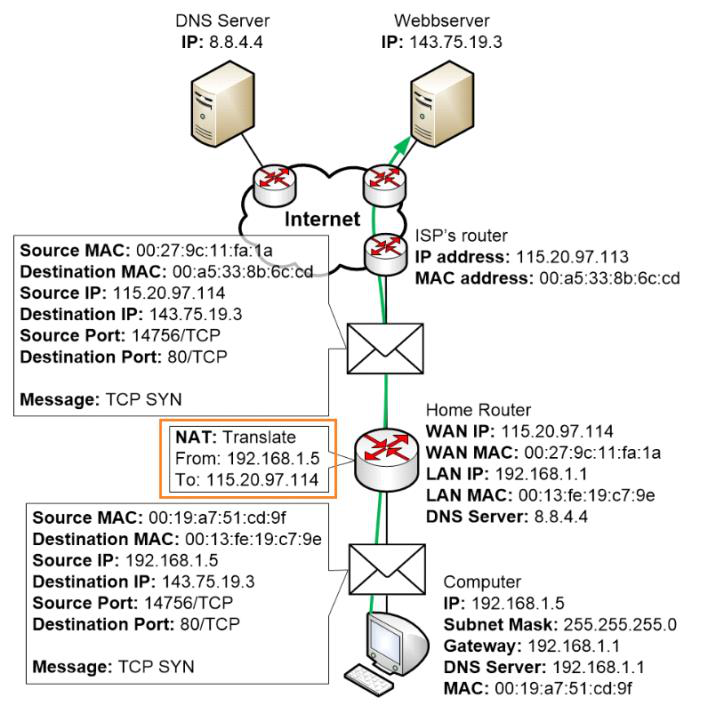
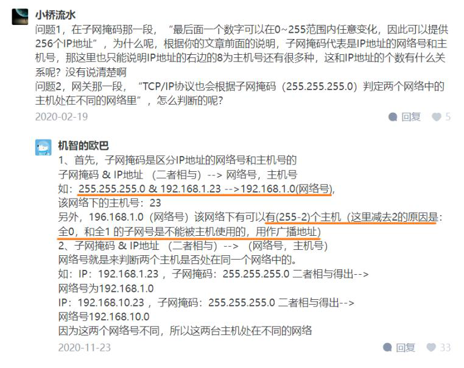

<!-- This md file is originally converted from onenote -->

# [7-2 網路基礎知識回顧](https://dockertips.readthedocs.io/en/latest/single-host-network/network-basic.html)

2024年6月18日
下午 09:42

## Contents [[↑](#7-2-網路基礎知識回顧)]

- [7-2 網路基礎知識回顧](#7-2-網路基礎知識回顧)
  - [Contents \[↑\]](#contents-)
    - [思考 \[↑\]](#思考-)
    - [數據包的傳輸過程 \[↑\]](#數據包的傳輸過程-)
    - [Subnet Mask \[↑\]](#subnet-mask-)
    - [Reference \[↑\]](#reference-)

### 思考 [[↑](#7-2-網路基礎知識回顧)]

- 問題
  <table>
    <colgroup>
      <col style="width: 100%" />
    </colgroup>
    <thead>
      <tr class="header">
        <th>
          

        </th>
      </tr>
    </thead>
    <tbody>
    </tbody>
  </table>

### 數據包的傳輸過程 [[↑](#7-2-網路基礎知識回顧)]

- [Traffic example, the full picture](https://www.homenethowto.com/advanced-topics/traffic-example-the-full-picture/#google_vignette)
  <table>
    <colgroup>
      <col style="width: 100%" />
    </colgroup>
    <thead>
      <tr class="header">
        <th>
          

          <ul class="incremental">
            <li>
              
把這個網址轉換成 ip 地址 by DNS

              <ol class="incremental" type="i">
                <li>
                  
先去看一下在本地有沒有這個 DNS 的記錄的緩存

                </li>
                <li>
                  
如果沒有, 再去發送一個 DNS 的請求給網絡服務提供商分配的 DNS server

                </li>
              </ol>
            </li>
            <li>
              
tcp 的三次握手進行連接

              <ol class="incremental" type="i">
                <li>
                  
在這個連接的過程當中, 有一個非常重要的概念 - <strong>NAT (Network Address Translation)</strong>

                  <ul class="incremental">
                    <li>
                      
我們的電腦的 ip 地址一般都是一個 192.168 這樣的一些無法在公網上面進行傳播的私有 ip 地址

                    </li>
                    <li>
                      
所以在進行對外訪問的時候, 一般經過家庭的路由器或者是經過網絡服務提供商的路由器的時候, 會把這個私有的地址轉換成一個公有的 ip 地址

                    </li>
                    <li>
                      
然後使用這個公有的 ip 地址和 web 服務器進行連接和通信

                    </li>
                    <li>
                      
之後的 Docker 網絡也會提到 NAT 這個技術

                    </li>
                  </ul>
                </li>
              </ol>
            </li>
          </ul>
          

            <table>
              <colgroup>
                <col style="width: 100%" />
              </colgroup>
              <thead>
                <tr class="header">
                  <th>
                    

                  </th>
                </tr>
              </thead>
              <tbody>
              </tbody>
            </table>
          

        </th>
      </tr>
    </thead>
    <tbody>
    </tbody>
  </table>

### Subnet Mask [[↑](#7-2-網路基礎知識回顧)]

- Subnet Mask
  <table>
    <colgroup>
      <col style="width: 100%" />
    </colgroup>
    <thead>
      <tr class="header">
        <th>
          

        </th>
      </tr>
    </thead>
    <tbody>
    </tbody>
  </table>

### Reference [[↑](#7-2-網路基礎知識回顧)]

- [一文搞懂网络知识，IP、子网掩码、网关、DNS、端口号](https://zhuanlan.zhihu.com/p/65226634)
- [Traffic example, the full picture](https://www.homenethowto.com/advanced-topics/traffic-example-the-full-picture/#google_vignette)
