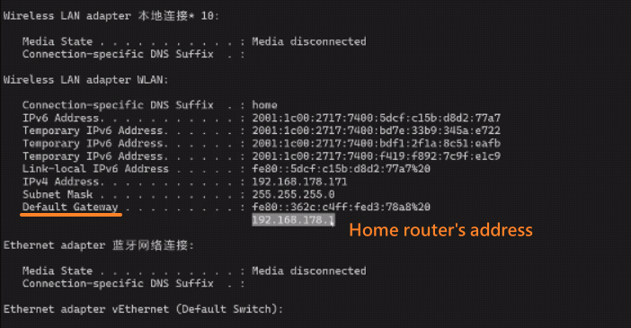
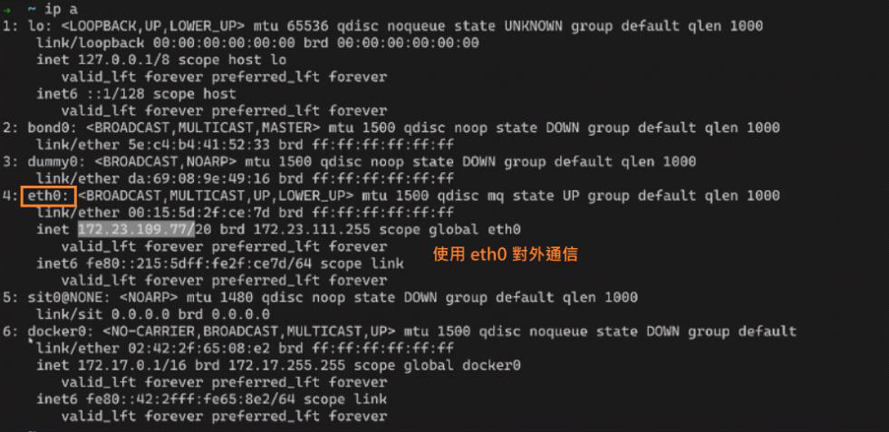

<!-- This md file is originally converted from onenote -->

# [7-3 網絡相關常用命令](https://dockertips.readthedocs.io/en/latest/single-host-network/linux-network-basic.html)

2024年6月19日
上午 05:09

## Contents [[↑](#7-3-網絡相關常用命令)]

- [7-3 網絡相關常用命令](#7-3-網絡相關常用命令)
  - [Contents \[↑\]](#contents-)
    - [IP 地址的查看 \[↑\]](#ip-地址的查看-)
    - [網絡連通性測試 \[↑\]](#網絡連通性測試-)

### IP 地址的查看 [[↑](#7-3-網絡相關常用命令)]

- `$ ifconfig`
  <table>
    <colgroup>
      <col style="width: 100%" />
    </colgroup>
    <thead>
      <tr class="header">
        <th>
          

          
 

        </th>
      </tr>
    </thead>
    <tbody>
    </tbody>
  </table>

- `$ ip addr` / `$ ip a`
  <table>
    <colgroup>
      <col style="width: 100%" />
    </colgroup>
    <thead>
      <tr class="header">
        <th>
          

          
 

        </th>
      </tr>
    </thead>
    <tbody>
    </tbody>
  </table>

### 網絡連通性測試 [[↑](#7-3-網絡相關常用命令)]

- Ping
  - 測試本地 IP 到目標 IP 之間的可達性
  - `$ ping <ip>`

- Telnet
  - 測試端口的連通性
  - `$ telnet www.google.com 80`

- Curl
  - 發送 web 請求
  - 發送 GET 請求
    - `$ curl <https://www.example.com>`
  - Reference
    - [curl 的用法指南](https://www.ruanyifeng.com/blog/2019/09/curl-reference.html)
