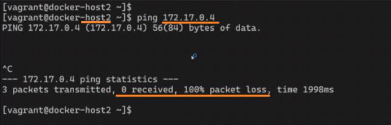

<!-- This md file is originally converted from onenote -->

# 7-4 容器網絡要解決哪些問題？

2024年6月19日
上午 05:26

## Contents [[↑](#7-4-容器網絡要解決哪些問題)]

- [7-4 容器網絡要解決哪些問題？](#7-4-容器網絡要解決哪些問題)
  - [Contents \[↑\]](#contents-)
    - [環境搭建 \[↑\]](#環境搭建-)
    - [問題 \[↑\]](#問題-)
      - [問題1 \[↑\]](#問題1-)
      - [問題2 \[↑\]](#問題2-)
      - [問題3 \[↑\]](#問題3-)
      - [問題4 \[↑\]](#問題4-)
      - [問題5 \[↑\]](#問題5-)
    - [問題整理 \[↑\]](#問題整理-)

### 環境搭建 [[↑](#7-4-容器網絡要解決哪些問題)]

- 兩台可以相互 PING 通的 Linux 主機, 且都有安裝 docker
  <table>
    <colgroup>
      <col style="width: 100%" />
    </colgroup>
    <thead>
      <tr class="header">
        <th>
          

          
 

        </th>
      </tr>
    </thead>
    <tbody>
      <tr class="odd">
        <td>
          

          
 

        </td>
      </tr>
      <tr class="even">
        <td>
          

          
 

        </td>
      </tr>
    </tbody>
  </table>

### 問題 [[↑](#7-4-容器網絡要解決哪些問題)]

#### 問題1 [[↑](#7-4-容器網絡要解決哪些問題)]

- 容器內的 IP 地址是怎麼來的
  <table>
    <colgroup>
      <col style="width: 100%" />
    </colgroup>
    <thead>
      <tr class="header">
        <th>
          

          
 

        </th>
      </tr>
    </thead>
    <tbody>
    </tbody>
  </table>

#### 問題2 [[↑](#7-4-容器網絡要解決哪些問題)]

- 為什麼本地的 host 可以 PING 通 container 的 IP
  <table>
    <colgroup>
      <col style="width: 100%" />
    </colgroup>
    <thead>
      <tr class="header">
        <th>
          

          
 

        </th>
      </tr>
    </thead>
    <tbody>
    </tbody>
  </table>

#### 問題3 [[↑](#7-4-容器網絡要解決哪些問題)]

- 為什麼 container 內部可以訪問到外網
  <table>
    <colgroup>
      <col style="width: 100%" />
    </colgroup>
    <thead>
      <tr class="header">
        <th>
          

          
 

        </th>
      </tr>
    </thead>
    <tbody>
    </tbody>
  </table>

#### 問題4 [[↑](#7-4-容器網絡要解決哪些問題)]

- 兩個 containers 之間為什麼可以互通
  <table>
    <colgroup>
      <col style="width: 100%" />
    </colgroup>
    <thead>
      <tr class="header">
        <th>
          

          
 

        </th>
      </tr>
    </thead>
    <tbody>
      <tr class="odd">
        <td>
          

          
 

        </td>
      </tr>
      <tr class="even">
        <td>
          

          
 

        </td>
      </tr>
      <tr class="odd">
        <td>
          

          
 

        </td>
      </tr>
    </tbody>
  </table>

#### 問題5 [[↑](#7-4-容器網絡要解決哪些問題)]

- 容器的端口轉發是如何運作的?
  <table>
    <colgroup>
      <col style="width: 100%" />
    </colgroup>
    <thead>
      <tr class="header">
        <th>
          

          
 

        </th>
      </tr>
    </thead>
    <tbody>
      <tr class="odd">
        <td>
          

          <ul class="incremental">
            <li>
              
$ docker container inspect &lt;container_id / container_name&gt;

            </li>
          </ul>
          

            <table>
              <colgroup>
                <col style="width: 100%" />
              </colgroup>
              <thead>
                <tr class="header">
                  <th>
                    

                    
 

                  </th>
                </tr>
              </thead>
              <tbody>
              </tbody>
            </table>
          

          <blockquote>
            
 

          </blockquote>
        </td>
      </tr>
      <tr class="even">
        <td>
          

          <ul class="incremental">
            <li>
              
本地可以去訪問 nginx 的 80 端口

            </li>
          </ul>
        </td>
      </tr>
      <tr class="odd">
        <td>
          

          <ul class="incremental">
            <li>
              
另外的機器根本就訪問不到 172.17.0.4 這個地址

            </li>
            <li>
              
但 host2 可以 ping 通 host1, 所以可以進行端口轉發, 將 host1 的 80 轉發到 172.17.0.4:80

            </li>
          </ul>
          

            <table>
              <colgroup>
                <col style="width: 100%" />
              </colgroup>
              <thead>
                <tr class="header">
                  <th>
                    

                    
 

                  </th>
                </tr>
              </thead>
              <tbody>
                <tr class="odd">
                  <td>
                    

                    
 

                  </td>
                </tr>
                <tr class="even">
                  <td>
                    

                    
 

                  </td>
                </tr>
              </tbody>
            </table>
          

        </td>
      </tr>
    </tbody>
  </table>

### 問題整理 [[↑](#7-4-容器網絡要解決哪些問題)]

- 這些問題都是容器網絡要解決的問題
  <table>
    <colgroup>
      <col style="width: 100%" />
    </colgroup>
    <thead>
      <tr class="header">
        <th>
          

          
 

        </th>
      </tr>
    </thead>
    <tbody>
    </tbody>
  </table>
