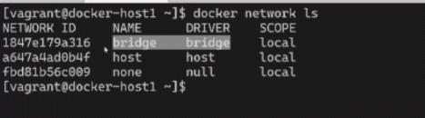

<!-- This md file is originally converted from onenote -->

# [7-5 容器間通信之 bridge 網絡](https://dockertips.readthedocs.io/en/latest/single-host-network/docker-bridge.html)

2024年6月19日
上午 06:01

## Contents [[↑](#7-5-容器間通信之-bridge-網絡)]

- [7-5 容器間通信之 bridge 網絡](#7-5-容器間通信之-bridge-網絡)
  - [Contents \[↑\]](#contents-)
    - [現實案例 \[↑\]](#現實案例-)
    - [兩個 containers 之間為什麼可以互通? \[↑\]](#兩個-containers-之間為什麼可以互通-)
    - [類比 \[↑\]](#類比-)
    - [容器间通信詳解 \[↑\]](#容器间通信詳解-)

### 現實案例 [[↑](#7-5-容器間通信之-bridge-網絡)]

- 現實案例
  <table>
    <colgroup>
      <col style="width: 100%" />
    </colgroup>
    <thead>
      <tr class="header">
        <th>
          

          <ul class="incremental">
            <li>
              
比如說這台電腦 192.168.1.2 想去和 192.168.1.5 這台電腦進行通信的話, 那麼它會把這個數據包先發送到 router 上面, 然後通過交換機的轉發的規則, 然後把這個數據包轉發到 192.168.1.5

            </li>
          </ul>
        </th>
      </tr>
    </thead>
    <tbody>
    </tbody>
  </table>

### 兩個 containers 之間為什麼可以互通? [[↑](#7-5-容器間通信之-bridge-網絡)]

- Bridge
  <table>
    <colgroup>
      <col style="width: 100%" />
    </colgroup>
    <thead>
      <tr class="header">
        <th>
          

          <ul class="incremental">
            <li>
              
Docker0 稱之為 Linux 的 Bridge

            </li>
          </ul>
        </th>
      </tr>
    </thead>
    <tbody>
      <tr class="odd">
        <td>
          

          <ul class="incremental">
            <li>
              
Docker 提供的三種網路模式

            </li>
            <li>
              
$ docker network ls

            </li>
          </ul>
        </td>
      </tr>
      <tr class="even">
        <td>
          

          <ul class="incremental">
            <li>
              
$ docker network inspect &lt;network id&gt;

            </li>
          </ul>
          

            <table>
              <colgroup>
                <col style="width: 100%" />
              </colgroup>
              <thead>
                <tr class="header">
                  <th>
                    

                    
 

                  </th>
                </tr>
              </thead>
              <tbody>
                <tr class="odd">
                  <td>
                    

                    
 

                  </td>
                </tr>
                <tr class="even">
                  <td>
                    

                    
 

                  </td>
                </tr>
              </tbody>
            </table>
          

        </td>
      </tr>
    </tbody>
  </table>

### 類比 [[↑](#7-5-容器間通信之-bridge-網絡)]

- 類比

  <table>
    <colgroup>
      <col style="width: 100%" />
    </colgroup>
    <thead>
      <tr class="header">
        <th>
          

          <ul class="incremental">
            <li>
              
因為 containers 都同時連接到了一個默認的一個 Linux Bridge - Docker0, 所以在這個 host 上面創建的 Containers 它們之間是 IP 可以相互通信的

            </li>
          </ul>
        </th>
      </tr>
    </thead>
    <tbody>
    </tbody>
  </table>

### 容器间通信詳解 [[↑](#7-5-容器間通信之-bridge-網絡)]

- 容器间通信詳解
  <table>
    <colgroup>
      <col style="width: 100%" />
    </colgroup>
    <thead>
      <tr class="header">
        <th>
          

          <ul class="incremental">
            <li>
              
下面的 eth0 負責的是對外,就是和我們這臺 host 機器與外部的目標進行通信

            </li>
            <li>
              
有一個 Docker 0 這樣一個 Linux Bridge, 且我們所創建的容器,它默認都會連接到這個Bridge上

              <ul class="incremental">
                <li>
                  
在進行這個連接的時候, 我們需要有一個這樣的一個 Link, 一條線去進行 container 和 docker0 的連接.

                  <ul class="incremental">
                    <li>
                      
這條線就類似於去連接我們電腦和路由器

                    </li>
                  </ul>
                </li>
                <li>
                  
在這個Linux Bridge或者在Linux的網絡裡面, 同樣需要這樣一條類似於網線的東西去進行 container 和 docker0 的連接.

                  <ul class="incremental">
                    <li>
                      
而在 Container 上的網絡接口就是 ETH0

                    </li>
                    <li>
                      
在 Docker0 上的網絡接口就是 VETH1

                    </li>
                  </ul>
                </li>
                <li>
                  
這樣就建立了連接, 然後 containers 之間就可以進行網絡通信了

                </li>
              </ul>
            </li>
          </ul>
        </th>
      </tr>
    </thead>
    <tbody>
    </tbody>
  </table>

- `brctl`

  - 安裝
    <table>
      <colgroup>
        <col style="width: 100%" />
      </colgroup>
      <thead>
        <tr class="header">
          <th>
            

            
 

          </th>
        </tr>
      </thead>
      <tbody>
      </tbody>
    </table>

  - 作用
    - `brctl` 可以去顯示 Linux Bridge 以及 Linux Bridge 相關的一些信息
    - `brctl show` 就可以顯示當前的 Bridge 以及這個 Bridge 上面連接哪些接口 Interface
      <table>
        <colgroup>
          <col style="width: 100%" />
        </colgroup>
        <thead>
          <tr class="header">
            <th>
              

              <ul class="incremental">
                <li>
                  
Docker 0 這個 Bridge 有兩個 Interface

                  <ul class="incremental">
                    <li>
                      
一個是這個 VETH 8c

                    </li>
                    <li>
                      
然後另外一個是 VETH d8f9

                    </li>
                  </ul>
                  
這兩個接口實際上是負責去連 container 的, 也就是上圖裡面所看到的 VETH1 和 VETH2

                </li>
              </ul>
            </th>
          </tr>
        </thead>
        <tbody>
        </tbody>
      </table>
