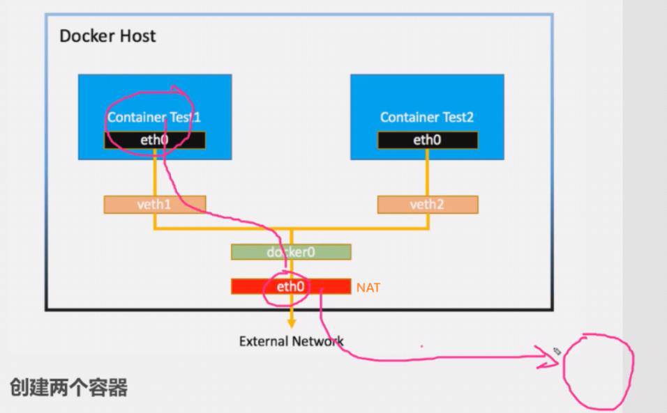
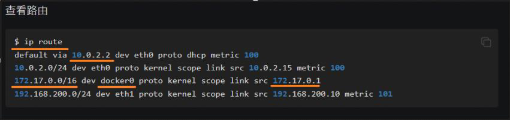
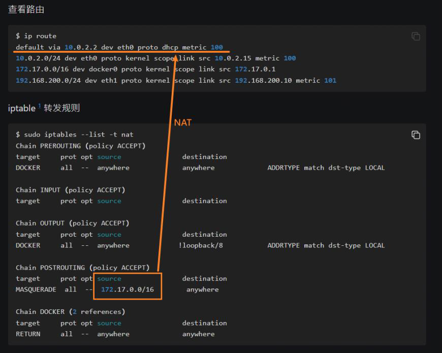

<!-- This md file is originally converted from onenote -->

# [7-6 容器對外通信之 bridge 網絡](https://dockertips.readthedocs.io/en/latest/single-host-network/docker-bridge.html#id3)

2024年6月20日
下午 01:49

## Contents [[↑](#7-6-容器對外通信之-bridge-網絡)]

- [7-6 容器對外通信之 bridge 網絡](#7-6-容器對外通信之-bridge-網絡)
  - [Contents \[↑\]](#contents-)
    - [環境準備 \[↑\]](#環境準備-)
    - [原理介紹 \[↑\]](#原理介紹-)

### 環境準備 [[↑](#7-6-容器對外通信之-bridge-網絡)]

- 前提條件
  - 如果想讓容器能夠訪問外網必須滿足一個條件就是這個容器所在的 host machine 是可以訪問外網的

### 原理介紹 [[↑](#7-6-容器對外通信之-bridge-網絡)]

- 工作原理
  <table>
    <colgroup>
      <col style="width: 100%" />
    </colgroup>
    <thead>
      <tr class="header">
        <th>
          

          <ul class="incremental">
            <li>
              
Test1 訪問 google.com 的時候, 是怎麼決定這個訪問是要出去還是要去 Test2?

              <ul class="incremental">
                <li>
                  
Host machine 的 eth0 上會有一個 route table

                </li>
              </ul>
            </li>
          </ul>
          

            <table>
              <colgroup>
                <col style="width: 100%" />
              </colgroup>
              <thead>
                <tr class="header">
                  <th>
                    

                    <ul class="incremental">
                      <li>
                        
`$ ip route`

                      </li>
                      <li>
                        
如果欲訪問的是 172.17.0.0/16 的話, 它就是Docker0上面連接的容器

                      </li>
                      <li>
                        
如果要訪問其他的地址的話, 就會走這個默認的路由. 這個默認路由就會經過 ETH0 出去

                        <ul class="incremental">
                          <li>
                            
這個 ETH0 就是我們這臺 host machine 對外進行通信的一個接口

                          </li>
                        </ul>
                      </li>
                    </ul>
                  </th>
                </tr>
              </thead>
              <tbody>
              </tbody>
            </table>
          

          <ul class="incremental">
            <li>
              
NAT

              <ul class="incremental">
                <li>
                  
通信從 container 出去的時候會有一個問題, 就是 container 的 IP 地址.

                  
Test1 的IP地址是 172.17.0.2 , 但是 host machine 的 ETH0 是 10.0.2.2

                </li>
                <li>
                  
這時候這個數據在出去之前需要做一個做一個 NAT, 把這個 172.17.0.0

                  
這個網段的地址, 轉換成10.0.2.2, 然後再出去

                </li>
                <li>
                  
這個轉發的規則是通過 IP tables 去定義的

                </li>
              </ul>
            </li>
          </ul>
          

            <table>
              <colgroup>
                <col style="width: 100%" />
              </colgroup>
              <thead>
                <tr class="header">
                  <th>
                    

                    <ul class="incremental">
                      <li>
                        
`$ sudo iptables --list -t nat`

                      </li>
                      <li>
                        
如果收到從這個 172.17.0.0/16 過來的數據要出去的話, 就給它去做一個 NAT, 轉換成這個 ETH0 的地址, 然後再出去

                      </li>
                      <li>
                        
所以, 從 Docker 容器裡面去往外 PING 或者是說從本地 host machine 往外PING, 從外界來看是區分不開的

                        <ul class="incremental">
                          <li>
                            
因為它一旦出到 host machine 外部的話, 那麼它的源地址都會變成ETH0

                          </li>
                        </ul>
                      </li>
                    </ul>
                  </th>
                </tr>
              </thead>
              <tbody>
              </tbody>
            </table>
          

          
 

        </th>
      </tr>
    </thead>
    <tbody>
    </tbody>
  </table>
