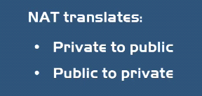

<!-- This md file is originally converted from onenote -->

# 7-7 網絡知識補充 - NAT

2024年6月20日
下午 03:46

## Contents [[↑](#7-7-網絡知識補充---nat)]

- [7-7 網絡知識補充 - NAT](#7-7-網絡知識補充---nat)
  - [Contents \[↑\]](#contents-)
    - [問題背景 \[↑\]](#問題背景-)
    - [多重 NAT \[↑\]](#多重-nat-)
    - [總結 \[↑\]](#總結-)
    - [Reference \[↑\]](#reference-)

### 問題背景 [[↑](#7-7-網絡知識補充---nat)]

- NAT 主要是用來解決 IPv4 地址的數量不足的問題
- IPv4 地址的數量實際上是不足以讓地球上每一個設備都分配一個 IP
- 所以開發出來 private IP, e.g.
  - 10.x.x.x
  - 192.168.x.x
  - 172.x.x
- 私有的 IP 地是無法在網絡上面進行數據傳輸的
  - 因為在網絡上進行通信的話, 必須要有一個獨一無二的地址
- 解決方案：NAT
  - 從 private 地址轉換成一個 public 地址去在互聯網上面去使用
    <table>
      <colgroup>
        <col style="width: 100%" />
      </colgroup>
      <thead>
        <tr class="header">
          <th>
            

            
 

          </th>
        </tr>
      </thead>
      <tbody>
      </tbody>
    </table>

### 多重 NAT [[↑](#7-7-網絡知識補充---nat)]

- 一般是由網絡服務提供商 (ATT/Spectrum) 提供 public ip
- 當連接經過網絡服務提供商的路由器 (硬體) 時, 做 NAT (private ip <-> public ip)
- 而這個 NAT 也可以以軟體來實現, e.g.
  - Docker 的 Bridge 網絡使用 IP tables, 通過軟件的形式實現這個地址的轉換. 把 container 的地址轉換成 host machine 的 IP 地址 (private ip <-> private ip)
    - 因為 host machine 本身也是一個 private ip

### 總結 [[↑](#7-7-網絡知識補充---nat)]

- 先從容器的 private ip 經過一次 NAT 轉換成 host machine 的 private ip
- 再從 host machine 的 private ip 往外去訪問到家中的網路提供商路由器
- 然後再經過一次 NAT 轉換成公路的 IP 再到互聯網上面去訪問外面的網站

### Reference [[↑](#7-7-網絡知識補充---nat)]

- [NAT Explained - Network Address Translation](https://www.youtube.com/watch?v=FTUV0t6JaDA)
