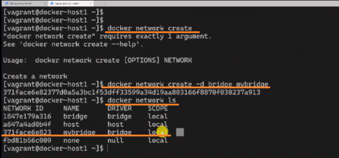
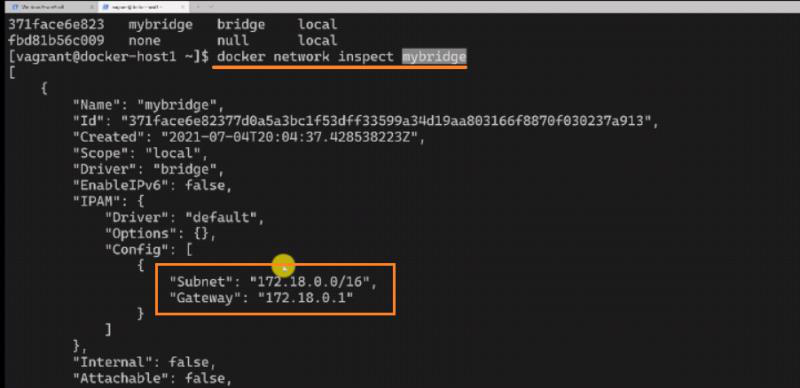
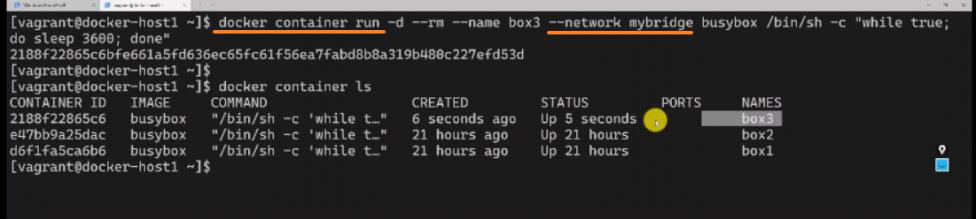
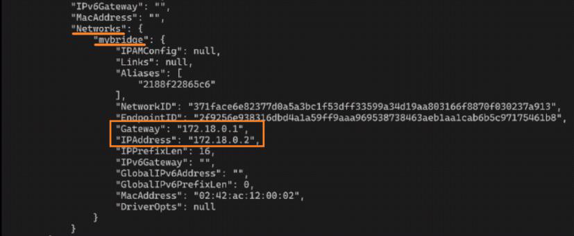
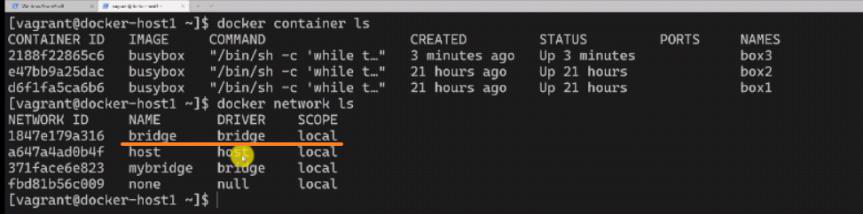
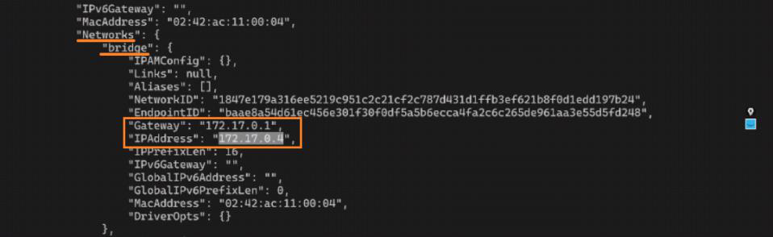
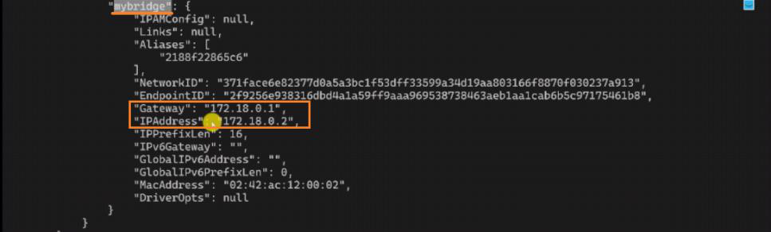
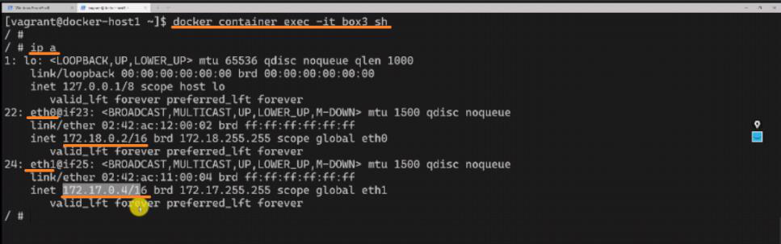
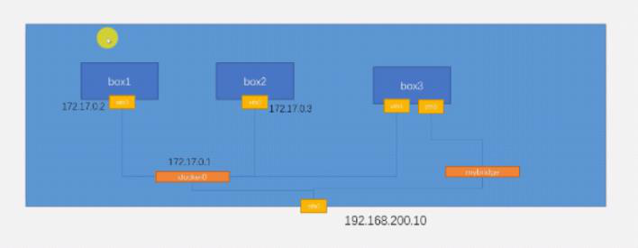

<!-- This md file is originally converted from onenote -->

# 7-8 創建和使用自定義 bridge (上)

2024年6月24日
下午 08:40

## Contents [[↑](#7-8-創建和使用自定義-bridge-上)]

- [7-8 創建和使用自定義 bridge (上)](#7-8-創建和使用自定義-bridge-上)
  - [Contents \[↑\]](#contents-)
    - [預設 Bridge \[↑\]](#預設-bridge-)
    - [創建自定義 Bridge \[↑\]](#創建自定義-bridge-)
    - [使用自定義 Bridge \[↑\]](#使用自定義-bridge-)
    - [連接多個網絡 \[↑\]](#連接多個網絡-)
    - [斷開 network 連接 \[↑\]](#斷開-network-連接-)
    - [總結 \[↑\]](#總結-)

### 預設 Bridge [[↑](#7-8-創建和使用自定義-bridge-上)]

- 在默認的情況下, Docker 會使用 Docker0 作為預設的 Bridge
  - 所創建的 Container 默認都會連在 Docker 0 上面

### 創建自定義 Bridge [[↑](#7-8-創建和使用自定義-bridge-上)]

- 實際上, 也可以使用 `$ docker network create` 這個命令創建自己的 Bridge
  - `$ docker network create -d <driver_type> <network_name>`
    - `-d` -- 用於指定 bridge driver 的類型
  - `$ docker network create -d bridge mybridge`
    <table>
      <colgroup>
        <col style="width: 100%" />
      </colgroup>
      <thead>
        <tr class="header">
          <th>
            

            
 

          </th>
        </tr>
      </thead>
      <tbody>
      </tbody>
    </table>

  - `$ docker network inspect mybridge`
    <table>
      <colgroup>
        <col style="width: 100%" />
      </colgroup>
      <thead>
        <tr class="header">
          <th>
            

            
 

          </th>
        </tr>
      </thead>
      <tbody>
      </tbody>
    </table>

### 使用自定義 Bridge [[↑](#7-8-創建和使用自定義-bridge-上)]

- `$ docker container run` **`--network <network_name>`**
  <table>
    <colgroup>
      <col style="width: 100%" />
    </colgroup>
    <thead>
      <tr class="header">
        <th>
          

          
 

        </th>
      </tr>
    </thead>
    <tbody>
    </tbody>
  </table>

- `$ docker container inspect box3`
    <table>
      <colgroup>
        <col style="width: 100%" />
      </colgroup>
      <thead>
        <tr class="header">
          <th>
            

            <ul class="incremental">
              <li>
                
$ docker network inspect mybridge

              </li>
            </ul>
            

              <table>
                <colgroup>
                  <col style="width: 100%" />
                </colgroup>
                <thead>
                  <tr class="header">
                    <th>
                      

                      
 

                    </th>
                  </tr>
                </thead>
                <tbody>
                </tbody>
              </table>
            

          </th>
        </tr>
      </thead>
      <tbody>
      </tbody>
    </table>

### 連接多個網絡 [[↑](#7-8-創建和使用自定義-bridge-上)]

- 可不可以讓一個容器同時連兩個網絡? -> **Yes**
  - Docker0
    <table>
      <colgroup>
        <col style="width: 100%" />
      </colgroup>
      <thead>
        <tr class="header">
          <th>
            

            <ul class="incremental">
              <li>
                
Docker0 是接口名

              </li>
              <li>
                
Docker0 的 network name 是 bridge

              </li>
            </ul>
          </th>
        </tr>
      </thead>
      <tbody>
      </tbody>
    </table>

  - 讓 box3 再連一下 Docker0
    - `$ docker network connect <network_name> <container_name>`
      - `$ docker network connect bridge box3`
      - `$ docker container inspect box3`
        <table>
          <colgroup>
            <col style="width: 100%" />
          </colgroup>
          <thead>
            <tr class="header">
              <th>
                

                
 

              </th>
            </tr>
          </thead>
          <tbody>
            <tr class="odd">
              <td></td>
            </tr>
            <tr class="even">
              <td>
                

                
 

              </td>
            </tr>
          </tbody>
        </table>

### 斷開 network 連接 [[↑](#7-8-創建和使用自定義-bridge-上)]

- `$ docker network disconnect <network_name> <container_name>`
  - `$ docker network disconnect bridge box3`
  - `$ docker container inspect box3`
    <table>
      <colgroup>
        <col style="width: 100%" />
      </colgroup>
      <thead>
        <tr class="header">
          <th>
            

            <ul class="incremental">
              <li>
                
那這時候 Box3 就只剩下 MyBridge 了

              </li>
            </ul>
          </th>
        </tr>
      </thead>
      <tbody>
      </tbody>
    </table>

### 總結 [[↑](#7-8-創建和使用自定義-bridge-上)]

- 總結
  <table>
    <colgroup>
      <col style="width: 100%" />
    </colgroup>
    <thead>
      <tr class="header">
        <th>
          

          
 

        </th>
      </tr>
    </thead>
    <tbody>
    </tbody>
  </table>
