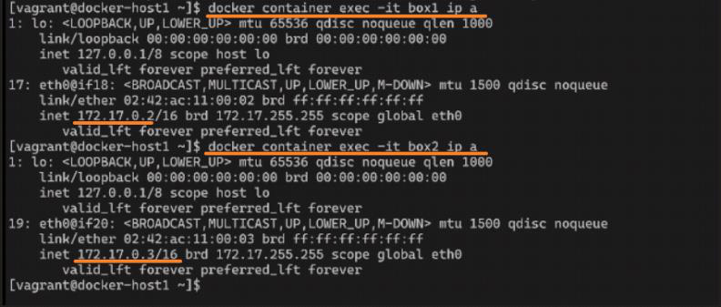
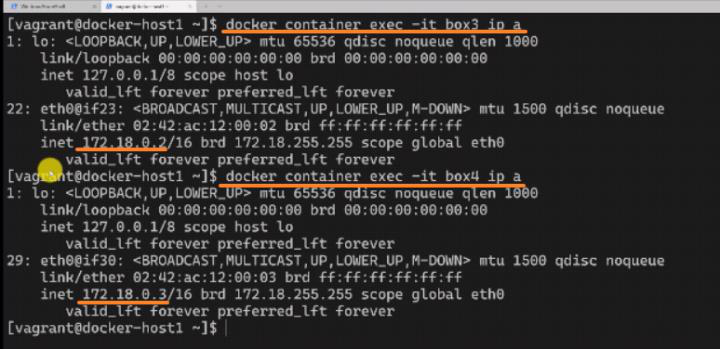
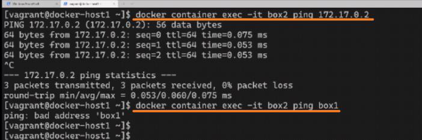
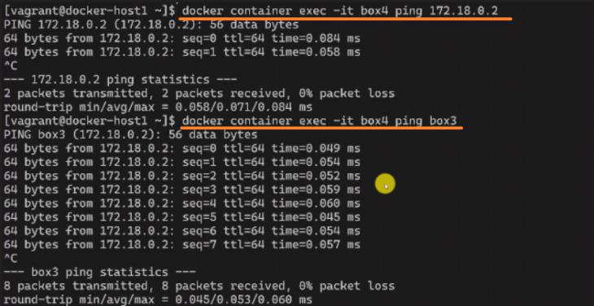
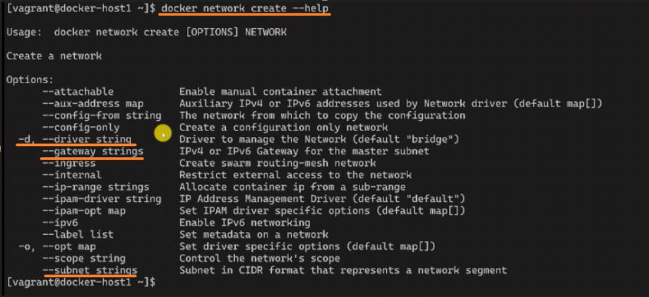
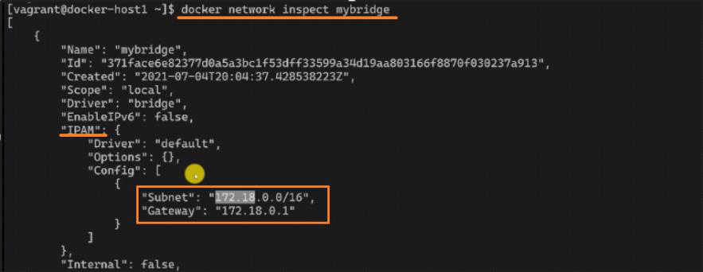
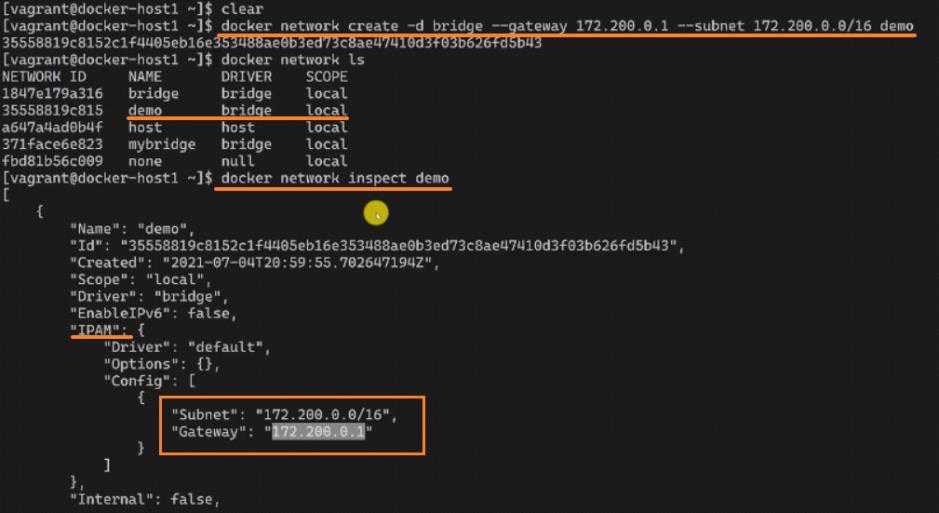

<!-- This md file is originally converted from onenote -->

# 7-9 創建和使用自定義 bridge (下)

2024年6月24日
下午 09:12

## Contents [[↑](#7-9-創建和使用自定義-bridge-下)]

- [7-9 創建和使用自定義 bridge (下)](#7-9-創建和使用自定義-bridge-下)
  - [Contents \[↑\]](#contents-)
    - [環境設定 \[↑\]](#環境設定-)
    - [DNS 功能  \[↑\]](#dns-功能--)
    - [指定 gateway 和 subnet to a bridge network \[↑\]](#指定-gateway-和-subnet-to-a-bridge-network-)

### 環境設定 [[↑](#7-9-創建和使用自定義-bridge-下)]

- box1 (172.17.0.2) 和 box2 (172.17.0.3) 連接 `Docker0` bridge network
  <table>
    <colgroup>
      <col style="width: 100%" />
    </colgroup>
    <thead>
      <tr class="header">
        <th>
          

          
 

        </th>
      </tr>
    </thead>
    <tbody>
    </tbody>
  </table>

- box3 (172.18.0.2) 和 box4 (172.18.0.3) 連接自定義 `mybridge` network
  <table>
    <colgroup>
      <col style="width: 100%" />
    </colgroup>
    <thead>
      <tr class="header">
        <th>
          

          
 

        </th>
      </tr>
    </thead>
    <tbody>
    </tbody>
  </table>

### DNS 功能  [[↑](#7-9-創建和使用自定義-bridge-下)]

- `Docker0` bridge 沒有 DNS 效果
  <table>
    <colgroup>
      <col style="width: 100%" />
    </colgroup>
    <thead>
      <tr class="header">
        <th>
          

          <ul class="incremental">
            <li>
              
默認的 Docker0 bridge 不提供 DNS 功能

            </li>
          </ul>
        </th>
      </tr>
    </thead>
    <tbody>
    </tbody>
  </table>

- 自定義 `mybridge` 的 DNS 效果 (非常有幫助)
  <table>
    <colgroup>
      <col style="width: 100%" />
    </colgroup>
    <thead>
      <tr class="header">
        <th>
          

          <ul class="incremental">
            <li>
              
自定義 mybridge 提供 DNS 功能

            </li>
            <li>
              
在本地使用 docker 的時候, 一般會建議去創建自定義的 bridge; 而不是每次都去使用 docker0 bridge

            </li>
          </ul>
        </th>
      </tr>
    </thead>
    <tbody>
      <tr class="odd">
        <td>
          

          
 

        </td>
      </tr>
    </tbody>
  </table>

### 指定 gateway 和 subnet to a bridge network [[↑](#7-9-創建和使用自定義-bridge-下)]

- 指定 gateway 和 subnet while creating a bridge network
  <table>
    <colgroup>
      <col style="width: 100%" />
    </colgroup>
    <thead>
      <tr class="header">
        <th>
          

          
 

        </th>
      </tr>
    </thead>
    <tbody>
      <tr class="odd">
        <td>
          

          <ul class="incremental">
            <li>
              
可以用 `--gateway` 和 `--subnet` 來指定

            </li>
          </ul>
          

            <table>
              <colgroup>
                <col style="width: 100%" />
              </colgroup>
              <thead>
                <tr class="header">
                  <th>
                    

                    <ul class="incremental">
                      <li>
                        
`$ docker network create -d bridge --gateway 172.200.0.1 --subnet 172.0.0/16 demo`

                      </li>
                      <li>
                        
如果創建一個容器連接到這個 demo 的 bridge 的話, 它就會分配這個網段的 ip, 比如說 172.200.0.2 開始

                      </li>
                    </ul>
                  </th>
                </tr>
              </thead>
              <tbody>
              </tbody>
            </table>
          

        </td>
      </tr>
    </tbody>
  </table>
